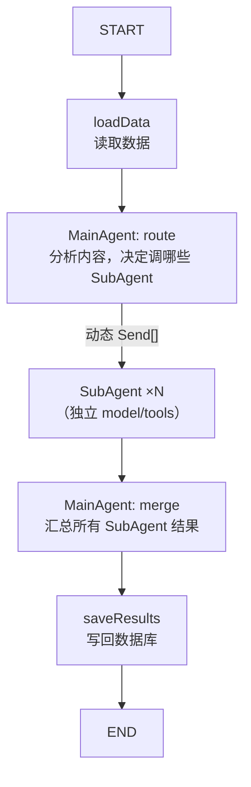
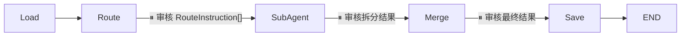

# LangGraph.js + LangChain ChatModel 重构方案

## 目标

用 LangGraph.js + LangChain ChatModel 实现 agent 系统：
- MainAgent 动态决定调用哪些 SubAgent
- 每个 SubAgent 独立配置 model、tools、并发控制
- 拆分 & 核查共用同一图模式
- HITL 人在回路支持
- LangSmith 可观测性

---

## 1. 架构概览



### MainAgent 双职责

| 阶段 | 职责 | prompt |
|------|------|--------|
| **route** | 看到内容后，返回结构化路由指令 `RouteInstruction[]` | `prompts/{module}/main-agent-route.json` |
| **merge** | 收到所有 SubAgent 结果后，按权重加权汇总 | `prompts/{module}/main-agent-merge.json` |

### 路由指令 RouteInstruction

MainAgent route 返回结构化指令，而非简单名称列表：

```typescript
type Priority = 'high' | 'medium' | 'low'

interface RouteInstruction {
  agentName: string        // 要调用的 SubAgent
  priority: Priority       // 权重（枚举，不信任 AI 给数值）
  hint?: string            // MainAgent 给 SubAgent 的提示
}
```

MainAgent route 返回示例：
```json
[
  { "agentName": "数据事实", "priority": "high", "hint": "重点关注第三段的 GDP 数据" },
  { "agentName": "引用观点", "priority": "medium" },
  { "agentName": "因果关系", "priority": "low", "hint": "文中因果推断较弱" }
]
```

merge 阶段 MainAgent 按权重加权处理结果——`high` 视角的拆分结果优先保留。

### SubAgent 独立配置

每个 SubAgent 绑定自己的 model、tools、并发参数——不再全局共享：

```typescript
interface SubAgentConfig {
  name: string
  promptPath: string
  model?: BaseChatModel       // 不指定则用默认 model
  tools?: StructuredTool[]    // 该 agent 可用的 skills
  maxConcurrency?: number     // 并发控制（防 rate limit）
}
```

示例：
```typescript
const agents: SubAgentConfig[] = [
  {
    name: "数据事实",
    promptPath: "fact-extractor/sub-agents/data-claims",
    model: cheapModel,           // 简单任务用便宜模型
    tools: [calculatorTool],
  },
  {
    name: "引用观点",
    promptPath: "fact-extractor/sub-agents/quote-claims",
    model: strongModel,          // 需要强推理
    tools: [searchTool],
  },
]
```

SubAgent 内部是 ReAct 循环：AI 可以多次调用 tools，直到产出最终结果。

---

### 数据源职责分离

| 存储 | 角色 | 生命周期 | HITL 读写 |
|------|------|---------|----------|
| **Checkpoint** | 图执行中间态 | 临时，任务完成后可清理 | ✅ HITL 读写都在这里 |
| **Mongoose** | 最终业务数据 | 永久 | ❌ 只有 save 节点写入 |

**原则**：Mongoose 里永远是"已确认"的干净数据。中间态全部活在 Checkpoint 里。

```
graph 运行 → 暂停 → 从 checkpoint 读 state → 前端展示
                                                ↓ 用户修改
                  graph.updateState() ← 修改写回 checkpoint
                                                ↓ 恢复执行
                  最终 save node → 写入 Mongoose（唯一写 DB 的时机）
```

---

### 可观测性：LangSmith

接入 LangSmith 追踪每次 agent 执行的全链路：

```typescript
// 设置环境变量即可自动接入
process.env.LANGSMITH_TRACING = "true"
process.env.LANGSMITH_API_KEY = "ls_..."
process.env.LANGSMITH_PROJECT = "chongming"
```

追踪内容：route 决策 → 每个 SubAgent 的 prompt/response/tool calls → merge 输入输出

---

## 2. 本方案范围

本方案**仅覆盖拆分模块**。核查模块结构对称，作为独立方案后续规划。

> **核查模块备忘**：核查的 HITL 需支持调整置信度 (1/0.5/0) 和理由，这是核查特有的可编辑参数。

---

## 3. State 定义

```typescript
import { Annotation } from "@langchain/langgraph"

const SplitGraphState = Annotation.Root({
  // 输入
  newsId: Annotation<string>,

  // loadData 填充
  content: Annotation<string>,
  visibleContext: Annotation<Record<string, string>>({
    default: () => ({}),
  }),

  // MainAgent route 输出：结构化路由指令
  routeInstructions: Annotation<RouteInstruction[]>({
    default: () => [],
  }),

  // SubAgent 结果（reducer 合并并发写入）
  subAgentResults: Annotation<SubAgentSplitRecord[]>({
    reducer: (prev, next) => [...prev, ...next],
    default: () => [],
  }),

  // MainAgent merge 输出
  mergedClaims: Annotation<RawClaim[]>({ default: () => [] }),
  rawMergeResponse: Annotation<string>({ default: () => "" }),
})
```

---

## 4. 关键 Node 实现

### 4.1 MainAgent Route Node

MainAgent 看到内容，返回结构化路由指令：

```typescript
function createRouteNode(model: BaseChatModel, routePromptPath: string, availableAgents: SubAgentConfig[]) {
  return async (state) => {
    const promptConfig = loadPrompt(routePromptPath)
    const agentList = availableAgents.map(a => `- ${a.name}`).join("\n")
    const prompt = renderPrompt(promptConfig.content, {
      content: state.content,
      context: formatContext(state.visibleContext),
      availableAgents: agentList,
    })

    const response = await model.invoke(prompt)
    // AI 返回 RouteInstruction[]（含 priority + hint）
    const instructions: RouteInstruction[] = JSON.parse(response.content as string)
    // 校验：只保留 availableAgents 中存在的 agent，priority 只接受枚举值
    const validPriorities = new Set(['high', 'medium', 'low'])
    const validNames = new Set(availableAgents.map(a => a.name))
    const routeInstructions = instructions.filter(
      i => validNames.has(i.agentName) && validPriorities.has(i.priority)
    )

    return { routeInstructions }
  }
}
```

### 4.2 动态扇出（基于路由指令）

```typescript
function dynamicFanOut(availableAgents: SubAgentConfig[]) {
  return (state) => {
    return state.routeInstructions.map(instruction => {
      const agentConfig = availableAgents.find(a => a.name === instruction.agentName)!
      return new Send("subAgent", {
        ...state,
        _agentConfig: agentConfig,
        _routeInstruction: instruction,  // 传递 priority + hint
      })
    })
  }
}
```

### 4.3 SubAgent Node（per-agent 配置）

```typescript
import { createReactAgent } from "@langchain/langgraph/prebuilt"

function createSubAgentNode(defaultModel: BaseChatModel) {
  return async (state) => {
    const agentConfig = state._agentConfig as SubAgentConfig
    const instruction = state._routeInstruction as RouteInstruction
    const promptConfig = loadPrompt(agentConfig.promptPath)

    // hint 注入 prompt（MainAgent 的补充指示）
    const prompt = renderPrompt(promptConfig.content, {
      content: state.content,
      context: formatContext(state.visibleContext),
      hint: instruction.hint ?? '',
    })

    // 优先用 agent 自己的 model/tools，否则用默认值
    const model = agentConfig.model ?? defaultModel
    const tools = agentConfig.tools ?? []

    // ReAct agent：AI 可以多轮调用 tools
    const agent = createReactAgent({
      llm: model,
      tools,
      prompt,
    })
    const result = await agent.invoke({ messages: [{ role: "user", content: prompt }] })
    const rawResponse = result.messages.at(-1)?.content as string

    let claims: RawClaim[] = []
    try { claims = JSON.parse(rawResponse) } catch {}

    return {
      subAgentResults: [{
        agentName: agentConfig.name,
        priority: instruction.priority,
        claims,
        rawResponse,
      }],
    }
  }
}
```

### 4.4 MainAgent Merge Node

```typescript
function createMergeNode(model: BaseChatModel, mergePromptPath: string) {
  return async (state) => {
    const promptConfig = loadPrompt(mergePromptPath)
    const subResultsText = state.subAgentResults
      .map(r => `【${r.agentName}】\n${r.claims.map(c => `  - ${c.content}`).join("\n")}`)
      .join("\n\n")

    const prompt = renderPrompt(promptConfig.content, {
      content: state.content,
      subResults: subResultsText,
    })

    const response = await model.invoke(prompt)
    const rawMergeResponse = response.content as string
    let mergedClaims: RawClaim[] = []
    try { mergedClaims = JSON.parse(rawMergeResponse) } catch {}

    return { mergedClaims, rawMergeResponse }
  }
}
```

---

## 5. 图构建 + 人在回路

### 5.1 执行模式

```typescript
type ExecutionMode = 'auto' | 'human-in-loop'
```

| 模式 | 行为 |
|------|------|
| `auto` | 全自动执行，无中断 |
| `human-in-loop` | 每个关键节点前暂停，等人审核/修改后恢复 |

### 5.2 中断点



| 中断点 | 人审核什么 | 可修改什么 |
|--------|-----------|-----------|
| route → subAgent | 选了哪些 SubAgent、priority、hint | 增删 SubAgent、改 priority/hint |
| subAgent → merge | 各 SubAgent 的拆分结果 | 删除/修改/补充 claim |
| merge → save | 最终去重后的事实列表 | 最终微调后再存库 |

HITL 数据全部读写 **Checkpoint state**，不读 Mongoose。

### 5.3 图构建

```typescript
import { MemorySaver } from "@langchain/langgraph"

export interface SplitGraphConfig {
  defaultModel: BaseChatModel         // 默认模型（route/merge 用）
  availableAgents: SubAgentConfig[]   // 每个 agent 可带自己的 model/tools
  routePromptPath: string
  mergePromptPath: string
  mode?: ExecutionMode                // 默认 'auto'
  maxConcurrency?: number             // 全局最大并发（默认 3）
}

export function buildSplitGraph(config: SplitGraphConfig) {
  const {
    defaultModel, availableAgents,
    routePromptPath, mergePromptPath,
    mode = 'auto', maxConcurrency = 3,
  } = config

  const checkpointer = new MemorySaver()  // 生产环境换 MongoDB checkpointer

  const interruptPoints = mode === 'human-in-loop'
    ? ["subAgent", "merge", "save"]
    : []

  return new StateGraph(SplitGraphState)
    .addNode("loadNews", loadNews)
    .addNode("route", createRouteNode(defaultModel, routePromptPath, availableAgents))
    .addNode("subAgent", createSubAgentNode(defaultModel))
    .addNode("merge", createMergeNode(defaultModel, mergePromptPath))
    .addNode("save", saveResults)
    .addEdge(START, "loadNews")
    .addEdge("loadNews", "route")
    .addConditionalEdges("route", dynamicFanOut(availableAgents))
    .addEdge("subAgent", "merge")
    .addEdge("merge", "save")
    .addEdge("save", END)
    .compile({ checkpointer, interruptBefore: interruptPoints })
}
```

### 5.4 HITL 调用流程

```typescript
const config = { configurable: { thread_id: "task-001" } }

// 1. 首次调用 → 自动停在第一个中断点（subAgent 之前）
let state = await graph.invoke({ newsId: "news-001" }, config)
// state.routeInstructions 已填充

// 2. 前端展示 → 用户审核/修改 routeInstructions
//    （通过 IPC 传给 renderer 进程）

// 3. 用户修改后写回 state
await graph.updateState(config, {
  routeInstructions: userModifiedInstructions,
})

// 4. 恢复执行 → 跑到下一个中断点（merge 之前）
state = await graph.invoke(null, config)
// state.subAgentResults 已填充

// 5. 重复：审核 → 修改 → updateState → invoke(null) → 直到 END
```

### 5.5 前端 IPC 交互

```
[Electron Main]                     [Electron Renderer (Vue)]
     │                                      │
     │── graph.invoke() ──────────────→ 暂停 │
     │                                      │
     │←── IPC: "graph:paused" ─────── 展示 state ──→ 用户审核
     │                                      │
     │←── IPC: "graph:resume" + 修改 ── 用户修改完 ←─│
     │                                      │
     │── updateState() + invoke(null) ─→ 继续│
     │── graph.invoke() ──────────────→ 下一个暂停
```

### 使用示例

```typescript
import { ChatOpenAI } from "@langchain/openai"
import { DynamicTool } from "@langchain/core/tools"

const cheapModel = new ChatOpenAI({ modelName: "gpt-4o-mini" })
const strongModel = new ChatOpenAI({ modelName: "gpt-4o" })

const searchTool = new DynamicTool({
  name: "search",
  description: "搜索互联网获取信息",
  func: async (query) => { /* 实现搜索 */ },
})
const calculatorTool = new DynamicTool({
  name: "calculator",
  description: "数学计算",
  func: async (expr) => { /* 实现计算 */ },
})

const splitGraph = buildSplitGraph({
  defaultModel: cheapModel,          // route/merge 用便宜模型
  availableAgents: [
    {
      name: "数据事实",
      promptPath: "fact-extractor/sub-agents/data-claims",
      model: strongModel,            // 数据分析需要强模型
      tools: [calculatorTool],
    },
    {
      name: "引用观点",
      promptPath: "fact-extractor/sub-agents/quote-claims",
      tools: [searchTool],           // 引用核查需要搜索
    },
    {
      name: "因果关系",
      promptPath: "fact-extractor/sub-agents/causal-claims",
      // 无 tools，纯推理
    },
  ],
  routePromptPath: "fact-extractor/main-agent-route",
  mergePromptPath: "fact-extractor/main-agent-merge",
  mode: "human-in-loop",
})

await splitGraph.invoke({ newsId: "news-20260630-001" })
```

---

## Proposed Changes

### [MODIFY] [types.ts](file:///Users/xiong/ChongMing/electron/fact-extractor/types.ts)

```diff
- export interface AIProvider { ... }
- export interface SplitSubAgent { ... }
- export interface SplitMainAgent { ... }

  /** 权重枚举 — 不信任 AI 给数值 */
+ export type Priority = 'high' | 'medium' | 'low'

+ /** SubAgent 注册配置（per-agent model/tools/并发） */
+ export interface SubAgentConfig {
+   name: string
+   promptPath: string
+   model?: BaseChatModel       // 不指定则用 defaultModel
+   tools?: StructuredTool[]    // 该 agent 可用的 skills
+   maxConcurrency?: number     // 并发控制
+ }

+ /** MainAgent route 返回的结构化路由指令 */
+ export interface RouteInstruction {
+   agentName: string
+   priority: Priority
+   hint?: string
+ }

  /** 修改 RawClaim — 新增 sourceAgent */
  export interface RawClaim {
    content: string
    category?: string
+   sourceAgent?: string   // 产出该条目的 SubAgent 名称
  }

  /** 修改 SplitClaim — 新增 sourceAgent */
  export interface SplitClaim {
    claimId: string
    content: string
    category?: string
+   sourceAgent: string    // 哪个 SubAgent 产出（或 "merge" 表示合并时新增）
  }

+ /** SubAgent 拆分记录（带权重） */
+ export interface SubAgentSplitRecord {
+   agentName: string
+   priority: Priority
+   claims: RawClaim[]
+   rawResponse: string
+ }

  // 核查相关类型（SubAgentOpinion, VerifyResult）
  // 在核查模块独立方案中定义，不在本方案范围内
```

事实引用格式：`news-20260630-001#3@数据事实`（文档 ID + `#` + claimId + `@` + sourceAgent）

### [REWRITE] [extractor.ts](file:///Users/xiong/ChongMing/electron/fact-extractor/extractor.ts)

如上第 4-5 节所述。

### [MODIFY] [index.ts](file:///Users/xiong/ChongMing/electron/fact-extractor/index.ts)

更新导出。

---

## Prompt 配置文件结构

```
prompts/
├── fact-extractor/
│   ├── main-agent-route.json      ← MainAgent 路由决策
│   ├── main-agent-merge.json      ← MainAgent 汇总合并
│   └── sub-agents/
│       ├── data-claims.json       ← 数据事实视角
│       ├── quote-claims.json      ← 引用观点视角
│       └── causal-claims.json     ← 因果关系视角
└── fact-verifier/
    ├── main-agent-route.json
    ├── main-agent-merge.json
    └── sub-agents/
        └── ...
```

---

## 新增依赖

| 包名 | 用途 |
|------|------|
| `@langchain/langgraph` | 图编排 + Send + Annotation |
| `@langchain/core` | BaseChatModel, StructuredTool |
| `@langchain/openai` | OpenAI ChatModel |
| `langsmith` | 可观测性追踪 |

## 文件清单

| 文件 | 动作 |
|------|------|
| `types.ts` | 修改：删旧接口，加 Priority/RouteInstruction/SubAgentConfig(per-agent) 等 |
| `extractor.ts` | 重写：LangGraph + per-agent ChatModel + ReAct + 动态路由 |
| `database.ts` | 保留 |
| `prompt-loader.ts` | 保留 |
| `index.ts` | 修改 |

## Verification Plan

- `npm run dev` 编译通过
- mongodb-memory-server + mock ChatModel 端到端测试
- LangSmith 环境变量配置后验证 trace 上报
