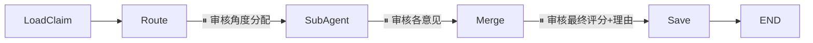

# 事实核查模块 — 实现方案

## 目标

构建事实核查模块 `fact-verifier`，与拆分模块 `fact-extractor` 结构对称：
- 同一 LangGraph StateGraph 模式
- MainAgent 动态路由 → SubAgent 扇出（per-agent config）→ MainAgent 合并
- 二层评分：Claim 层可编辑，News 层算法派生不可编辑
- HITL 支持调整单条事实的置信度和理由
- mode 运行时可切换

---

## 三层评分体系

```
SubAgent ×N (per claim)      Claim MainAgent (per claim)      News 算法
  0 (false)                      汇总 SubAgent 意见              聚合所有 claim score
  0.5 (uncertain)     →          输出 0 / 0.5 / 1       →       + 拆分权重(priority)
  1 (true)                       HITL 可修改                     输出 confidence: 0~1
                                                                 不可修改（派生值）
```

| 层级 | 产出者 | 评分 | 含义 | HITL 可编辑 |
|------|--------|------|------|-----------|
| **SubAgent** | 各核查角度 | `0 \| 0.5 \| 1` | 0=false, 0.5=uncertain, 1=true | 可审核/修改意见 |
| **Claim** | 该 claim 的 MainAgent | `0 \| 0.5 \| 1` | 汇总所有角度后的判定 | ✅ 可直接修改 |
| **News** | 独立算法 | `number (0-1)` | 基于所有 claim score + 权重 | ❌ 不可修改（派生值） |

- 核查图**只负责**产出单条 claim 的 `score: 0 | 0.5 | 1`
- News 整体 `confidence` 在所有 claim 核查完后由独立算法计算（算法 TBD）
- `confidence` 是只读派生值，前端可展示但不可人工覆盖

---

## 1. 拆分 vs 核查 — 对称映射

| | 拆分 (fact-extractor) | 核查 (fact-verifier) |
|---|---|---|
| **输入** | `newsId` → 读整篇 NewsDocument | `newsId` + `claimId` → 读单条 SplitClaim |
| **loadData** | 读 content + visibleContext | 读 claimContent + 原文 content + visibleContext |
| **route** | "从哪些角度拆分？" | "从哪些角度核查？" |
| **SubAgent 输出** | `RawClaim[]` | `SubAgentOpinion { score, reason }` |
| **merge** | 去重合并事实 | 汇总评分 + 综合理由 |
| **save** | claims 写回文档 | 核查结果写回 claim |
| **HITL 可编辑** | routeInstructions, claims | routeInstructions, opinions, **finalScore, finalReason** |

---

## 2. 核查特有类型

```typescript
/** 置信度 — 只接受枚举值 */
export type Confidence = 1 | 0.5 | 0

/** SubAgent 核查意见 */
export interface SubAgentOpinion {
  agentName: string
  priority: Priority
  score: Confidence
  reason: string
  rawResponse: string
}

/** 核查结果（写回 DB） */
export interface VerifyResult {
  claimId: string
  score: Confidence
  reason: string
  opinions: SubAgentOpinion[]
  rawMergeResponse: string
  verifiedAt: Date
}

/** 核查图构建配置 */
export interface VerifyGraphConfig {
  defaultModel: BaseChatModel
  availableAgents: SubAgentConfig[]   // 复用拆分的 SubAgentConfig
  routePromptPath: string
  mergePromptPath: string
  maxConcurrency?: number
}
```

---

## 3. State 定义

```typescript
const VerifyGraphState = Annotation.Root({
  // 输入
  newsId: Annotation<string>,
  claimId: Annotation<string>,

  // 运行时可切换
  mode: Annotation<ExecutionMode>({
    value: (_prev, next) => next,
    default: () => 'auto' as ExecutionMode,
  }),

  // loadClaim 填充
  claimContent: Annotation<string>,
  originalContent: Annotation<string>,         // 原文（供 SubAgent 参照）
  visibleContext: Annotation<Record<string, string>>({
    value: (prev, next) => ({ ...prev, ...next }),
    default: () => ({}),
  }),

  // MainAgent route 输出
  routeInstructions: Annotation<RouteInstruction[]>({
    value: (_prev, next) => next,
    default: () => [],
  }),

  // SubAgent 意见（reducer 合并并发写入）
  subAgentOpinions: Annotation<SubAgentOpinion[]>({
    value: (prev, next) => [...prev, ...next],
    default: () => [],
  }),

  // MainAgent merge 输出（HITL 可调整）
  finalScore: Annotation<Confidence>({
    value: (_prev, next) => next,
    default: () => 0.5 as Confidence,
  }),
  finalReason: Annotation<string>({
    value: (_prev, next) => next,
    default: () => '',
  }),
  rawMergeResponse: Annotation<string>({
    value: (_prev, next) => next,
    default: () => '',
  }),
})
```

---

## 4. 关键 Node 实现

### 4.1 loadClaim

```typescript
async function loadClaim(state) {
  const doc = await NewsModel.findById(state.newsId)
  if (!doc) throw new Error(`News not found: ${state.newsId}`)

  const claim = doc.claims.find(c => c.claimId === state.claimId)
  if (!claim) throw new Error(`Claim not found: ${state.claimId}`)

  const context = doc.context as unknown as NewsContext
  const visibleContext = extractVisibleContext(context)

  return {
    claimContent: claim.content,
    originalContent: doc.content,    // 原文供参照
    visibleContext,
  }
}
```

### 4.2 route（复用拆分的 createRouteNode 模式）

prompt 变量不同：`{{claimContent}}` + `{{originalContent}}` + `{{context}}`

### 4.3 SubAgent Node（输出 opinion 而非 claims）

```typescript
function createVerifySubAgentNode(defaultModel: BaseChatModel) {
  return async (state) => {
    // ... 同拆分的 per-agent model/tools + ReAct 逻辑 ...

    // 解析 opinion
    let opinion: { score: number; reason: string } = { score: 0.5, reason: '' }
    try { opinion = JSON.parse(rawResponse) } catch {}

    // 校验 score 枚举
    const validScores = new Set([1, 0.5, 0])
    const score = validScores.has(opinion.score) ? opinion.score as Confidence : 0.5

    return {
      subAgentOpinions: [{
        agentName: agentConfig.name,
        priority: instruction.priority,
        score,
        reason: opinion.reason,
        rawResponse,
      }],
    }
  }
}
```

### 4.4 merge（汇总评分 + 理由）

```typescript
function createVerifyMergeNode(model, mergePromptPath) {
  return async (state) => {
    // prompt 包含所有 SubAgent 的 score + reason
    // AI 输出最终 { score, reason }
    const response = await model.invoke(prompt)
    const result = JSON.parse(response.content as string)

    // 校验 score 枚举
    const validScores = new Set([1, 0.5, 0])
    const finalScore = validScores.has(result.score) ? result.score : 0.5

    return { finalScore, finalReason: result.reason, rawMergeResponse }
  }
}
```

### 4.5 save（写回 claim 的核查结果）

```typescript
async function saveVerifyResult(state) {
  const doc = await NewsModel.findById(state.newsId)
  const claimIndex = doc.claims.findIndex(c => c.claimId === state.claimId)

  // 写入核查结果到 claim 的 verifyResult 字段
  doc.claims[claimIndex].verifyResult = {
    score: state.finalScore,
    reason: state.finalReason,
    opinions: state.subAgentOpinions,
    rawMergeResponse: state.rawMergeResponse,
    verifiedAt: new Date(),
  }
  await doc.save()
  return {}
}
```

---

## 5. HITL 中断点



| 中断点 | 人审核什么 | 可修改什么 |
|--------|-----------|----------|
| route → subAgent | 从哪些角度核查 | 增删角度、改 priority/hint |
| subAgent → merge | 各 SubAgent 的 score + reason | 修改/删除某个意见 |
| **merge → save** | **单条事实的最终评分 + 理由** | **直接改 finalScore (0/0.5/1) 和 finalReason** |

> 第三个中断点是核查特有的——用户可以直接覆盖 AI 对该条事实的判断。
> 新闻整体 confidence 不在此处编辑，它是所有 claim 核查完后算法派生的。

---

## 6. 数据模型扩展

### NewsDocument 扩展

```diff
  NewsDocument {
    ...
+   confidence?: number           // 新闻整体置信度（算法派生，只读）
+   confidenceUpdatedAt?: Date    // 上次计算时间
    claims: [
      {
        claimId: "1",
        content: "...",
        category: "...",
        sourceAgent: "数据事实",
+       verifyResult?: {
+         score: 1 | 0.5 | 0,     // 该条事实的核查评分（可编辑）
+         reason: string,
+         opinions: SubAgentOpinion[],
+         rawMergeResponse: string,
+         verifiedAt: Date,
+       }
      }
    ]
  }
```

> `confidence` 不由核查图写入，而是在所有 claim 核查完成后由独立的计算函数更新。

### database.ts 新增 Schema

```typescript
const subAgentOpinionSchema = new Schema({
  agentName: { type: String, required: true },
  priority: { type: String, enum: ['high', 'medium', 'low'], required: true },
  score: { type: Number, enum: [1, 0.5, 0], required: true },
  reason: String,
  rawResponse: String,
}, { _id: false })

const verifyResultSchema = new Schema({
  score: { type: Number, enum: [1, 0.5, 0], required: true },
  reason: String,
  opinions: [subAgentOpinionSchema],
  rawMergeResponse: String,
  verifiedAt: Date,
}, { _id: false })

// splitClaimSchema 扩展
const splitClaimSchema = new Schema({
  claimId: { type: String, required: true },
  content: { type: String, required: true },
  category: String,
  sourceAgent: String,
  verifyResult: verifyResultSchema,     // 新增
}, { _id: false })
```

---

## Proposed Changes

### 新增文件

| 文件 | 说明 |
|------|------|
| `electron/fact-verifier/types.ts` | 核查特有类型：Confidence, SubAgentOpinion, VerifyResult, VerifyGraphConfig |
| `electron/fact-verifier/verifier.ts` | LangGraph StateGraph：loadClaim → route → subAgent → merge → save |
| `electron/fact-verifier/index.ts` | 模块导出 |

### 修改文件

| 文件 | 变化 |
|------|------|
| `electron/fact-extractor/types.ts` | 新增 `Confidence` 类型导出（共享） |
| `electron/fact-extractor/database.ts` | splitClaimSchema 加 `sourceAgent` + `verifyResult` |

### 复用文件（不修改）

| 文件 | 复用方式 |
|------|---------|
| `prompt-loader.ts` | 直接 import |
| `database.ts` 的 `NewsModel` / `connectDB` / `disconnectDB` | 直接 import |

---

## Prompt 配置文件

```
prompts/
└── fact-verifier/
    ├── main-agent-route.json      ← "这条事实需要从哪些角度核查？"
    ├── main-agent-merge.json      ← "汇总各角度意见，给出最终评分"
    └── sub-agents/
        ├── logic-consistency.json ← 逻辑一致性
        ├── source-reliability.json← 信源可靠性
        └── data-accuracy.json     ← 数据准确性
```

---

## 新增依赖

无（复用拆分模块已安装的 LangGraph / LangChain 依赖）

---

## Verification Plan

- `npm run dev` / `npx tsc --noEmit` 编译通过
- 验证 verifyResult 正确写入 MongoDB claim 子文档
