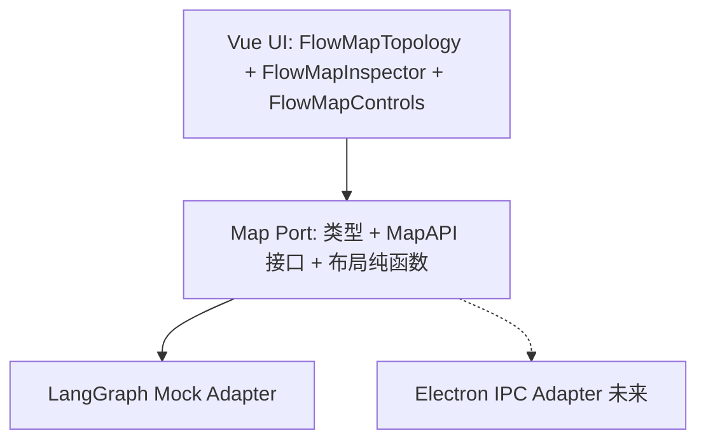

# 007 — Map 层 Port 重建（技术设计）

## 背景与定位

之前的 Map 层实现把 LangGraph 双图编排（split slice / verify slice / routeInstructions / pendingValidatedClaims）泄漏到了前端节点上（`MapNode.scope`、`stage: 'split' | 'verify'`），导致：

- 前端组件里到处是 `scope.kind === 'verify'` 分支
- 布局算法有两套：`hasVerifyWorkers` 时切换
- 拆分完成才 materialize 核查 SubAgent，画布会「阶段性长出新分支」

这些都违反 Map 层的核心定位。本次重建把定位钉死：

> **Map 层 = 前端稳定 Port。前端只认识「节点」和「工具」。后端换 LangGraph、换编排、换存储都不影响前端代码。**

## 架构



三层严格分离：

- **UI**：只消费 `MapSnapshot`，通过 `MapAPI` 发起 mutation
- **Port**：定义 `MapNode` / `MapEdge` / `MapSnapshot` / `MapAPI` + 纯函数（`graph-ops`、`layout`）
- **Adapter**：实现 `MapAPI`，内部持有 LangGraph 形态的 checkpoint，翻译成 `MapSnapshot`

## Port 边界（硬规则）

**前端可见**：

| 概念 | 值 |
|------|----|
| 节点种类 `NodeKind` | `subAgent` \| `claim` \| `opinion` |
| 数据阶段 `DataPhase` | `workerOut` → `pendingValidated` → `persisted` |
| 工具 `ToolKind`（runtime 标记） | `invoke` \| `validate` \| `save` |
| 运行阶段 `RunPhase` | `idle` \| `running` \| `interrupted` \| `completed` |
| 图关系 | `parentId` + `edges`（拓扑，无 `stage` / `scope`） |

**前端 NEVER 见**：`SplitCheckpointSlice`、`VerifyCheckpointSlice`、`verifyByClaimId`、`routeInstructions`、`subAgentResults`、`pendingValidatedClaims`、`FlowScope`、`stage: 'split'|'verify'`、`isBridge`、`edge.kind`。

## 类型（`src/flow-map/types.ts`）

```ts
export type NodeKind = 'subAgent' | 'claim' | 'opinion'
export type ToolKind = 'invoke' | 'validate' | 'save'
export type DataPhase = 'workerOut' | 'pendingValidated' | 'persisted'
export type RunPhase = 'idle' | 'running' | 'interrupted' | 'completed'

interface MapNodeBase {
  id: string
  kind: NodeKind
  parentId?: string
  paramsLocked: boolean
  dataPhase?: DataPhase
  runtime?: { activeTool?: ToolKind; pendingTool?: ToolKind }
}
export interface SubAgentMapNode extends MapNodeBase { kind: 'subAgent'; params: SubAgentParams }
export interface ClaimMapNode    extends MapNodeBase { kind: 'claim';    params: ClaimParams;    dataPhase: DataPhase }
export interface OpinionMapNode  extends MapNodeBase { kind: 'opinion';  params: OpinionParams;  dataPhase: DataPhase }
export type MapNode = SubAgentMapNode | ClaimMapNode | OpinionMapNode

export interface MapEdge { id: string; from: string; to: string }

export interface MapSnapshot {
  newsId: string
  nodes: MapNode[]
  edges: MapEdge[]
  runPhase: RunPhase
  activeNodeId?: string       // HITL 焦点节点
  pendingTool?: ToolKind      // 焦点节点在等待的工具
}
```

「工具」是节点的 runtime 标记：`runtime.activeTool` / `runtime.pendingTool`。图上不画独立的工具方框。

## MapAPI（`src/flow-map/api.ts`）

```ts
export interface MapAPI {
  getSnapshot(newsId: string): Promise<MapSnapshot>
  getSubAgentCatalog(parentNodeId: string): Promise<SubAgentEntry[]>

  addSubAgent(i: AddSubAgentInput): Promise<MapSnapshot>
  updateNodeParams(i: UpdateNodeParamsInput): Promise<MapSnapshot>
  removeNode(i: { newsId: string; nodeId: string }): Promise<MapSnapshot>

  startRun(newsId: string, mode?: ExecutionMode): Promise<{ runId: string }>
  continueStep(newsId: string): Promise<MapSnapshot>
  cancel(newsId: string): Promise<void>
  setMode(newsId: string, mode: ExecutionMode): Promise<void>

  canAddSubAgent(newsId: string, parentNodeId: string): Promise<boolean>
  canEditNode(newsId: string, nodeId: string): Promise<boolean>

  onUpdated(cb: (newsId: string) => void): () => void
}
```

- `addSubAgent` 通过 `parentNodeId` 挂载：`NEWS_ROOT_ID` → 拆分槽位；持久化 claim 节点 id → 该 claim 的核查槽位。Adapter 内部翻译。
- `continueStep` 只推进 `snapshot.activeNodeId`；前端不需要传槽位信息。

## 布局（`src/flow-map/layout.ts`）

- 从 `NEWS_ROOT_ID` BFS 计算深度 → `x = PAD_X + depth * GAP_X`
- 同 parent 的子节点纵向分行
- 节点大小仅按 `kind` 决定：`subAgent`（大）/ `claim`（中）/ `opinion`（中）
- **无 X_SPLIT / X_VERIFY 常量**
- persisted claim 无特殊 "bridge" 逻辑，就是一个普通节点

## Adapter 内部（`src/flow-map/adapters/langgraph-mock.ts`）

内部维护 LangGraph 形态：

```ts
interface InternalCheckpoint {
  newsId: string
  split?: {
    routeInstructions: RouteInstruction[]
    subAgentResults: SubAgentResult[]
    pendingClaims: Record<InstanceId, RawClaim[]>
    activeInstanceId?: string
    pendingTool?: ToolKind
    runPhase: RunPhase
    mode: ExecutionMode
  }
  verifyByClaimId: Record<ClaimId, VerifySlice>
  persistedClaims: PersistedClaim[]
}
```

对外只吐 `MapSnapshot`。执行策略：

- `startRun` → 模拟所有拆分 subAgent invoke，为第一个进入 save 中断
- `continueStep` → commit 当前 activeNodeId 的 pending：
  - 拆分 claim persist 时**立刻** materialize 该 claim 的下游核查 subAgent（idle，仅节点+边）
  - 若还有未完成的拆分槽 → 进入下一拆分 save 中断
  - 否则从 news.claims 顺序找首个未跑核查 → invoke + 首槽 save 中断
- claim / opinion 的 `pendingValidated → persisted` 都通过 `activeNodeId` 唯一推进

## UI

### `FlowMapTopology.vue`

- 消费 `MapSnapshot` + `layoutMapSnapshot(snapshot) → LayoutSnapshot`
- 节点样式按 `kind` + `dataPhase` + `runtime.pendingTool`
- 无 "拆分"/"核查" 语义标签
- 选中节点 → 更新 `store.selectedNodeId`

### `FlowMapInspector.vue`

- 按 `kind` + `dataPhase` 分发编辑表单
- 空画布 + idle → "添加拆分 SubAgent"（`parentNodeId = NEWS_ROOT_ID`）
- 选中 persisted claim + idle → "为此事实添加核查 SubAgent"（`parentNodeId = claim.id`）

### `FlowMapControls.vue`

- 显示 `runPhase` 中文标签
- 运行 / 继续 / 取消 / auto|human-in-loop 切换

## 文件结构

```
src/flow-map/
  types.ts                 # Port 类型
  api.ts                   # MapAPI 接口
  ids.ts                   # NEWS_ROOT_ID + id 生成
  graph-ops.ts             # 锁规则 / canAdd / canEdit（纯函数）
  layout.ts                # 拓扑 BFS 布局
  port.ts                  # getMapAPI() 全局解析
  index.ts                 # 统一导出
  fixtures/
    demo.ts                # 演示种子数据
  adapters/
    langgraph-mock.ts      # Mock 适配器
  # tests
  graph-ops.spec.ts
  layout.spec.ts
  adapters/langgraph-mock.spec.ts

src/stores/flow-map.ts
src/composables/use-flow-map.ts
src/config/map-flow.ts

src/components/flow/
  FlowMapTopology.vue
  FlowMapInspector.vue
  FlowMapControls.vue

src/mocks/
  flow-map-seed.ts
  flow-map-api.ts

vitest.config.ts
```

## 验收（硬指标）

1. `rg -n "SplitCheckpointSlice|verifyByClaimId|routeInstructions|subAgentResults|pendingValidatedClaims|FlowScope" src/flow-map src/stores/flow-map.ts src/composables/use-flow-map.ts src/components/flow/FlowMap*.vue` → **零匹配**
2. `rg -n "stage === 'split'|stage === 'verify'|scope\\.kind" src/flow-map src/stores/flow-map.ts src/composables/use-flow-map.ts src/components/flow/FlowMap*.vue` → **零匹配**
3. `MapSnapshot` / `MapNode` / `MapEdge` 上无 `stage`、`scope`、`isBridge`、`edge.kind`
4. `dev:web`：拆分 save 后画布右侧立即出现该事实的核查 subAgent（idle），拓扑不发生"换布局"跳变
5. `vue-tsc --noEmit` 通过；`npm run test:map` 通过

## 不在本期

- 真实 Electron IPC Adapter 接线
- 后端 `verifyResult` 落库
- 删除 legacy `useUnifiedFlowFromNews.ts` 等（`USE_MAP_FLOW=0` 时仍走它）
