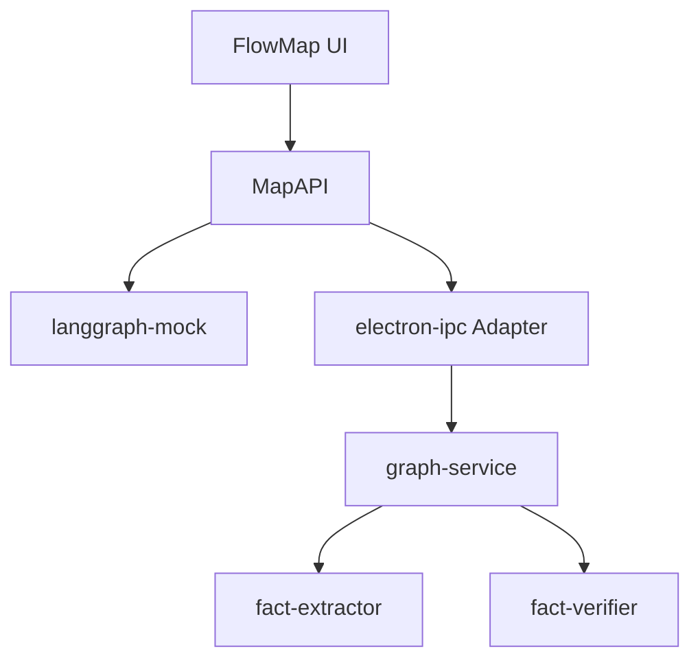

# 008 — LangGraph 接入 Map 层（技术设计）

## 目标

把现有 Electron / LangGraph 双图（split、verify）接到 Map Port（`MapAPI` / `MapSnapshot`），使 `USE_MAP_FLOW=1` 在真机与 mock 下行为一致。

## 两条主规则

1. **节点 = 有可改 `params`；工具 = 无参动作**（`invoke` / `validate` / `save`），只挂在 `runtime` / 快照级 `pendingTool`。
2. **一次 interrupt 对应一个节点**：`interrupted` 时有且仅有一对 `(activeNodeId, pendingTool)`。禁止批处理 save 伪装成单次 interrupt。

## 架构



- UI / Port **永不**见 `GraphType`、`routeInstructions`、`startSplit` / `startVerify`。
- Adapter 把两张图投影成**一张**拓扑：`news → subAgent → claim → verifySubAgent → opinion`。
- claim 单条 persist 后立刻 materialize 该 claim 下的核查 SubAgent（idle）。

## SubAgent 从哪来（两处 Route Agent + 人工加槽）

**新闻有 Split Route Agent，每条 claim 有 Verify Route Agent。** 都是：AI route 先预置，人工之后仍可加槽。

| 作用域 | Route Agent | 焦点（invoke 配置期） |
|--------|-------------|----------------------|
| 整篇新闻 | Split `route` → 拆分 subAgents | `news`（`NEWS_ROOT_ID`） |
| 单条 claim | Verify `route` → 该 claim 下核查 subAgents | 该 `claim` 节点 |

| 来源 | 何时 |
|------|------|
| **Route Agent** | split：`startRun` 后；verify：claim **save 落盘时**跑该 claim 的 verify route |
| **人工 idle / 落盘前预置** | `addSubAgent`；与 route 结果**合并** |
| **人工在 invoke 配置期加槽** | `pendingTool=invoke` 时仍可 `addSubAgent` |

流程：

```text
startRun → Split Route Agent 预置拆分槽
        → invoke 中断（焦点=news，人工可再加拆分槽）
        → continue → 并行 invoke → 按条 claim save
        → 每条 claim 落盘：Verify Route Agent 预置该 claim 的核查槽（idle，图画完整）
        → 拆分全 persist 后：逐 claim
              invoke 中断（焦点=claim，人工可再加核查槽）
              → continue → 核查 invoke → opinion save …
```

后端两边都是 `createRouteNode`：**始终跑 AI route**，再 merge 人工预置。Port 不区分槽来源。

## 节点 / 工具 / 焦点

| 概念 | 定义 |
|------|------|
| 节点 | `news` / `subAgent` / `claim` / `opinion`，有 `params` |
| 工具 | 无 `params`；`pendingTool` / `activeTool` |
| 焦点节点 | `activeNodeId` 指向的唯一节点；「继续」只提交该节点上的当前工具 |

并行：SubAgent **invoke 扇出**可并行。串行：HITL 确认（validate/save）按节点排队。

## 双图 → 一张 Map 图

| 时刻 | Adapter 行为 | 快照 |
|------|--------------|------|
| idle | news + 可选人工预置槽 | news（± subAgents） |
| startRun | Route Agent 配槽（合并人工预置） | subAgents；**invoke 中断**（人工可再加槽） |
| continueStep(invoke) | 并行 invoke 当前全部槽 | claims workerOut；焦点首条 **save** |
| continueStep(save claim) | persist 该条；**Verify Route Agent** 预置该 claim 核查槽 | claim persisted + idle verify subAgents |
| 拆分 claim 全 persist | 首个 claim 上 **verify invoke 中断**（Route 已配，可再加槽） | pendingTool=invoke，焦点=claim |
| continueStep(verify invoke) | 跑该 claim 当前全部核查槽 | opinion save 中断… |
| 全部完成 | runPhase=completed | 完整拓扑 |

`newsId → runId` 仅 Adapter 内部；换 verify run 时 Map 的 `runPhase` 不闪回 idle（除非 cancel）。

## 后端变更

### Interrupt 载荷

```ts
focus?: { kind: 'subAgent' | 'claim' | 'opinion'; id: string }
pendingTool?: 'invoke' | 'validate' | 'save'
```

### Per-node save（split）

merge 之后进入循环节点 `saveNext`：

- state：`saveCursor`、`mergedClaims`
- interruptBefore `saveNext`，focus = 当前 claim
- resume 后只写库该条 claim，cursor++，未完则回到 `saveNext`，否则 END

### Per-node save（verify）

对称：按 `subAgentOpinions` 下标 interrupt，每次写入/更新该条 opinion 到 claim.verifyResult。

### IPC 新增 / 扩展

| API | 说明 |
|-----|------|
| `catalog.list(module)` | 暴露 sub-agent-catalog |
| `graph.getActiveRun(newsId)` | `{ runId, graphType, mode, focus?, pendingTool?, state? } \| null` |
| `startSplit({ routeInstructions? })` | **可选人工预置**；与 AI route **合并**，不替代 route |
| `RouteInstruction.instanceId?` | 稳定 Map 节点 id |

### 异常

- `MapSnapshot.error?: string`
- `RunPhase` 增加 `error`（失败后保留拓扑）
- Adapter 订 `events.onError` → 写 `error` + `runPhase='error'` + `onUpdated`

## SubAgent / 产出节点的真实参数（相对后端）

后端 route 实例是 `RouteInstruction`，worker 实际用到：

| 字段 | 来源 | 用途 |
|------|------|------|
| `agentName` | route / catalog | 解析 `SubAgentConfig` |
| `priority` | route（必填） | 扇出排序、merge 加权、写入 results |
| `hint` | route（可选） | 注入 SubAgent prompt `{{hint}}` |
| `instanceId` | Adapter / route 补齐 | Map 节点稳定 id |

注册表 `SubAgentConfig`（`promptPath` / `model` / `tools`）是能力配置，**不进** Map 节点可编辑 params。

Map Port 必须对齐的可编辑面：

```ts
SubAgentParams {
  agentName: string
  displayLabel: string
  description?: string  // catalog 只读展示
  priority: Priority    // 可改
  hint?: string         // 可改
}
```

产出对齐：

- `ClaimParams`：`content` / `category` / `sourceAgent?`（**去掉**误放在 claim 上的 `priority`，priority 属于槽）
- `OpinionParams`：`content`（reason）/ `confidence`（score）/ `priority` / `evidence?`

invoke 配置期 Inspector 编辑的是槽上的 `priority`/`hint`；`continueStep(invoke)` → `resume({ routeInstructions })` 带上完整列表。

## 不在本期

- 把 split/verify 合成一张 LangGraph
- 独立 opinion 表
- 去重等新 ToolKind（契约已支持扩展，本期不实现）
- 把 `SubAgentConfig.model` / `tools` 暴露为 Map 可编辑字段
