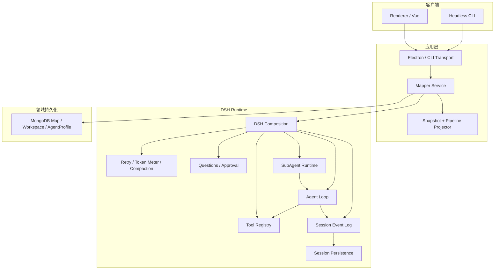

# 046 — DSH 原生运行架构

> 本文为第一版设计记录，已被 `049-DSH多人协作重构执行计划.md` 取代，不再直接执行。

## 1. 决策摘要

重明下一版采用 DSH-first 架构：

- DSH 是唯一 Agent Runtime，负责 session、消息、模型循环、工具、SubAgent、流式事件、取消、重试和 Agent 内部恢复。
- Mapper 是唯一领域服务，负责 Map CRUD、Source/News/Claim/VerifyResult、不变式、级联失效和最终写入。
- MongoDB 只保存已经接受的领域数据；DSH Session Persistence 只保存运行过程。
- Renderer 只读取 `MapperSnapshot` 并发送 `MapperCommand`。
- 删除 LangChain/LangGraph 和自研 `AgentLoop`、调用账本、运行 checkpoint。
- 不同时维护旧运行路径，不提供兼容层，不迁移旧 run/checkpoint 数据。

本方案所谓“最大化利用 DSH”，是最大化复用 DSH 已经解决的运行时问题，不是安装全部插件。固定的 Parse/Split/Verify 仍由普通 TypeScript 领域代码描述，不启用 model-written Workflow、Agent Team、Shell、LSP、Goal、Plan、Todo。

## 2. 最终架构



依赖规则：

```text
renderer  → contracts
transport → mapper
mapper    → domain + DSH public services
DSH       → DSH packages + platform adapters
platform  → Mongo / filesystem / Electron
```

禁止：

```text
renderer → electron/**
renderer → DSH
mapper   → Vue / Electron / LangGraph
DSH      → MapperDocument / Vue
Mongo    → DSH SessionEvent
```

## 3. 最终目录

```text
src/
├─ contracts/
│  ├─ domain.ts                 # Source/News/Claim/VerifyResult
│  ├─ mapper.ts                 # Query/Command/Result/API
│  └─ snapshot.ts               # Renderer DTO
│
├─ mapper/
│  ├─ service.ts                # read/dispatch/watch 组合入口
│  ├─ document-store.ts         # Mongo 领域文档读写
│  ├─ commands.ts               # Map/Node CRUD 与级联失效
│  ├─ pipeline.ts               # 固定业务流水线
│  ├─ stages.ts                 # Parse/Split/Verify
│  ├─ project.ts                # Document + Session → Snapshot
│  └─ agent-profiles.ts         # Workspace AgentProfile 解析
│
├─ runtime/
│  └─ dsh/
│     ├─ composition.ts         # 唯一 DSH 装配点
│     ├─ sessions.ts            # run session 创建/恢复/关闭
│     ├─ agents.ts              # AgentProfile → DSH Agent
│     ├─ subagents.ts           # named SubAgent 调用
│     ├─ schemas.ts             # 结构化 route/split/verify 输出
│     ├─ events.ts              # chongming/* session events
│     ├─ projection.ts          # session events → RunProjection
│     ├─ interaction.ts         # Renderer question/approval bridge
│     └─ tools/
│        └─ web-search.ts       # DSH ToolDefinition
│
├─ platform/
│  ├─ mongo.ts                  # schema、连接、revision
│  ├─ settings.ts               # app/db/model 配置
│  ├─ files.ts                  # 导入导出与本地源文件
│  └─ paths.ts                  # 数据目录
│
├─ renderer/
│  ├─ components/               # 现有视觉组件机械迁移
│  ├─ flow-map/                 # 纯布局和展示
│  ├─ stores/
│  │  ├─ mapper.ts              # 唯一 Map 业务 store
│  │  ├─ workspace.ts
│  │  └─ tabs.ts
│  └─ main.ts
│
└─ entries/
   ├─ desktop/
   │  ├─ main.ts
   │  ├─ preload.ts
   │  └─ ipc.ts
   └─ cli/
      ├─ main.ts
      └─ commands.ts
```

## 4. 状态所有权

### 4.1 MongoDB：领域事实

```ts
interface MapDocument {
  id: string
  workspaceId: string
  name?: string
  sources: SourceRecord[]
  news: NewsRecord[]
  claims: ClaimRecord[]
  activeRunSessionId?: string
  revision: number
  createdAt: string
  updatedAt: string
}

interface NewsRecord {
  id: string
  sourceId?: string
  content: string
  context: NewsContext
  splitCompletedAt?: string
}
```

MongoDB 不再保存：

- `MapperRun`
- `MapperCallRecord`
- `status/step/pauseReason`
- Agent prompt、message、tool call、stream chunk
- pending draft
- Timeline 数字坐标

`activeRunSessionId` 只是 Map 到当前 DSH Session 的定位指针，不是第二份运行状态。

### 4.2 DSH Session：执行事实

DSH 原生事件保存 turn、step、message、tool 和 Agent 生命周期。重明只增加四类领域事件：

```ts
type ChongMingSessionEvent =
  | { type: 'chongming/run-start'; mapId: string; scopeId?: string; until: DataState; mode: RunMode }
  | { type: 'chongming/stage-start'; stage: Stage; targetId: string }
  | { type: 'chongming/draft'; stage: Stage; targetId: string; value: unknown }
  | { type: 'chongming/stage-commit'; stage: Stage; targetId: string; mapRevision: number }
```

不为已有 DSH 事件再造别名；Agent 调用、工具调用、错误、取消、流式内容直接消费 DSH 原生事件。

### 4.3 Renderer：临时交互状态

仅保存在 Pinia：

- 当前 tab
- 选中节点
- Timeline 的 `until`
- 面板尺寸和缩放
- 待回答问题的本地表单内容

Renderer 不保存运行状态副本；重连后从 Mapper Snapshot + DSH projection 重建。

## 5. Pipeline 机制

内部删除 `MapperTimeline`。用户运行请求改为：

```ts
interface RunStartCommand {
  type: 'run.start'
  mapId: string
  scopeId?: string
  until: 'news' | 'claims' | 'verified'
  mode: 'auto' | 'human-in-loop'
}
```

固定流程：

```text
Source --parse--> News --split--> Claims --verify--> VerifyResult
```

任务规划规则：

1. Source 没有对应 News：生成 parse task。
2. News 没有 `splitCompletedAt`：生成 split task；允许合法地产生 0 条 Claim。
3. Claim 没有 verify：生成 verify task。
4. 超过 `until` 的任务不生成。
5. 业务目标之间按文档顺序执行；同一任务内 SubAgent 并行。

上游编辑失效规则：

- 更新 Source：删除其派生 News、Claims 和 VerifyResult。
- 更新 News 内容或 AI context：清除 `splitCompletedAt`，删除其 Claims。
- 更新 Claim 内容：删除该 Claim 的 VerifyResult。

## 6. DSH 运行组合

第一阶段装配：

```text
Cordis context
DSH session
DSH system-prompt
DSH tools
DSH agent + agent-loop
LLM adapter
session persistence SQLite
session checkpoint policy
LLM retry
SubAgent runtime
structured output
```

在长任务测试证明有需要后再装配：

```text
token meter
basic compaction
tool-result pruner
session projection cache
session query
```

本次明确不装配：

```text
workflow-worker-thread
tool-workflow
agent-team
goal / plan / todo
shell / terminal / filesystem / LSP
sandbox
jobs
API Gateway
```

原因：它们解决的是动态 coding-agent 或远程平台问题，不解决当前固定事实核查流水线。Electron Main 内嵌 DSH；只有出现远程多设备运行需求时才单独规划 DSH Host + API Gateway。

## 7. Agent 与 SubAgent 映射

```text
fact-parser/extract                 → parse Agent
fact-extractor/main-agent-route     → split route Agent
fact-extractor/sub-agents/*         → named split SubAgent
fact-extractor/main-agent-merge     → split merge Agent
fact-verifier/main-agent-route      → verify route Agent
fact-verifier/sub-agents/*          → named verify SubAgent
fact-verifier/main-agent-merge      → verify merge Agent
```

每次 `run.start` 创建父 Session：

```text
run:<mapId>:<uuid>
```

每个 route/worker/merge 是该 run 的一次性子 Session。稳定 label 用于 UI，SessionId 由 DSH 生成并记录父子关系，不再拼接业务 callId。

## 8. HITL

Mapper 决定何时需要人工输入，DSH interaction service 负责等待、恢复和审计：

```text
confirm-route → question
validate      → question（允许编辑结构化草稿）
save          → approval
```

Renderer 只实现 Question/Approval provider；关闭窗口后未决交互由 Session 恢复。自动模式不创建这些请求。

## 9. 一致性与失败语义

- DSH Session 先记录 draft，再尝试 Mongo commit。
- Mongo commit 成功后追加 `chongming/stage-commit(mapRevision)`。
- 若进程死在 Mongo commit 之后、commit event 之前，恢复时按 Map revision 和目标实体检测已提交结果，补写 commit event，不重复领域写入。
- Map 写入继续使用 revision 乐观锁。
- 第一阶段保留 Map lease，防止两个本地进程同时编辑同一 Map；独立 DSH Host 落地后再删除 lease。
- Agent/tool 调用由 DSH session checkpoint 恢复，不再由 Mapper 重放调用账本。
- `run.cancel` 调用 DSH Agent cancel；取消不会自动继续。

## 10. Public Mapper API

保留唯一三个方法，避免 Renderer 大改：

```ts
interface MapperAPI {
  read(query: MapperQuery): Promise<MapperReadResult>
  dispatch(command: MapperCommand): Promise<MapperDispatchResult>
  watch(listener: (event: MapperUpdated) => void): () => void
}
```

删除 `timeline.update`，调整 `run.start`，其余 CRUD 命令按产品行为保留。

## 11. 非目标

- 旧数据库运行状态迁移。
- LangGraph 与 DSH 双运行。
- DSH Runtime 可插拔抽象层。
- 自定义通用 EventBus、Repository class、DI container。
- 历史时间旅行和 Map 版本分支。
- 远程 DSH Server。
- 模型自主生成产品工作流代码。

## 12. 成功标准

1. 代码中不存在 LangChain/LangGraph import。
2. 代码中不存在自定义 `AgentLoop`、`MapperCallRecord` 和 `checkpointTail`。
3. 杀死进程后，同一 run session 可以恢复到未完成 Agent step。
4. 并行 SubAgent 已完成结果不重复执行。
5. HITL 关闭应用后仍可继续。
6. Mongo 只出现接受后的领域数据，不出现 Agent 消息和运行草稿。
7. Renderer 不 import `electron/**`、DSH 或 Mongo 类型。
8. Desktop 与 CLI 使用同一个 `createApplication()` composition。
9. 所有现有领域、布局、导入导出测试通过；新增 DSH 恢复测试通过。
