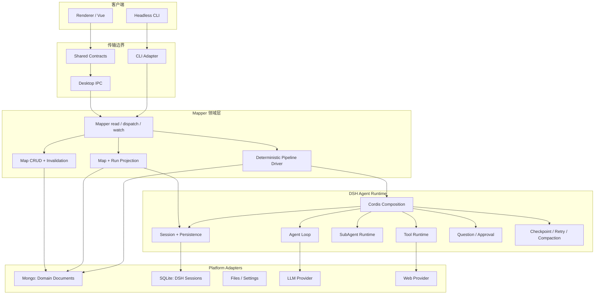

# 047 — DSH 插件化重构总计划

> 本文是能力最大化研究稿，已被 `049-DSH多人协作重构执行计划.md` 取代，不再直接执行。

## 0. 文档地位

本文记录完整风险与能力边界；最终执行范围以 048 为准。

本次只规划，不修改业务代码。正式实施前必须先保护当前工作树；当前仓库存在未提交修改，禁止通过 reset、checkout 或覆盖文件的方式清理。

## 1. 最终决策

重明采用三层主架构：

```text
Renderer → Mapper → DSH Runtime
```

其中：

- Renderer 只展示 Snapshot、提交 Command、回答 Interaction。
- Mapper 只负责事实核查领域数据、固定 Pipeline、Mongo commit 和 Snapshot 投影。
- DSH 是唯一 Agent Runtime，负责 Session、Agent loop、模型、Tool、SubAgent、流式事件、重试与 Agent 运行记录。
- Platform 是三层旁边的适配器，不是第四层业务架构。
- 删除 LangChain、LangGraph、自研 AgentLoop、自研 call ledger 和数字化 MapperTimeline。
- 不保留旧 API、旧 schema、双读、双写或运行时兼容分支。

## 2. 必须接受的 DSH 语义

### 2.1 DSH 不能从半个函数原地继续

DSH Session Persistence 保存 append-only SessionEvent。进程在 turn 中崩溃后，冷恢复会保留已持久前缀，并补齐 interrupted turn；它不会恢复 JavaScript 栈、Promise 或从函数中间继续。

因此：

```text
DSH 恢复       = 恢复 Agent 会话与已持久事件
Mapper 恢复    = 根据领域数据和 RunProjection 决定下一业务 task
```

计划中禁止使用“精确恢复未完成 Agent step”这一表述。

### 2.2 Tool checkpoint 不是 exactly-once

DSH checkpoint policy 可以在模型请求、顶层 Tool 副作用和 step 边界前 flush。若崩溃发生在 Tool 已产生外部效果、但结果尚未持久化之间，恢复结果是 `TOOL_OUTCOME_UNKNOWN`，不能证明 Tool 是否执行成功。

规则：

- 只读 Tool 可以重试。
- 写 Tool 必须接受稳定 idempotency key 或先查询外部状态。
- 模型不得直接调用 Map commit Tool；最终 Mongo 写入由 Mapper 完成。

### 2.3 Structured output 不是成功保证

SubAgent 请求 schema 后仍可能以 error、partial 或无有效 structured result 结束。Mapper 必须在信任边界验证结果；不得删除所有结果校验，只删除 Markdown/JSON 猜测式容错解析。

### 2.4 Pending Interaction 不能凭假设恢复

Approval 的 ask/outcome 可以进入 Session Log，但进程退出后等待中的 Promise 不存在。Spike 必须验证恢复 API；若 DSH 不自动重建 pending request，则 `RunProjection` 根据“request 无 outcome”重新发布同一 interactionId。

### 2.5 Session Persistence 没有通用删除/保留 API

第一版不开发私有 SQLite 清理器，也不依赖 DSH 私有表。先保留 Session；只有磁盘规模实测需要时，再使用官方 retention API 或单独设计可替换 persistence provider。

## 3. 最终架构图



### 3.1 唯一允许的依赖方向

```text
renderer/*        → contracts/*
desktop/*         → contracts/* + app/application
cli/*             → contracts/* + app/application
app/mapper/*      → contracts/* + app/domain/* + app/runtime/dsh public facade
app/runtime/dsh/* → DSH packages + app/platform/*
app/platform/*    → Mongoose / filesystem / Electron-independent settings
```

禁止：

```text
renderer → electron、Mongoose、DSH
mapper   → Vue、Electron、LangChain、LangGraph
DSH      → Vue、MapperDocument schema
platform → Mapper service
```

## 4. 最终目录结构

```text
ChongMing/
├─ contracts/
│  ├─ domain.ts
│  ├─ mapper.ts
│  └─ snapshot.ts
│
├─ app/
│  ├─ application.ts
│  ├─ domain/
│  │  ├─ model.ts
│  │  ├─ ids.ts
│  │  └─ context.ts
│  ├─ mapper/
│  │  ├─ service.ts
│  │  ├─ store.ts
│  │  ├─ commands.ts
│  │  ├─ pipeline.ts
│  │  ├─ stages.ts
│  │  ├─ project.ts
│  │  └─ agent-profiles.ts
│  ├─ runtime/dsh/
│  │  ├─ composition.ts
│  │  ├─ sessions.ts
│  │  ├─ agents.ts
│  │  ├─ schemas.ts
│  │  ├─ events.ts
│  │  ├─ projection.ts
│  │  ├─ interaction.ts
│  │  └─ web-tavily.ts
│  └─ platform/
│     ├─ mongo.ts
│     ├─ settings.ts
│     ├─ files.ts
│     └─ paths.ts
│
├─ renderer/
│  ├─ components/
│  ├─ chrome/
│  ├─ composables/
│  ├─ flow-map/
│  ├─ stores/
│  │  ├─ mapper.ts
│  │  ├─ workspace.ts
│  │  └─ tabs.ts
│  ├─ views/
│  └─ main.ts
│
├─ desktop/
│  ├─ main.ts
│  ├─ preload.ts
│  └─ ipc.ts
│
├─ cli/
│  ├─ main.ts
│  └─ commands.ts
│
└─ tests/
   ├─ domain/
   ├─ mapper/
   ├─ runtime/
   ├─ renderer/
   └─ integration/
```

不创建 `repositories/`、`use-cases/`、`ports/`、`adapters/`、`factories/` 等只有单一实现的目录。

## 5. 三份状态及其所有者

### 5.1 Mongo：已经接受的领域事实

```ts
interface MapDocument {
  id: string
  workspaceId: string
  name?: string
  sources: SourceRecord[]
  news: NewsRecord[]
  claims: ClaimRecord[]
  routes: RouteRecord[]
  activeRunSessionId?: string
  revision: number
  createdAt: string
  updatedAt: string
}
```

新增最小幂等标记：

```ts
interface StageStamp {
  taskKey: string
  inputRevision: number
  completedAt: string
}

interface SourceRecord {
  // existing fields
  revision: number
}

interface NewsRecord {
  // existing fields
  revision: number
  parse?: StageStamp
  split?: StageStamp
}

interface ClaimRecord {
  // existing fields
  revision: number
  verify?: VerifyResult
}

interface VerifyResult {
  // existing fields
  stage: StageStamp
}
```

用途：若 Mongo commit 成功、但 DSH `stage-commit` 事件尚未 flush，恢复时可以根据 taskKey 判断已经写入，补写事件而不重复保存。

实体 revision 只在影响该实体后续计算的输入变化时递增：内容、AI context 或该实体的 route 配置变化。AgentProfile 更新不自动推翻已经接受的历史结果；用户显式重新运行时才使用新 Profile。

Mongo 删除：

```text
run
timeline
MapperCallRecord schema
AgentCall schema
status / step / pauseReason / draft
```

### 5.2 DSH Session：执行事实

DSH 原生事件直接保存模型、Tool、消息和 turn。重明只扩展必要的业务事件：

```ts
type ChongMingRunEvent =
  | { type: 'chongming/run-start'; runId; mapId; scopeId?; until; mode }
  | { type: 'chongming/task-start'; taskKey; stage; targetId; inputRevision; childSessionIds }
  | { type: 'chongming/draft'; taskKey; value }
  | { type: 'chongming/interaction'; taskKey; interactionId; kind; status; value? }
  | { type: 'chongming/task-commit'; taskKey; mapRevision }
  | { type: 'chongming/run-end'; result }
```

每个业务事件 append 后，只有在下一外部副作用依赖它时才显式 `sessions.flush()`；不对每个 stream chunk 手工 flush。

### 5.3 Renderer：可丢弃的 UI 状态

只保存：

```text
activeTabId
selectedNodeId
pipelineUntil
panel sizes
draft form input
```

`runPhase`、worker 完成数、待确认状态和 stream 均从 Snapshot 重建。

## 6. 业务 Pipeline

```text
Source --parse--> News --split--> Claims --verify--> VerifyResult
```

### 6.1 Run 请求

删除 `timeline.update`。运行命令改为：

```ts
type RunStart = {
  type: 'run.start'
  mapId: string
  scopeId?: string
  until: 'news' | 'claims' | 'verified'
  mode: 'auto' | 'human-in-loop'
}
```

### 6.2 Task 规划

```text
Source 无有效派生 News       → parse
News 无当前 revision 的 split → split
Claim 无当前 revision verify  → verify
```

`taskKey` 必须确定性生成：

```text
<stage>:<targetId>:<inputRevision>
```

第一版：业务 task 串行；一个 task 内的 SubAgent 有界并行。不开跨 Source 并发，也不用 DSH Workflow Worker。

### 6.3 上游编辑失效

```text
更新 Source → 删除派生 News 与 Claims
更新 News   → 清除 split stamp 并删除 Claims
更新 Claim  → 清除 VerifyResult
更新 Route  → 递增其 parent 实体 revision，并执行相同下游失效
```

失效和用户编辑必须在同一个 Mongo revision commit 中完成。

### 6.4 Crash 恢复

`pipelineResume()` 加载 `activeRunSessionId`，折叠 DSH 事件，并执行：

| 最后状态 | 恢复动作 |
|---|---|
| `task-commit` 已存在 | 跳过 task |
| Mongo 有相同 taskKey，缺 commit event | 补写 `task-commit` |
| draft 已持久化，未批准 | 重建同一 interactionId |
| draft 已批准，Mongo 未写 | 幂等 commit |
| child turn 完整结束，parent 未记录 draft | 从 child Session 读取并验证 structured result |
| child turn interrupted | 开新 turn，携带恢复说明继续或重试 |
| Tool outcome unknown | 只读 Tool 可重试；写 Tool 要求人工确认/外部核对 |
| run 已取消 | 不自动恢复 |

这是一种“从持久边界继续”，不是恢复进程内调用栈。

## 7. DSH Plugin 设计

### 7.1 官方插件组合

Spike 锁定确切版本后，只装配实际使用的包：

```text
@deepseek-ai/cordis
@deepseek-ai/dsh-session
@deepseek-ai/dsh-session-persistence-sqlite
@deepseek-ai/dsh-session-checkpoint-policy
@deepseek-ai/dsh-system-prompt
@deepseek-ai/dsh-tools
@deepseek-ai/dsh-agent
@deepseek-ai/dsh-agent-loop
@deepseek-ai/dsh-llm-*
@deepseek-ai/dsh-llm-retry
@deepseek-ai/dsh-subagent
@deepseek-ai/dsh-subagent-spawn-in-process
```

长上下文测试证明需要后才增加：

```text
@deepseek-ai/dsh-token-meter
@deepseek-ai/dsh-compaction-basic
@deepseek-ai/dsh-compaction-tool-result-pruner
```

### 7.2 重明自有插件

只创建三个：

1. `chongming-run-events`：声明业务 SessionEvent，并注册 RunProjection。
2. `chongming-interaction`：把 question/approval 请求桥接到 Mapper watch/Renderer answer。
3. `chongming-web-tavily`：如 DSH 没有满足当前配置的 Tavily Provider，则实现 `ctx.web` Provider；模型侧复用官方 `tool-web`。

不为 Parse、Split、Verify、每个 AgentProfile 或每个 CRUD command 创建插件。

### 7.3 Scope

```text
Host scope       → Session persistence、LLM provider、Web provider
Workspace scope  → Workspace AgentProfile 和默认模型
Run scope        → 本次 run 的 system prompt、允许 tools、interaction
Child scope      → 单个 SubAgent 的 prompt、model、tools
```

Scope 负责可见性和生命周期，不作为安全沙箱。

### 7.4 明确不采用

```text
Workflow Worker
Agent Team
Goal / Plan / Todo
Shell / Terminal / Filesystem / LSP
Jobs
Sandbox
API Gateway
动态插件安装
```

触发条件出现时再立新设计文档，不为未来预留空接口。

## 8. AgentProfile 映射

保留 Agent Manager 产品能力，但把三套来源合并成一套 `AgentProfile`：

```ts
interface AgentProfile {
  id: string
  workspaceId: string
  role: 'parse' | 'route' | 'worker' | 'merge'
  stage: 'parse' | 'split' | 'verify'
  name: string
  prompt: string
  model?: string
  baseUrl?: string
  tools: string[]
  priority?: Priority
}
```

当前映射：

```text
fact-parser/extract             → parse
fact-extractor/main-agent-route → split route
fact-extractor/sub-agents/*     → split worker
fact-extractor/main-agent-merge → split merge
fact-verifier/main-agent-route  → verify route
fact-verifier/sub-agents/*      → verify worker
fact-verifier/main-agent-merge  → verify merge
```

AgentProfile 不是 Cordis Plugin。`agents.ts` 在 Child scope 中读取 Profile 并注册 prompt/model/tools。

## 9. 最终函数清单

### 9.1 Contracts

`contracts/mapper.ts`

```text
MapperAPI.read()
MapperAPI.dispatch()
MapperAPI.watch()
```

### 9.2 Mapper

`app/mapper/service.ts`

```text
mapperCreate(application)
mapperRead(query)
mapperDispatch(command)
mapperWatch(listener)
mapperEmit(mapId)
```

`app/mapper/store.ts`

```text
mapDocumentCreate()
mapDocumentRead()
mapDocumentList()
mapDocumentCommit()
mapDocumentDelete()
```

`app/mapper/commands.ts`

```text
mapCreateNode()
mapUpdateNode()
mapDeleteNode()
mapUpdateName()
mapInvalidateSource()
mapInvalidateNews()
mapInvalidateClaim()
```

`app/mapper/pipeline.ts`

```text
pipelineReadTasks()
pipelineStart()
pipelineResume()
pipelineContinue()
pipelineCancel()
pipelineRunTask()
pipelineCommitDraft()
pipelineRepairCommit()
pipelineReadTaskKey()
```

`app/mapper/stages.ts`

```text
stageRunParse()
stageRunSplit()
stageRunVerify()
stageRunRoute()
stageRunWorkers()
stageRunMerge()
```

`app/mapper/project.ts`

```text
projectReadMap()
projectReadPipeline()
projectReadSnapshot()
```

`app/mapper/agent-profiles.ts`

```text
agentProfileList()
agentProfileRead()
agentProfileCreate()
agentProfileUpdate()
agentProfileDelete()
agentProfileReadStage()
```

### 9.3 DSH runtime

`app/runtime/dsh/composition.ts`

```text
dshCreateRuntime()
dshDeleteRuntime()
```

`sessions.ts`

```text
dshCreateRunSession()
dshReadRunSession()
dshResumeRunSession()
dshCancelRunSession()
dshFlushSession()
```

`agents.ts`

```text
dshCreateChildSessionId()
dshRunAgent()
dshReadAgentResult()
dshRunSubagents()
```

`events.ts`

```text
dshAppendRunStart()
dshAppendTaskStart()
dshAppendDraft()
dshAppendInteraction()
dshAppendTaskCommit()
dshAppendRunEnd()
```

`projection.ts`

```text
dshProjectRun()
dshProjectStream()
dshProjectInteraction()
```

`interaction.ts`

```text
dshRequestQuestion()
dshRequestApproval()
dshResolveInteraction()
```

`schemas.ts`

```text
routeOutputSchema
splitOutputSchema
verifyOutputSchema
mergeOutputSchema
```

## 10. 文件迁移与删除清单

### 10.1 直接删除

```text
electron/agent-loop/langgraph.ts
electron/mapper/index.ts
electron/mapper/types.ts
electron/mapper/service.ts
electron/mapper/document.ts
electron/mapper/output.ts
electron/mapper/project.ts
electron/mapper/stages/parse.ts
electron/mapper/stages/split.ts
electron/mapper/stages/verify.ts
electron/shared/llm-model.ts
electron/shared/llm-utils.ts
electron/tools/index.ts
electron/tools/web-search.ts
src/stores/run-coordinator.ts
src/flow-map/timeline.ts
src/flow-map/timeline-project.ts
src/.DS_Store
```

删除动作只能在新路径完成切换且测试通过后执行。

### 10.2 合并后删除

| 当前文件 | 目标 | 处理 |
|---|---|---|
| `electron/api/agent-registry-service.ts` | `app/mapper/agent-profiles.ts` | 合并 CRUD |
| `electron/api/catalog-service.ts` | 同上 | 删除重复 catalog |
| `electron/api/sub-agent-catalog.ts` | 同上 | 删除磁盘扫描缓存 |
| `electron/api/local-agent-service.ts` | 同上 | 删除第二份 Agent store |
| `electron/api/prompt-config-service.ts` | 同上 | Prompt 成为 AgentProfile 字段 |
| `electron/shared/prompt-loader.ts` | 同上 | 初始配置仅用于 seed |
| `electron/shared/prompt-migrate.ts` | 删除 | 不做兼容迁移 |
| `electron/shared/prompt-output.ts` | `runtime/dsh/schemas.ts` | 改为严格 schema |
| `electron/shared/prompt-vars.ts` | `mapper/stages.ts` | 只保留实际变量渲染 |
| `electron/shared/database.ts` | `app/platform/mongo.ts` | 拆领域 schema，不放业务函数 |
| `electron/api/map-lease.ts` | `app/platform/mongo.ts` | 第一阶段保留 |
| `electron/api/workspace-service.ts` | `app/mapper/agent-profiles.ts` + platform | 拆领域/存储职责 |
| `electron/api/file-service.ts` | `app/platform/files.ts` | 迁移导入导出 |
| `electron/api/app-service.ts` | `app/platform/settings.ts` | 迁移配置 |
| `electron/api/db-service.ts` | `app/platform/mongo.ts` | 迁移连接管理 |

### 10.3 机械移动并保留行为

```text
src/components/**  → renderer/components/**
src/chrome/**      → renderer/chrome/**
src/composables/** → renderer/composables/**
src/views/**       → renderer/views/**
src/shortcuts/**   → renderer/shortcuts/**
src/flow-map/layout*.ts → renderer/flow-map/**
src/flow-map/columns.ts → renderer/flow-map/columns.ts
src/flow-map/labels.ts  → renderer/flow-map/labels.ts
```

第一轮只改 import 路径，不趁机重写视觉组件。

### 10.4 重写

```text
src/stores/flow-map.ts       → renderer/stores/mapper.ts
src/stores/workspace.ts      → renderer/stores/workspace.ts
src/stores/workspace-tabs.ts → renderer/stores/tabs.ts
src/flow-map/timeline-frame.ts → renderer/flow-map/pipeline-frame.ts
electron/main.ts             → desktop/main.ts
electron/preload.ts          → desktop/preload.ts
electron/api/channels.ts     → desktop/ipc.ts
electron/api/register-handlers.ts → desktop/ipc.ts
server/bootstrap.ts          → app/application.ts + cli/main.ts
server/commands.ts           → cli/commands.ts
```

## 11. 旧函数删除表

删除且不保留 shim：

```text
createMapper(agentLoop)
runUntilPause()
checkpoint()
executeCalls()
readNextRun()
parseStep()
splitStep()
verifyStep()
llmRunInvoke()
llmCreateChatModel()
toolRead()
timelineCreateDefault()
timelineValidate()
timelineProjectLines()
timelineReadGlobalStart()
timelineReadGlobalFrame()
timelineReadDataEnd()
```

Agent Catalog 合并完成后删除：

```text
catalogListAll()
catalogGet/Create/Update/Delete/Reload()
catalogRead/ReadEntries/DeleteCache()
localAgentReadFromDisk/Seed/List/Upsert/Delete/SyncFromDiskPath()
registryList/Get/Create/Update/Delete/Reload()
promptConfigList/Get/Update()
```

对应能力只保留 `agentProfile*` 一套函数。

## 12. Public API 变化

保留：

```text
mapper.read
mapper.dispatch
mapper.watch
map.create / rename / delete
node.create / update / delete
run.start / continue / cancel
claims.dedup
routes.batch-update（产品确认仍需要才保留）
```

删除：

```text
timeline.update
独立 catalog API
独立 promptConfig API
独立 agentRegistry API
```

新增 Mapper commands：

```text
agent.list
agent.read
agent.create
agent.update
agent.delete
interaction.answer
```

这样 Renderer 只有一个业务入口；DB、app settings 和文件选择仍是 platform API，不强塞入 Mapper。

## 13. 实施阶段

### Phase 0：保护基线

动作：

1. 检查当前未提交修改归属。
2. 建立 `codex/dsh-rewrite` 分支。
3. 将当前可工作的 Mapper checkpoint 版本形成保护提交。
4. 运行并记录 `npm test`、typecheck、DMG build 基线。

退出条件：工作树干净、当前版本可恢复、测试基线有记录。

### Phase 1：一次性 DSH Spike

Spike 只存在于临时分支或临时目录，验证后删除，不进入最终架构。

验证：

- Electron/Vite 打包 DSH ESM/CJS 和 SQLite native dependency。
- 当前 OpenAI-compatible `baseUrl/model/key` 能通过 DSH LLM provider。
- 自定义 Tavily provider + 官方 tool-web 可运行。
- 稳定父/子 SessionId。
- SubAgent structured output 成功与失败形态。
- 一个 child 完成后进程崩溃，冷恢复能读取结果。
- interrupted turn 的真实恢复结果。
- question/approval 在崩溃前后的行为。
- cancel 能收敛 parent/children。

Go/No-Go：任一核心项无法通过公开 API 实现，则停止 DSH-first；不修改生产路径。

### Phase 2：Contracts 与领域模型

新增 `contracts/**`、`app/domain/**`、`app/mapper/store.ts`、`commands.ts`。

完成：

- 新 MapDocument。
- StageStamp 和 inputRevision。
- CRUD。
- 上游级联失效。
- revision conflict。
- 纯领域测试。

退出条件：新代码不 import DSH/Electron/Vue，领域测试通过。

### Phase 3：DSH Composition

新增 `app/runtime/dsh/**`，只接单 Agent：

```text
session → prompt → LLM → web tool → structured result
```

退出条件：Session 持久化、checkpoint policy、stream、cancel 和 restart 测试通过。

### Phase 4：SubAgent 与 Pipeline Driver

完成 parse/split/verify，使用稳定 taskKey 和 childSessionId；同 task 内 Worker 有界并行。

退出条件：自动模式、0 Claim、部分 child 完成后重启、错误重试测试通过。

### Phase 5：HITL 与 RunProjection

完成业务事件、projection、question/approval bridge 和 interactionId 恢复。

退出条件：三个 gate 均可关闭应用后继续；不会重复 Mongo commit。

### Phase 6：Mapper 切换

新 Mapper 接管 `read/dispatch/watch`，Desktop 与 CLI 暂时通过适配测试入口调用。

退出条件：所有 Mapper CRUD、运行、取消、恢复、lease 测试通过。

### Phase 7：Renderer 与入口切换

机械移动 UI，合并 Store，接入 PipelineSnapshot 和 DSH stream projection；Desktop/CLI 共用 `applicationCreate()`。

退出条件：Renderer 无 `electron/**` import，Desktop 和 CLI Snapshot 一致。

### Phase 8：删除旧实现

执行第 10、11 节删除清单，移除 LangChain/LangGraph/LangSmith dependencies，清理空目录和旧测试。

退出条件：生产 bundle 中只有 DSH Agent 路径。

### Phase 9：收尾

更新 README、coding.md、design overview、Vite/Electron/TSConfig；运行静态搜索、全量测试和打包。

## 14. 测试计划

### 保留

```text
布局与导航测试
Map ID 测试
Workspace/AgentProfile CRUD
导入导出
App/DB settings
CLI smoke
```

### 删除并替换

```text
agent-loop-contract.spec.ts
mapper-parse.spec.ts
mapper-split-verify.spec.ts
mapper-recovery.spec.ts
mapper-cancel.spec.ts
timeline-project.spec.ts
```

### 新增

```text
tests/domain/invalidation.spec.ts
tests/mapper/commands.spec.ts
tests/mapper/pipeline.spec.ts
tests/mapper/projection.spec.ts
tests/runtime/dsh-session.spec.ts
tests/runtime/dsh-agent.spec.ts
tests/runtime/dsh-subagent.spec.ts
tests/runtime/dsh-recovery.spec.ts
tests/runtime/dsh-interaction.spec.ts
tests/integration/desktop.spec.ts
tests/integration/cli.spec.ts
```

### 必须覆盖

1. 非法 structured output 明确失败，不猜 JSON。
2. Worker 乱序完成，领域结果顺序稳定。
3. 已完成 child 在恢复时不重新创建。
4. interrupted child 使用新 turn，而不是声称原地继续。
5. unknown Tool outcome 不盲目重试写操作。
6. pending interaction 重启后保持同一 interactionId。
7. Mongo commit/DSH event 双写窗口可修复。
8. 0 Claim 仍完成 split。
9. 上游修改使下游结果失效。
10. cancel 后不自动恢复。
11. 两进程不能同时运行同一 Map。
12. Desktop 与 CLI 行为一致。

## 15. 静态完成检查

```bash
rg "@langchain|langgraph|langsmith" app renderer desktop cli package.json
rg "AgentLoop|MapperCallRecord|checkpointTail|MapperTimeline" app renderer desktop cli
rg "from .*electron/" renderer
find app renderer desktop cli -type d -empty
```

以上搜索除历史文档外必须无结果。

运行：

```bash
npm test
npx vue-tsc --noEmit
npm run headless -- status <mapId>
npm run build:check
```

## 16. 提交边界

```text
1. test: prove DSH integration and recovery semantics
2. feat: add clean contracts and domain model
3. feat: compose persistent DSH runtime
4. feat: run fact pipeline through DSH subagents
5. feat: project durable HITL and runtime state
6. refactor: switch Mapper and transports
7. refactor: move Renderer behind contracts
8. feat!: delete LangGraph and legacy run state
9. docs: publish DSH-native architecture
```

每个提交必须独立通过相关测试。第 8 个提交后不得存在双轨路径。

## 17. 风险与止损

| 风险 | 止损策略 |
|---|---|
| DSH package/API 快速变化 | Spike 锁版本；不包一层“通用 runtime” |
| Electron 打包 SQLite 失败 | Spike 阶段 No-Go |
| OpenAI-compatible provider 不满足当前配置 | 只实现最小 DSH LLM Provider，或 No-Go |
| Pending interaction 无原生恢复 | 业务 event + projection 重发同一 interactionId |
| Session/Mongo 无分布式事务 | taskKey + StageStamp 修复，不引入事务协调器 |
| 多进程抢同一 run | 第一阶段保留 Map lease |
| Session 无限增长 | 暂不私改 SQLite；实测后单独设计 retention |
| Plugin 数量失控 | 重明自有插件上限三个，超出必须单独论证 |

## 18. 工期与代码量

单人估计：

```text
Spike                         2–3 天
Contracts + Domain            2–3 天
DSH Composition               3–5 天
Pipeline + Recovery           5–8 天
HITL + Projection             3–5 天
Renderer + Transport          4–6 天
Deletion + QA                 2–4 天
总计                          21–34 个工作日
```

046 的 13–22 天估计偏乐观，未充分计入 DSH 实际 crash 语义、Electron 打包、Interaction 恢复和跨存储修复。

预计：

- 删除/合并现有代码 2,000–3,200 行。
- 新增 DSH composition、projection、pipeline glue 1,200–2,000 行。
- 净减少约 500–1,500 行。
- 目标不是追求最大删行，而是彻底删除第二套 Agent runtime 和第二套运行历史。

## 19. 最终完成定义

全部满足才算完成：

- Agent 执行只经过 DSH。
- 生产依赖不含 LangChain/LangGraph/LangSmith。
- Mapper 不保存 message、Tool、Agent call ledger。
- Mongo 只保存领域结果、幂等 stamp 和当前 Session 指针。
- DSH Session 保存完整 Agent 执行事实。
- Crash 后从持久边界恢复，不宣称恢复进程栈。
- Renderer 只依赖 contracts。
- Desktop 与 CLI 使用同一个 application composition。
- 时间线是 PipelineSnapshot 投影，不是第二套状态机。
- 旧文件、函数、类型、schema、测试和空目录全部删除。
- 全量测试、类型检查、CLI smoke 和 DMG build 全部通过。
