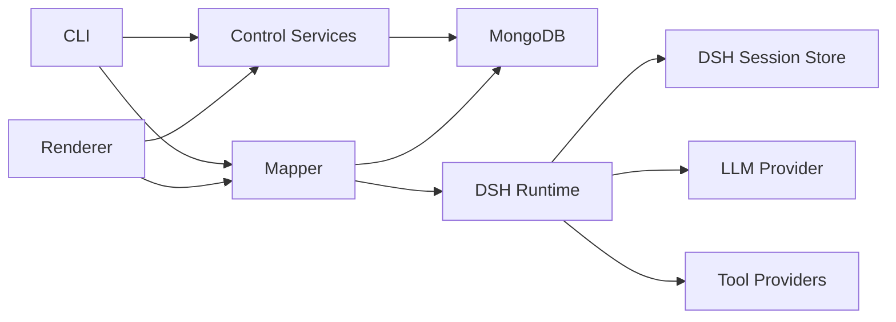

# 048 — DSH 简化重构执行计划

> 本文是单机简化方案，已被近期多人协作方案 `049-DSH多人协作重构执行计划.md` 取代，不再直接执行。

## 0. 文档地位

本文保留为单机方案记录；最终执行以 049 为准。

047 的问题是为了让 DSH 保存全部业务过程，引入了自定义 Session Event、RunProjection、StageStamp、taskKey 和 Mongo/SQLite 对账协议。那些内容保留为风险研究，不进入第一版实现。

本计划遵循一个规则：

> Mongo 保存业务断点；DSH 保存 Agent 会话。两者通过确定性 SessionId 关联，不双写同一份状态。

本轮仅形成计划，不修改业务代码。正式实施前必须保护当前未提交修改。

## 1. 目标与非目标

### 1.1 目标

1. 目录一眼对应 Renderer → Mapper → DSH。
2. DSH 成为唯一 Agent Runtime。
3. Mapper 保留一个最小业务状态机，不再保存 Agent 调用账本。
4. 应用重启后从业务阶段和 DSH 持久 Session 继续。
5. Timeline 只做 Pipeline 投影，不做第二套状态机。
6. Desktop 与 CLI 使用同一个应用组合入口。
7. 删除 LangChain、LangGraph、LangSmith 和旧 AgentLoop。

### 1.2 非目标

- 不把固定 Parse/Split/Verify 改成 DSH Workflow。
- 不为业务阶段定义自定义 DSH Session Event。
- 不使用 DSH Agent Team、Goal、Plan、Todo、Shell、LSP、Terminal、Jobs。
- 不接 DSH API Gateway。
- 不重写现有 Vue 视觉组件。
- 不在同一轮合并 Agent Catalog、Prompt Config 和 Workspace 数据源。
- 不实现跨设备 DSH Session。
- 不实现 Session 历史删除、回放或 Timeline 时间旅行。
- 不兼容旧 Map run/schema；开发数据库直接清理。

## 2. 最终架构



### 2.1 三层职责

#### Renderer

- 读取 `MapperSnapshot`。
- 发送 `MapperCommand`。
- 展示拓扑、Pipeline、流式文本和错误。
- 在 HITL gate 编辑 draft 并发送 `run.continue`。
- 不理解 DSH Session、Mongo schema 或 Electron main 实现。

#### Mapper

- Map/Node CRUD。
- Source → News → Claims → VerifyResult 固定 Pipeline。
- 当前业务 stage、step、HITL 等待和 draft。
- 上游修改后的下游失效。
- 读取 DSH Agent 结果并写入 Mongo。
- MapDocument → MapperSnapshot 投影。

#### DSH

- 模型调用循环。
- Message/Tool 历史。
- Session persistence。
- Agent 内部崩溃修复边界。
- Tool registry。
- streaming、retry、cancel。
- 长上下文确有需要时的 compaction。

### 2.2 Platform

Mongo、SQLite、文件、设置和 Electron 只是外部适配器，不包含 Pipeline 决策。

Workspace、Agent 配置、导入导出和应用设置组成旁路 Control Plane；它们不进入 Renderer → Mapper → DSH 执行链，也不反向调用 Mapper。无须为了形式上的“一个 API”把这些命令塞进 Mapper。

## 3. 最终目录

```text
ChongMing/
├─ application.ts            # Desktop/CLI 共用组合入口
├─ contracts/
│  ├─ mapper.ts              # Renderer/Desktop/CLI 共用 DTO
│  ├─ control.ts             # Workspace/Agent/File/Settings DTO
│  └─ domain.ts              # 无框架领域类型
│
├─ mapper/
│  ├─ types.ts               # MapperRun 与内部窄类型
│  ├─ store.ts               # MapDocument Mongo CRUD
│  ├─ service.ts             # read / dispatch / watch
│  ├─ run.ts                 # 最小业务状态机和恢复
│  ├─ project.ts             # Document → Snapshot
│  └─ stages/
│     ├─ parse.ts
│     ├─ split.ts
│     └─ verify.ts
│
├─ agent/
│  ├─ dsh.ts                 # 唯一 DSH composition + facade
│  ├─ schemas.ts             # 严格结构化输出 schema
│  └─ web-tavily.ts          # 仅官方 provider 不满足时存在
│
├─ control/
│  ├─ workspaces.ts          # Workspace CRUD
│  ├─ agents.ts              # Registry/Catalog/Prompt，行为先保持
│  ├─ files.ts               # 导入导出应用服务
│  └─ settings.ts            # App/DB 设置应用服务
│
├─ platform/
│  ├─ mongo.ts
│  ├─ map-lease.ts
│  ├─ file-system.ts
│  ├─ settings-store.ts
│  └─ paths.ts
│
├─ renderer/                 # 现有 Vue UI 机械移动
├─ desktop/                  # Electron main / preload / IPC
├─ cli/                      # Headless CLI
└─ tests/
```

不增加：

```text
events.ts
projection.ts（DSH projection）
interaction.ts（DSH HITL bridge）
sessions.ts
agents.ts
subagents.ts
ports/
repositories/
use-cases/
factories/
```

只有 `agent/dsh.ts` 确认超过 400–500 行且存在清晰独立职责时，才拆文件。

## 4. 状态模型

### 4.1 MapDocument

```ts
interface MapDocument {
  id: string
  workspaceId: string
  name?: string
  sources: SourceRecord[]
  news: NewsRecord[]
  claims: ClaimRecord[]
  routes: RouteRecord[]
  run?: MapperRun
  revision: number
  createdAt: string
  updatedAt: string
}
```

删除：

```text
timeline
MapperCallRecord[]
AgentCall prompt/result/status/attempt/timestamps
```

### 4.2 最小 MapperRun

```ts
interface MapperRun {
  runId: string
  stage: 'parse' | 'split' | 'verify'
  step: 'route' | 'confirm-route' | 'workers' | 'merge' | 'validate' | 'save'
  targetId: string
  until: 'news' | 'claims' | 'verified'
  mode: 'auto' | 'human-in-loop'
  status: 'running' | 'waiting' | 'error'
  draft?: ParseDraft | SplitDraft | VerifyDraft
  error?: string
}
```

这个状态只回答：

```text
产品正在处理哪个实体？
处于哪个业务阶段？
是否等待人？
已接受但尚未保存的业务草稿是什么？
```

它不回答 Agent 内部执行了哪些模型或 Tool step；那些只在 DSH Session 中。

### 4.3 Split 完成标记

不能用 `claims.length > 0` 判断 Split 完成，因为合法结果可能是 0 条 Claim。

```ts
interface NewsRecord {
  id: string
  sourceId?: string
  content: string
  context: NewsContext
  splitAt?: string
}
```

其他完成状态可以从领域结果推导：

```text
Source 有对应 News → parse 完成
News 有 splitAt      → split 完成
Claim 有 verify      → verify 完成
```

### 4.4 Renderer 状态

只保留：

```text
activeTabId
selectedNodeId
selectedUntil
panel/zoom 状态
未提交的表单输入
```

`runPhase`、active stage/step、draft 和 worker 状态从 MapperSnapshot 读取。`status === 'waiting'` 且 step 为 `confirm-route/validate/save` 时即可推导当前 HITL gate，不再保存第二个 gate 字段。

## 5. DSH SessionId 规则

每一次 Agent 工作使用确定性 SessionId：

```text
<runId>:<stage>:<targetId>:<role>[:<instanceId>]
```

示例：

```text
abc:split:news-1:route
abc:split:news-1:worker:data-0
abc:split:news-1:worker:quote-0
abc:split:news-1:merge
```

Mapper 不保存 Session 列表。它根据 `MapperRun + routes` 推导所有 SessionId。

Spike 必须验证 DSH 对 SessionId 字符集和长度的限制；如不允许当前格式，只在 `dshReadSessionId()` 中使用标准库 hash，业务层仍传结构化 SessionKey。

## 6. Agent 执行与恢复

### 6.1 统一入口

Mapper 只能通过一个 DSH 特定函数执行 Agent：

```ts
dshRun({
  sessionKey,
  profile,
  prompt,
  schema,
  signal,
  onEvent,
})
```

`dshRun()` 的行为：

1. Session 不存在：创建并运行第一 turn。
2. Session 已完整完成：读取并返回最后一个有效 structured result，不重复调用模型。
3. Session 有 interrupted turn：恢复 Session，发起新的修复 turn。
4. Session 上次是可重试错误：在同一 Session 发起新 turn。
5. Session 正在本进程运行：加入同一个 Promise，不创建第二个 Agent。

这不是通用 `AgentLoop` 接口，而是项目对 DSH 的直接使用；不为未来框架保留抽象。

### 6.2 Crash 矩阵

| 崩溃位置 | Mongo | DSH | 恢复动作 |
|---|---|---|---|
| Agent 开始前 | 当前 step | 无 Session | 创建并运行 |
| Agent turn 中 | 当前 step | interrupted | 新修复 turn |
| Agent 完成后、Mongo 前 | 当前 step | completed | 读取结果并推进 Mongo |
| Mongo commit 后 | 下一 step/无 run | completed | 按 Mongo 跳过旧 step |
| HITL 等待中 | `waiting + step + draft` | completed | 直接重建 UI gate |
| 用户取消后 | 无 run | cancelled/closed | 不恢复 |

没有 Mongo/DSH 分布式事务，也不需要补写 DSH 业务事件。

恢复入口只有一个：成功取得 Map lease 后调用 `runResume()`。如果数据库存在 run、但本进程没有对应 live execution，`runResume()` 根据当前 step 和确定性 SessionId继续；若 status 为 waiting/error，则保持等待用户操作。不得在 Mapper read 或 Renderer mount 中各写一套恢复逻辑。

### 6.3 Tool 副作用

- 第一版 Agent Tool 只允许只读搜索和读取上下文。
- Map save 不是 Tool，由 Mapper 执行。
- DSH 出现 unknown Tool outcome 时，只读 Tool 可以由修复 turn 决定重试。
- 未来增加写 Tool 时，必须单独设计 idempotency key 和核对逻辑。

## 7. Pipeline

```text
Source --parse--> News --split--> Claims --verify--> VerifyResult
```

### 7.1 Run 命令

```ts
type RunStartCommand = {
  type: 'run.start'
  mapId: string
  scopeId?: string
  until: 'news' | 'claims' | 'verified'
  mode: 'auto' | 'human-in-loop'
}
```

删除 `timeline.update`、`startX`、`endX`、`stateIndex` 和持久化 `activeScope`。

### 7.2 调度规则

```text
Source 无 News → parse
News 无 splitAt → split
Claim 无 verify → verify
```

第一版：

- 不同业务 target 串行。
- 一个 target 内 Worker 有界并行。
- 自动模式保存后选择下一个未完成 target。
- HITL 模式在 confirm-route、validate、save step 等待。
- 达到 `until` 后结束。

### 7.3 上游失效

```text
更新 Source → 删除派生 News、Claims、VerifyResult
更新 News   → 清除 splitAt，删除其 Claims
更新 Claim  → 清除该 Claim.verify
更新 Route  → 清除 parent 对应阶段的下游结果
```

修改和失效在同一个 Map revision commit 中完成。

## 8. DSH 使用范围

### 8.1 第一版启用

Spike 锁定确切包名和版本后启用对应能力：

```text
Cordis
Session
Session Persistence SQLite
Session Checkpoint Policy
System Prompt
Tools
Agent + Agent Loop
LLM Provider
LLM Retry
```

并行 Worker 优先直接创建多个 DSH Agent Session。只有公开 SubAgent API 明显减少代码，才启用 SubAgent packages；不得为了产品 UI 叫“SubAgent”就强行依赖 DSH SubAgent Runtime。

### 8.2 实测后启用

```text
Token Meter
Compaction Basic
Tool Result Pruner
```

触发条件：真实长任务达到上下文上限或 Tool result 明显挤占上下文。

### 8.3 不启用

```text
Workflow Worker
Agent Team
Goal / Plan / Todo
Shell / Terminal / Filesystem / LSP
Jobs
Sandbox
API Gateway
Dynamic Extensions
DSH Approval 作为产品 HITL
```

### 8.4 自有 Plugin

默认零个。

只有当前 Tavily 无官方 DSH Provider 时，增加一个：

```text
chongming-web-tavily
```

它只提供 DSH Web capability，模型侧复用 DSH Tool consumer。不创建 run、projection、interaction 插件。

## 9. 文件操作清单

### 9.1 新增

```text
contracts/domain.ts
contracts/mapper.ts
contracts/control.ts
application.ts
mapper/types.ts
mapper/store.ts
mapper/service.ts
mapper/run.ts
mapper/project.ts
mapper/stages/parse.ts
mapper/stages/split.ts
mapper/stages/verify.ts
agent/dsh.ts
agent/schemas.ts
agent/web-tavily.ts（条件新增）
control/workspaces.ts
control/agents.ts
control/files.ts
control/settings.ts
platform/mongo.ts
platform/map-lease.ts
platform/file-system.ts
platform/settings-store.ts
platform/paths.ts
desktop/main.ts
desktop/preload.ts
desktop/ipc.ts
cli/main.ts
cli/commands.ts
```

### 9.2 删除

切换完成后删除：

```text
electron/agent-loop/langgraph.ts
electron/mapper/index.ts
electron/mapper/types.ts
electron/mapper/service.ts
electron/mapper/document.ts
electron/mapper/output.ts
electron/mapper/project.ts
electron/mapper/stages/parse.ts
electron/mapper/stages/split.ts
electron/mapper/stages/verify.ts
electron/shared/llm-model.ts
electron/shared/llm-utils.ts
electron/tools/index.ts
electron/tools/web-search.ts
src/stores/run-coordinator.ts
src/flow-map/timeline.ts
src/flow-map/timeline-project.ts
src/.DS_Store
```

### 9.3 重写或移动

| 当前 | 最终 | 动作 |
|---|---|---|
| `electron/shared/database.ts` | `platform/mongo.ts` | 删除 run call schema，保留领域/workspace/agent schema |
| `electron/api/map-lease.ts` | `platform/map-lease.ts` | 第一版保留逻辑 |
| `electron/api/file-service.ts` | `control/files.ts` | 保留 API，底层 I/O 放 platform |
| `electron/shared/app-settings.ts` | `platform/settings-store.ts` | 机械迁移 |
| `electron/shared/db-settings.ts` | `platform/settings-store.ts` | 合并设置 I/O |
| `electron/shared/paths.ts` | `platform/paths.ts` | 机械迁移 |
| `electron/main.ts` | `desktop/main.ts` | 使用统一 application create |
| `electron/preload.ts` | `desktop/preload.ts` | DTO 改从 contracts import |
| `electron/api/channels.ts` | `desktop/ipc.ts` | 与 handler 合并 |
| `electron/api/register-handlers.ts` | `desktop/ipc.ts` | 与 channel 合并 |
| `server/cli.ts` | `cli/main.ts` | 机械迁移 |
| `server/commands.ts` | `cli/commands.ts` | 使用 Mapper API |
| `src/stores/flow-map.ts` | `renderer/stores/mapper.ts` | 删除本地运行状态机 |
| `src/stores/workspace.ts` | `renderer/stores/workspace.ts` | 机械迁移 |
| `src/stores/workspace-tabs.ts` | `renderer/stores/tabs.ts` | 机械迁移 |
| `src/flow-map/timeline-frame.ts` | `renderer/flow-map/pipeline-frame.ts` | 只保留 UI 坐标 |

### 9.4 本轮明确保留

不与 DSH 重构捆绑：

```text
electron/api/agent-registry-service.ts
electron/api/catalog-service.ts
electron/api/sub-agent-catalog.ts
electron/api/local-agent-service.ts
electron/api/prompt-config-service.ts
electron/api/workspace-service.ts
所有现有 Vue 组件实现
FlowMap layout 和键盘导航算法
导入导出产品能力
```

这些文件可以机械移动，但不改变数据模型和行为。Agent 数据源合并另立任务。

最终机械归位：

```text
workspace-service                         → control/workspaces.ts
agent-registry/catalog/sub-agent/local    → control/agents.ts 或 control/agents/*
prompt-config-service                     → control/agents.ts 或 control/agents/*
app-service + db-service                  → control/settings.ts
file-service                              → control/files.ts
```

若合并后单文件超过 500 行，只按现有职责在 `control/` 下保留多个文件；不改变数据来源。

## 10. 函数变化

### 10.1 新增 Mapper 函数

`mapper/service.ts`

```text
mapperCreate()
mapperRead()
mapperDispatch()
mapperWatch()
mapperEmit()
```

`mapper/store.ts`

```text
mapDocumentCreate()
mapDocumentRead()
mapDocumentList()
mapDocumentCommit()
mapDocumentDelete()
```

`mapper/run.ts`

```text
runStart()
runContinue()
runCancel()
runResume()
runAdvance()
runReadNextTarget()
runReadSessionKey()
runApplyDecision()
```

`mapper/project.ts`

```text
projectReadSnapshot()
projectReadPipeline()
```

`mapper/stages/*.ts`

```text
parseRun()
splitRunRoute()
splitRunWorkers()
splitRunMerge()
verifyRunRoute()
verifyRunWorkers()
verifyRunMerge()
```

### 10.2 新增 DSH 函数

`agent/dsh.ts`

```text
dshCreate()
dshDelete()
dshRun()
dshCancel()
dshReadResult()
dshReadSessionId()
dshReadStatus()
```

`agent/schemas.ts`

```text
routeOutputSchema
splitOutputSchema
verifyOutputSchema
mergeOutputSchema
```

`agent/web-tavily.ts`（条件存在）

```text
dshCreateTavilyProvider()
```

### 10.3 删除函数

```text
createMapper(agentLoop)
runUntilPause()
checkpoint()
executeCalls()
readNextRun()
parseStep()
splitStep()
verifyStep()
llmRunInvoke()
llmCreateChatModel()
toolRead()
readJsonText()
readJson()
readRouteOutput() 的宽松 Markdown/JSON 路径
readClaimsOutput() 的宽松路径
readVerifyOutput() 的宽松路径
readMergeFlags() 的宽松路径
timelineCreateDefault()
timelineValidate()
timelineProjectLines()
timelineReadGlobalStart()
timelineReadGlobalFrame()
timelineReadDataEnd()
```

结构化结果仍必须经过 schema 验证；删除的是猜测式 parser，不是边界验证。

## 11. Public API

Mapper 仍只有：

```ts
interface MapperAPI {
  read(query: MapperQuery): Promise<MapperReadResult>
  dispatch(command: MapperCommand): Promise<MapperDispatchResult>
  watch(listener: (event: MapperUpdated) => void): () => void
}
```

保留：

```text
map.create / rename / delete
node.create / update / delete
run.start / continue / cancel
run.set-mode
claims.dedup
routes.batch-update
lease.acquire / release
```

修改：

```text
run.start: selectedNodeId → scopeId + until
run.continue: 只提交当前 waiting step 的 decision
```

删除：

```text
timeline.update
```

Agent/Workspace/App/File/DB API 本轮保持现状，只将公共 DTO 移入 contracts，避免扩大范围。

它们最终由旁路 `ControlAPI` 暴露；MapperAPI 仍只处理 Map/Pipeline：

```ts
interface ApplicationAPI {
  mapper: MapperAPI
  control: ControlAPI
}
```

## 12. 启动与关闭

新增唯一组合入口：

```ts
applicationCreate({ mode, dataDir })
applicationDelete(application)
```

它按顺序完成：

```text
settings
→ Mongo
→ DSH Session Store
→ DSH Runtime
→ Mapper
```

关闭顺序反向：

```text
停止接受命令
→ cancel/drain live Agents
→ flush DSH Sessions
→ dispose DSH
→ release Map leases
→ disconnect Mongo
```

应用正常退出只停止并 flush Runtime，不删除 MapperRun。只有用户明确发送 `run.cancel` 才删除 MapperRun；因此“关闭应用”和“取消任务”语义不能共用同一函数。

Desktop 和 CLI 都调用这两个函数，不分别装配 Runtime。

## 13. 实施阶段

### Phase 0：保护当前基线

1. 审核当前未提交修改。
2. 建立 `codex/dsh-rewrite` 分支。
3. 将当前可工作的 Mapper checkpoint 版本保存为保护提交。
4. 记录测试、typecheck、CLI smoke 和 DMG build 基线。

退出条件：工作树干净，旧版本可随时构建。

### Phase 1：一次性 DSH Spike

Spike 放临时目录或临时分支，验证后删除，不进入生产树。

验证：

1. DSH packages 可被当前 Node/Electron/Vite 打包。
2. SQLite persistence 在应用数据目录工作。
3. 当前 OpenAI-compatible baseUrl/model/key 可用。
4. Tavily 能通过官方 Web seam 或最小 provider 使用。
5. Session 完成后可以通过公开 API读取 structured result。
6. interrupted turn 恢复行为符合预期。
7. 相同 SessionId 不会并发创建两个 live Agent。
8. cancel 和 dispose 不遗留活 Agent。

Go/No-Go：任何核心项需要依赖 DSH 私有模块或 patch DSH 源码，则停止迁移。

### Phase 2：新增 DSH Runtime

- 新增 `agent/dsh.ts` 和严格 schema。
- 接通单 Agent、stream、web、retry、persistence。
- 暂不接生产 Mapper。

退出条件：DSH runtime 集成测试通过。

### Phase 3：简化 MapperRun

- 删除 call ledger 和 checkpointTail。
- 引入最小 MapperRun。
- 加入确定性 SessionKey。
- 重写 parse/split/verify 调用 DSH。
- 加入 `splitAt`。

退出条件：自动 Pipeline、HITL 和恢复测试通过。

### Phase 4：切换生产入口

- `mapperService` 改用 DSH。
- Desktop/CLI 使用 `applicationCreate()`。
- 删除 LangGraph production import。

退出条件：现有产品流程全部经过 DSH，旧路径不可达。

### Phase 5：Timeline 简化

- 删除持久化 MapperTimeline。
- `until` 改为运行参数。
- `PipelineSnapshot` 从领域数据和 MapperRun 派生。
- Renderer 不根据 layout depth 推进业务状态。

退出条件：0 Claim、部分 verify 和多根节点展示正确。

### Phase 6：删除旧运行内核

- 删除第 9.2 和 10.3 节文件/函数。
- 移除 LangChain/LangGraph/LangSmith dependencies。
- 删除旧测试并加入 DSH 测试。

退出条件：静态搜索无旧 Runtime。

### Phase 7：机械目录整理

- 移动 Renderer/Desktop/CLI/Platform 文件。
- 只修改 import 和构建入口。
- 不同时重构 UI 或 Agent Catalog。

退出条件：目录对应最终架构，行为测试无变化。

### Phase 8：文档、测试、打包

- 更新 README、coding.md、design overview。
- 清理空目录和构建垃圾。
- 执行全量验证。

## 14. 测试计划

### 14.1 新增

```text
tests/agent/dsh.spec.ts
tests/agent/dsh-recovery.spec.ts
tests/mapper/run.spec.ts
tests/mapper/run-recovery.spec.ts
tests/mapper/invalidation.spec.ts
tests/mapper/pipeline-project.spec.ts
tests/integration/application.spec.ts
```

### 14.2 必测场景

1. Session 不存在时只创建一次。
2. completed Session 直接读取结果，不重复模型调用。
3. interrupted Session 通过新 turn 恢复。
4. 两个 Worker 乱序完成但输出顺序稳定。
5. 一个 Worker 完成后进程退出，恢复时只处理未完成 Session。
6. structured output 非法时明确 error。
7. HITL route/validate/save 重启后仍可继续。
8. 0 Claim 设置 splitAt，不会循环 Split。
9. Mongo commit 后崩溃不会重新运行上一 step。
10. Agent 完成、Mongo 未 commit 时复用 Session 结果。
11. cancel 删除 MapperRun，不自动恢复。
12. 上游修改清理全部下游结果。
13. 同一 Map 的第二个进程拿不到 lease。
14. Desktop 与 CLI 使用同一 Mapper 行为。

### 14.3 保留

- Map CRUD。
- Layout/navigation。
- Workspace/Agent Registry/Catalog。
- Prompt settings。
- Import/export。
- App/DB settings。
- CLI smoke。

## 15. 静态验收

```bash
rg "@langchain|langgraph|langsmith" package.json mapper agent platform renderer desktop cli
rg "AgentLoop|MapperCallRecord|checkpointTail|MapperTimeline" mapper agent renderer
rg "from .*electron/" renderer
find mapper agent platform renderer desktop cli -type d -empty
```

除历史文档外必须无结果。

运行：

```bash
npm test
npx vue-tsc --noEmit
npm run headless -- status <mapId>
npm run build:check
```

## 16. 提交边界

```text
1. test: prove DSH runtime and persistence
2. feat: add DSH runtime facade
3. refactor: simplify Mapper run state
4. feat: execute pipeline through DSH sessions
5. refactor: derive pipeline instead of timeline state
6. feat!: remove LangGraph and call ledger
7. refactor: align physical directories with architecture
8. docs: publish simplified DSH architecture
```

每个提交必须通过对应测试。第 6 个提交后不允许保留双运行路径。

## 17. 风险与止损

| 风险 | 止损 |
|---|---|
| DSH API/包仍快速变化 | Spike 锁版本；直接依赖 DSH，不再包通用 Runtime 接口 |
| Electron/SQLite 打包失败 | Phase 1 No-Go |
| Provider 不支持当前 OpenAI-compatible 配置 | 写最小 DSH provider；超过一个文件则重新评估 |
| DSH 无法可靠读取 completed structured result | No-Go，不重造 Session parser |
| interrupted turn 重试导致只读 Tool 重放 | 接受 at-least-once；禁止写 Tool |
| 两个存储无法事务提交 | Mongo 业务状态为权威；不向 DSH 双写业务状态 |
| 多进程冲突 | 保留现有 Map lease |
| Session 增长 | 第一版不私改 SQLite；实测后独立解决 |
| 目录迁移造成巨大 diff | 放在功能切换后独立机械提交 |

## 18. 工期与代码量

单人估计：

```text
DSH Spike                   1–2 天
DSH Runtime                 2–3 天
MapperRun/Pipeline          3–5 天
恢复/HITL                   2–3 天
Timeline                    1–2 天
切换与删除                  2–3 天
机械目录整理与 QA           2–3 天
总计                        13–21 个工作日
```

预计：

- 删除旧运行、LangGraph、call ledger、Timeline 状态约 1,300–2,000 行。
- 新增 DSH facade、严格 schema 和简化 run 约 700–1,200 行。
- 净减少约 500–1,000 行。
- 自有 DSH Plugin 为 0–1 个。
- 后端核心长期控制在 `mapper` 7–8 个文件、`agent` 2–3 个文件。

## 19. 最终完成定义

全部满足才完成：

- Renderer → Mapper → DSH 主线一眼可见。
- Workspace/Agent/Settings/File 明确位于旁路 Control Plane，不混入 Mapper。
- DSH 是唯一 Agent Runtime。
- Mongo MapperRun 只保存业务 stage、step、status 和 draft。
- DSH Session 只保存 Agent 内部历史。
- 没有自定义 DSH 业务事件和跨存储对账器。
- 没有 Agent call ledger。
- 没有持久化 Timeline 状态。
- 没有 LangChain/LangGraph/LangSmith production dependency。
- HITL 和应用重启继续正常。
- 0 Claim 不会造成无限重跑。
- Desktop 与 CLI 使用同一应用入口。
- 旧文件、旧函数、空目录全部删除。
- 全量测试、typecheck、CLI smoke 和 DMG build 通过。
