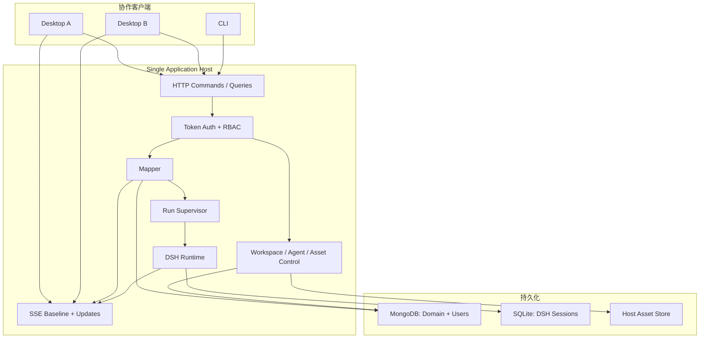

# 049 — DSH 多人协作重构执行计划

## 0. 文档地位

本文是当前唯一执行计划，取代 046、047、048。

近期目标同时包含：

1. DSH 取代 LangGraph，成为唯一 Agent Runtime。
2. 架构物理结构一眼可见。
3. 多用户共享 Workspace、Map、运行状态和 HITL。
4. 不为了远期规模提前引入 CRDT、多 Host、Kafka、Redis 或事件溯源。

本计划只落文档，不修改业务代码。正式实施前必须先处理当前工作树中已有未提交修改，禁止 reset 或覆盖。

## 1. 最终原则

### 1.1 一台中心 Host

所有写入和 Agent 运行只能发生在中心 Host：

```text
Desktop/Web/CLI Client
        ↓ HTTP + SSE
Application Host
├─ Auth
├─ Mapper
├─ Control Services
├─ DSH Runtime
├─ MongoDB
└─ DSH SQLite Session Store
```

客户端不直连 Mongo，不运行 DSH，不持有 Map lease，不读取本地 Session Store。

Desktop 的 `client/*` 运行在 Electron Main，持有 Host URL 和 Token；Renderer 仍通过受限 preload 调用它，Token 不暴露给页面 JavaScript。CLI 复用同一个 `client/*`。

### 1.2 两份互不重复的状态

```text
Mongo MapperRun
  只保存业务 stage、step、status、draft 和 HITL

DSH Session
  只保存模型、消息、Tool 和 Agent turn
```

二者通过确定性 SessionId 关联。不创建自定义 DSH 业务事件、StageStamp、taskKey 或跨存储对账器。

### 1.3 Host 是唯一权威

- 用户身份由 Access Token 在 Host 解析，actorId 不接受客户端自报。
- 所有权限判断在 Host/Mapper 边界执行。
- 所有 Map mutation 携带 `expectedRevision`。
- 所有运行命令通过 Mongo 原子条件竞争。
- 所有订阅先发完整基线，再发更新；断线后重新取得基线。

## 2. 本期多人协作范围

### 2.1 必须支持

- 多个用户登录同一个 Host。
- Host Admin 创建用户；Workspace Owner 添加、移除成员和修改角色。
- 多人查看同一个 Workspace 和 Map。
- 不同用户同时编辑不同 Map。
- 多人同时打开同一个 Map，并实时看到 committed 更新。
- 同一 Map 同时只有一个 Pipeline run。
- 多人观看同一个 Agent run、stream 和 Tool 状态。
- Editor 中第一个有效回答者解决 HITL，其他回答得到明确冲突。
- 应用/网络断开后重新连接并恢复完整 Snapshot。
- Host 重启后恢复 MapperRun 和 DSH Session。
- Desktop 与 CLI 使用相同远程 API。
- 用户上传的来源文件可被其他成员和 Host 读取。

### 2.2 明确不支持

- 同一个文本字段的字符级实时合编。
- 离线编辑和离线 mutation queue。
- 多 Host 横向扩容。
- 自动故障转移。
- 跨区域部署。
- Presence 光标、正在输入状态。
- 评论、聊天、@mention。
- 完整审计/合规事件仓库。
- DSH API Gateway 和 DSH Web Client 整套接入。
- Session 历史清理和时间旅行。

本期同一 Map 的并发编辑采用 revision 冲突，不采用 CRDT。

## 3. 最终架构图



## 4. 最终目录

```text
ChongMing/
├─ contracts/
│  ├─ auth.ts
│  ├─ mapper.ts
│  ├─ control.ts
│  ├─ stream.ts
│  └─ domain.ts
│
├─ host/
│  ├─ application.ts
│  ├─ server.ts
│  ├─ routes.ts
│  ├─ stream.ts
│  └─ auth.ts
│
├─ mapper/
│  ├─ types.ts
│  ├─ store.ts
│  ├─ service.ts
│  ├─ run.ts
│  ├─ supervisor.ts
│  ├─ project.ts
│  └─ stages/
│     ├─ parse.ts
│     ├─ split.ts
│     └─ verify.ts
│
├─ agent/
│  ├─ dsh.ts
│  ├─ schemas.ts
│  └─ web-tavily.ts            # 条件存在
│
├─ control/
│  ├─ users.ts
│  ├─ workspaces.ts
│  ├─ agents.ts
│  ├─ assets.ts
│  └─ settings.ts
│
├─ platform/
│  ├─ mongo.ts
│  ├─ session-store.ts
│  ├─ asset-store.ts
│  ├─ settings-store.ts
│  └─ paths.ts
│
├─ client/
│  ├─ api.ts
│  └─ stream.ts
│
├─ renderer/                   # 现有 Vue 视觉实现机械移动
├─ desktop/                    # 桌面壳、凭证保存、窗口
├─ cli/                        # 远程 API 客户端
└─ tests/
```

不创建：

```text
event-bus/
repositories/
ports/
use-cases/
command-bus/
crdt/
distributed-lock/
DSH business projection/
```

进程内更新分发使用一个 `Set<Listener>`；未来多 Host 时再替换为外部 pub/sub。

## 5. 身份与权限

### 5.1 小团队 Token 登录

第一版不实现密码、邮件或 OAuth。Owner/Host CLI 创建用户并生成一次性展示的随机 Token：

```ts
interface UserDocument {
  id: string
  displayName: string
  disabledAt?: string
  createdAt: string
}

interface AccessTokenDocument {
  id: string
  userId: string
  tokenHash: string
  createdAt: string
  expiresAt?: string
  revokedAt?: string
}
```

- Token 使用 `crypto.randomBytes(32)` 生成。
- Mongo 只保存 SHA-256 hash，不保存明文。
- 客户端通过 `Authorization: Bearer <token>` 发送。
- Desktop 使用系统安全凭证存储；若当前 Electron 没有合适能力，第一版要求每次启动输入，不把 Token 明文放普通 JSON。
- CLI 从 `CHONGMING_TOKEN` 或受限权限配置文件读取。
- Host 日志不得输出 Authorization header。

用户和 Token 由 Host 本机管理命令创建；第一版不提供远程公开注册接口。Workspace Owner 只能把已有 userId 加入自己的 Workspace，不能创建全局用户或读取其他用户的 Token。

当需要外部客户自助注册、SSO 或企业身份时，再替换为 OIDC；Mapper 只依赖解析后的 `RequestActor`。

### 5.2 Workspace RBAC

```ts
type WorkspaceRole = 'owner' | 'editor' | 'viewer'

interface WorkspaceMember {
  userId: string
  role: WorkspaceRole
  addedAt: string
}

interface RequestActor {
  userId: string
}
```

权限：

| 操作 | Owner | Editor | Viewer |
|---|---:|---:|---:|
| 查看 Workspace/Map/运行 | ✓ | ✓ | ✓ |
| 编辑 Map | ✓ | ✓ | — |
| 启动/取消 Pipeline | ✓ | ✓ | — |
| 回答 HITL | ✓ | ✓ | — |
| 编辑 AgentProfile | ✓ | ✓ | — |
| 管理成员/删除 Workspace | ✓ | — | — |
| 修改 Host 模型/数据库设置 | Host Admin | — | — |

所有 service 方法首先接收 Host 注入的 `RequestActor`，随后调用统一 `authRequireWorkspaceRole()`。不在每个 Vue 组件复制权限判断。

## 6. 协作数据模型

### 6.1 Workspace

```ts
interface WorkspaceDocument {
  id: string
  name: string
  members: WorkspaceMember[]
  revision: number
  createdBy: string
  updatedBy: string
  createdAt: string
  updatedAt: string
}
```

### 6.2 Map

```ts
interface MapDocument {
  id: string
  workspaceId: string
  name?: string
  sources: SourceRecord[]
  news: NewsRecord[]
  claims: ClaimRecord[]
  routes: RouteRecord[]
  run?: MapperRun
  revision: number
  updatedBy: string
  createdAt: string
  updatedAt: string
}
```

### 6.3 最小 MapperRun

```ts
interface MapperRun {
  runId: string
  stage: 'parse' | 'split' | 'verify'
  step: 'route' | 'confirm-route' | 'workers' | 'merge' | 'validate' | 'save'
  targetId: string
  until: 'news' | 'claims' | 'verified'
  mode: 'auto' | 'human-in-loop'
  status: 'running' | 'waiting' | 'error'
  draft?: ParseDraft | SplitDraft | VerifyDraft
  interactionId?: string
  startedBy: string
  lastActionBy: string
  error?: string
}
```

`interactionId` 只在 waiting 状态存在，用于 first-writer-wins；它不是另一套 Interaction 表。

### 6.4 Source Asset

中心 Host 不能读取成员电脑上的绝对文件路径。删除 `SourceRecord.uri = /Users/...` 的远程语义，改为：

```ts
interface AssetDocument {
  id: string
  workspaceId: string
  filename: string
  mediaType: string
  size: number
  sha256: string
  status: 'pending' | 'ready'
  storageKey?: string
  uploadedBy: string
  createdAt: string
}

type SourceRecord =
  | { id: string; kind: 'asset'; assetId: string; label?: string }
  | { id: string; kind: 'url'; url: string; label?: string }
```

第一版 Asset Store 是 Host 持久目录；多 Host/S3 不在本期。

`asset.create` 先保存 pending metadata；PUT 写入 Host 临时文件，验证 size/sha256 后原子移动并标记 ready。Source 只能引用 ready Asset。失败上传保留 pending metadata 供相同 assetId 重试，不把半文件暴露给 Pipeline。

第一版限制单 Asset 10 MB。Map/Workspace 导出继续使用单文件 bundle，Asset 内容以 base64 随 manifest 导出，并限制整个 bundle 50 MB；超过限制明确报错。出现大文件需求时再改 ZIP/Object Storage，不在本期增加归档协议。

## 7. 并发写入协议

### 7.1 Mutation Envelope

```ts
interface MutationEnvelope<TCommand> {
  requestId: string
  expectedRevision: number
  command: TCommand
}
```

`actorId` 不在 envelope 中，由 Token 解析。

### 7.2 原子提交

Map mutation 使用：

```text
UPDATE maps
WHERE id = mapId AND revision = expectedRevision
SET ..., revision = revision + 1, updatedBy = actor.userId
```

失败返回：

```ts
interface RevisionConflict {
  code: 'revision-conflict'
  expectedRevision: number
  actualRevision: number
  snapshot: MapperSnapshot
}
```

`MapperSnapshot.revision` 是必填字段；Client 只能从最近一次 Host baseline/snapshot 取得下一条 mutation 的 expectedRevision，不维护自己的递增计数。

客户端不得自动重放 mutation。用户看到最新 Snapshot 后重新操作。

### 7.3 创建命令幂等

网络响应可能丢失，因此创建命令由客户端预分配稳定 ID：

```text
map.create      带 mapId
node.create     带 nodeId
asset.create    带 assetId
run.start       带 runId
```

相同 ID、相同 payload 的重试返回现有结果；相同 ID、不同 payload 返回 `id-conflict`。不增加 CommandReceipt 集合。

### 7.4 冲突粒度

第一版整个 Map 共用 revision。即使两个用户修改不同节点，其中一个也可能冲突，这是刻意的简单上限。

当 Map 存在 active run 时，除 `run.continue`、`run.cancel` 和只读查询外，第一版禁止修改该 Map。这样避免后台 Pipeline commit 与人工编辑相互覆盖。不同 Map 仍可并行编辑和运行；需要“运行中编辑其他节点”时，再通过 node revision 放宽，而不是在第一版实现字段级合并。

升级条件：真实使用中 revision conflict 超过写操作的 5%，再引入 node revision；只有出现同字段字符级共同编辑需求时才评估 CRDT。

## 8. 查询与实时订阅

### 8.1 HTTP

```text
POST /api/mapper/read
POST /api/mapper/dispatch
POST /api/control/read
POST /api/control/dispatch
PUT  /api/assets/:assetId/content
GET  /health
```

使用 Node 内置 HTTP/Fetch 能力；第一版不增加 Express/Fastify。上传接口接收原始字节，元数据通过 `asset.create` 先登记，不实现 multipart parser。

### 8.2 SSE

```text
GET /api/maps/:mapId/events
```

连接成功后固定发送：

```ts
{ type: 'baseline', snapshot, revision }
```

之后发送：

```ts
type MapStreamEvent =
  | { type: 'snapshot'; snapshot; revision }
  | { type: 'activity'; runId; sessionId; activity }
  | { type: 'run-error'; runId; error }
```

- committed Map 更新第一版推送完整 Snapshot，不计算 JSON Patch。
- DSH token/tool activity 是瞬态事件。
- 断线重连时重新发送完整 baseline，不回放普通瞬态事件。
- baseline 中包含当前 run、累计可用文本和 pending HITL，因此 UI 能恢复。
- SSE 每 20–30 秒发送 heartbeat。
- Client 只自动重连 GET/SSE，不自动重试 mutation。
- Electron Main/CLI 中的 Client 使用 `fetch()` 读取 `text/event-stream`，以便发送 Authorization header；不把 Token 放 URL query，也不依赖无法设置自定义 header 的浏览器原生 EventSource。

升级条件：单个 Snapshot 超过 1 MB 或同 Map 持续超过 10 次更新/秒，再引入增量 patch。

## 9. Run ownership

中心 Host 是唯一执行者，因此删除客户端 Map write lease。运行互斥由 MapDocument 本身保证：

```text
run.start:
  filter = id + expectedRevision + run does not exist

run.continue:
  filter = id + expectedRevision + runId + status waiting + interactionId

run.cancel:
  filter = id + expectedRevision + runId
```

第一条成功 mutation 获胜；其他请求得到 revision/run conflict。

`RunSupervisor` 是 Host 内唯一 live execution registry：

```text
MapId → Promise + AbortController
```

它不持久化，不是第三份状态。Host 启动时查询存在 `run` 的 Map，并调用 `runResume()`；运行中再次收到相同 runId 时加入现有 Promise。

## 10. DSH 使用与恢复

### 10.1 确定性 SessionId

```text
<runId>:<stage>:<targetId>:<role>[:<instanceId>]
```

Mapper 根据 Run 和 routes 推导 Session，不保存 Agent call ledger。

### 10.2 `dshRun()`

```ts
dshRun({ sessionKey, profile, prompt, schema, signal, onEvent })
```

行为：

1. Session 不存在：创建并执行。
2. Session 已完成：读取 structured result，不重复模型调用。
3. Session 有 interrupted turn：恢复后发起新修复 turn。
4. Session 可重试失败：同 Session 发起新 turn。
5. Session 已在 Host 运行：加入现有 Promise。

DSH 不从 Promise 或半个函数原地继续。它恢复持久 Session；Mapper 根据 Mongo step 决定业务下一步。

### 10.3 存储

本期只有一个 Host，DSH SQLite 放在持久磁盘。Host 重启后继续使用同一数据库。

不支持多个 Host 共享 SQLite。需要横向扩容时必须先实现共享 DSH Persistence 或 Session→Host 稳定分片，该工作不在本期。

### 10.4 DSH packages

Spike 后锁定对应能力的确切版本：

```text
Cordis
Session
Session Persistence SQLite
Session Checkpoint Policy
System Prompt
Tools
Agent + Agent Loop
LLM Provider
LLM Retry
```

SubAgent package 只有明显减少代码才启用；固定 Worker 并行可以直接创建多个 DSH Agent Session。

第一版不启用 Workflow、Agent Team、Goal、Plan、Todo、Shell、LSP、Jobs、Dynamic Extensions。

## 11. HITL 多人竞争

进入等待时，Mapper 原子写入：

```ts
{
  status: 'waiting',
  step: 'confirm-route' | 'validate' | 'save',
  interactionId: `${runId}:${stage}:${step}`,
  draft,
}
```

所有 Viewer 可以看到，只有 Owner/Editor 可以回答。

回答命令必须带：

```text
mapId
runId
interactionId
expectedRevision
decision
```

第一个匹配 Mongo 条件的回答成功，并把 `lastActionBy` 写为 actor。后续回答得到 `interaction-resolved` 和最新 Snapshot。

产品 HITL 不使用 DSH Approval；DSH Approval 只留给未来有副作用 Tool 的权限询问。

## 12. Timeline / Pipeline

删除持久化：

```text
MapperTimeline
startX
endX
stateIndex
activeScope
timeline.update
```

运行范围改为 `run.start.until`。PipelineSnapshot 从领域数据和 MapperRun 派生：

```text
Source 有 News → parse 完成
News 有 splitAt → split 完成
Claim 有 verify → verify 完成
```

`News.splitAt` 必须存在，因为合法 Split 可能产生 0 Claim。

所有客户端得到同一个 Host 投影，不根据本地 FlowMap layout 推进状态。

## 13. 文件新增清单

### 13.1 Contracts

```text
contracts/auth.ts
contracts/domain.ts
contracts/mapper.ts
contracts/control.ts
contracts/stream.ts
```

### 13.2 Host 与 Client

```text
host/application.ts
host/server.ts
host/routes.ts
host/stream.ts
host/auth.ts
client/api.ts
client/stream.ts
```

### 13.3 Mapper 与 DSH

```text
mapper/types.ts
mapper/store.ts
mapper/service.ts
mapper/run.ts
mapper/supervisor.ts
mapper/project.ts
mapper/stages/parse.ts
mapper/stages/split.ts
mapper/stages/verify.ts
agent/dsh.ts
agent/schemas.ts
agent/web-tavily.ts（条件新增）
```

### 13.4 Control 与 Platform

```text
control/users.ts
control/workspaces.ts
control/agents.ts
control/assets.ts
control/settings.ts
platform/mongo.ts
platform/session-store.ts
platform/asset-store.ts
platform/settings-store.ts
platform/paths.ts
```

### 13.5 Entrypoints

```text
desktop/main.ts
desktop/preload.ts
cli/main.ts
cli/commands.ts
host/main.ts
```

## 14. 文件删除与迁移

### 14.1 切换后删除

```text
electron/agent-loop/langgraph.ts
electron/mapper/index.ts
electron/mapper/types.ts
electron/mapper/service.ts
electron/mapper/document.ts
electron/mapper/output.ts
electron/mapper/project.ts
electron/mapper/stages/parse.ts
electron/mapper/stages/split.ts
electron/mapper/stages/verify.ts
electron/shared/llm-model.ts
electron/shared/llm-utils.ts
electron/tools/index.ts
electron/tools/web-search.ts
electron/api/map-lease.ts
src/stores/run-coordinator.ts
src/flow-map/timeline.ts
src/flow-map/timeline-project.ts
src/.DS_Store
```

### 14.2 迁移

| 当前 | 目标 | 行为 |
|---|---|---|
| `electron/shared/database.ts` | `platform/mongo.ts` | 新 schema、revision、用户/资产模型 |
| `electron/api/workspace-service.ts` | `control/workspaces.ts` | 加 actor/RBAC/revision |
| `electron/api/agent-registry-service.ts` 等 | `control/agents.ts` 或同目录模块 | 保持数据源，增加 RBAC |
| `electron/api/file-service.ts` | `control/assets.ts` + `platform/asset-store.ts` | 本地路径改上传资产 |
| `electron/api/app-service.ts`、`db-service.ts` | `control/settings.ts` | 仅 Host Admin |
| `electron/shared/app-settings.ts`、`db-settings.ts` | `platform/settings-store.ts` | Host 本地设置 |
| `electron/main.ts` | `desktop/main.ts` | 仅客户端壳，不运行 Mapper/DSH |
| `electron/preload.ts` | `desktop/preload.ts` | 只暴露远程 Client API |
| `server/cli.ts` | `cli/main.ts` | 远程 Client |
| `server/commands.ts` | `cli/commands.ts` | HTTP API |
| `src/stores/flow-map.ts` | `renderer/stores/mapper.ts` | baseline + revision + conflict |
| `src/stores/workspace.ts` | `renderer/stores/workspace.ts` | 远程 Control API |
| `src/stores/workspace-tabs.ts` | `renderer/stores/tabs.ts` | 不再 acquire lease |
| `src/flow-map/timeline-frame.ts` | `renderer/flow-map/pipeline-frame.ts` | 仅显示坐标 |

Vue 组件、FlowMap layout、键盘导航第一轮只移动和改 import，不改视觉行为。

## 15. 函数清单

### 15.1 Host

```text
applicationCreate()
applicationDelete()
hostCreateServer()
hostRegisterRoutes()
hostAuthenticate()
hostReadActor()
hostWriteJson()
hostReadJson()
streamSubscribeMap()
streamPublishSnapshot()
streamPublishActivity()
streamDeleteClient()
```

### 15.2 Auth/Control

```text
authCreateUser()
authCreateToken()
authRevokeToken()
authReadActor()
authRequireWorkspaceRole()
workspaceAddMember()
workspaceUpdateMember()
workspaceDeleteMember()
assetCreate()
assetWriteContent()
assetReadContent()
assetDelete()
```

### 15.3 Mapper

```text
mapperCreate()
mapperRead()
mapperDispatch()
mapperWatch()
mapperEmit()
mapDocumentCreate()
mapDocumentRead()
mapDocumentList()
mapDocumentCommit()
mapDocumentDelete()
mapApplyCreateNode()
mapApplyUpdateNode()
mapApplyDeleteNode()
mapInvalidateSource()
mapInvalidateNews()
mapInvalidateClaim()
```

### 15.4 Run

```text
runStart()
runContinue()
runCancel()
runResume()
runAdvance()
runReadNextTarget()
runReadSessionKey()
runApplyDecision()
supervisorStart()
supervisorResume()
supervisorCancel()
supervisorDelete()
```

### 15.5 Stage/DSH

```text
parseRun()
splitRunRoute()
splitRunWorkers()
splitRunMerge()
verifyRunRoute()
verifyRunWorkers()
verifyRunMerge()
dshCreate()
dshDelete()
dshRun()
dshCancel()
dshReadResult()
dshReadSessionId()
dshReadStatus()
```

### 15.6 Client

```text
clientCreate()
clientRead()
clientDispatch()
clientSubscribeMap()
clientReconnect()
clientUploadAsset()
```

## 16. 删除函数与类型

删除且不保留 shim：

```text
AgentLoop
AgentCall
AgentResult
MapperCallPlan
MapperCallRecord
MapperStageContext
MapperTimeline
createMapper(agentLoop)
runUntilPause()
checkpoint()
executeCalls()
readNextRun()
parseStep()
splitStep()
verifyStep()
llmRunInvoke()
llmCreateChatModel()
toolRead()
timelineCreateDefault()
timelineValidate()
timelineProjectLines()
mapLeaseTryAcquire/Heartbeat/Release/AssertWritable()
```

宽松模型输出解析器替换为严格 schema validation，不保留 Markdown 猜测式 fallback。

## 17. Public API

### 17.1 Mapper

```ts
interface MapperAPI {
  read(actor: RequestActor, query: MapperQuery): Promise<MapperReadResult>
  dispatch(actor: RequestActor, envelope: MapperMutation): Promise<MapperDispatchResult>
  watch(mapId: string, listener: MapperListener): () => void
}
```

`actor` 只由 Host 注入；网络 DTO 中不存在该字段。

### 17.2 Client

```ts
interface ApplicationClient {
  mapper: {
    read(query): Promise<MapperReadResult>
    dispatch(envelope): Promise<MapperDispatchResult>
    subscribe(mapId, listener): Unsubscribe
  }
  control: ControlClient
  assets: AssetClient
}
```

### 17.3 Command 变化

所有 Map mutation 新增：

```text
requestId
expectedRevision
```

新增：

```text
workspace.member.add / update / delete
asset.create / delete
interaction.answer
```

`user.create/disable` 与 `token.create/revoke` 只属于 Host 本机 Admin CLI，不进入远程 ApplicationClient。

删除：

```text
lease.acquire / release
timeline.update
本地文件路径 Source create
```

## 18. 实施阶段

### Phase 0：保护基线

1. 审核并提交当前未提交 Mapper checkpoint 工作。
2. 建立 `codex/dsh-collaboration` 分支。
3. 记录当前 tests/typecheck/CLI/DMG 基线。

退出条件：旧版本随时可构建和回退。

### Phase 1：DSH Spike

临时验证：

- Node/Electron/Vite 打包。
- SQLite persistence。
- 当前 OpenAI-compatible provider。
- Tavily Web seam。
- structured result 读取。
- completed/interrupted Session 行为。
- cancel/dispose。

需要 DSH 私有 API或修改 DSH 源码则 No-Go。

### Phase 2：中心 Host 与 Auth

- 新增 Host HTTP、Bearer Token、User、WorkspaceMember。
- Desktop/CLI 通过 Client API访问 Host。
- 保留旧 Mapper 实现作为临时 Host 后端。

退出条件：两个不同 Token 的角色测试通过，客户端不直连 Mongo。

### Phase 3：Revision 与 SSE

- 所有 mutation 加 expectedRevision。
- 创建 ID 客户端预分配。
- 加 baseline/full Snapshot SSE。
- 删除客户端写 lease，Host 中仍临时调用旧 lease 时不得暴露给客户端。

退出条件：并发写冲突、重连和 first-writer-wins 测试通过。

### Phase 4：Asset 上传

- 新增 Asset metadata 与 Host store。
- Source 改为 assetId/url。
- 导入导出包含资产或显式引用策略。

退出条件：用户 A 上传、用户 B 能运行同一 Source；路径穿越和越权测试通过。

### Phase 5：DSH Runtime

- 新增 `agent/dsh.ts` 与严格 schema。
- 先接单 Agent，再接 Worker 并行。
- DSH activity 转发 SSE。

退出条件：Agent Session 可在 Host 重启后继续，多个客户端观察相同运行。

### Phase 6：简化 MapperRun

- 删除 call ledger/checkpointTail。
- 使用确定性 SessionId。
- 重写 Parse/Split/Verify。
- 加入 splitAt。
- 新增 RunSupervisor。

退出条件：自动、HITL、错误、取消、崩溃矩阵通过。

### Phase 7：多人 HITL

- waiting 时写 interactionId。
- answer 使用 revision/runId/interactionId 原子竞争。
- SSE 同步所有客户端。

退出条件：两位 Editor 同时回答只有一个成功，Viewer 被拒绝。

### Phase 8：Pipeline Timeline

- 删除 MapperTimeline。
- until 成为 run.start 参数。
- Host 投影 PipelineSnapshot。

退出条件：所有客户端显示相同进度；0 Claim 不重复 Split。

### Phase 9：删除旧 Runtime 与 lease

- 删除 LangGraph、AgentLoop、Mapper call ledger。
- 删除客户端和 Host 的 Map lease 路径。
- 移除 LangChain/LangGraph/LangSmith dependencies。

退出条件：静态搜索无旧路径，Host 是唯一写者。

### Phase 10：机械目录整理

- 按最终目录移动文件。
- 只改 import/build entry，不重写 UI。

退出条件：行为测试不变，Renderer 只 import contracts/client。

### Phase 11：文档、部署、打包

- 新增 Host 启动脚本和部署文档。
- 明确持久卷、Mongo URI、TLS reverse proxy、Token 初始化。
- Desktop 配置 Host URL。
- 全量测试和打包。

## 19. 测试计划

### 19.1 Auth/RBAC

- 无 Token、无效 Token、已撤销 Token。
- Viewer mutation 被拒绝。
- Editor 不能管理成员。
- Owner 可以管理成员。
- 跨 Workspace asset/map 越权。

### 19.2 并发

- 两个客户端同 revision 修改，只有一个成功。
- conflict 返回实际 revision 和最新 Snapshot。
- 同一稳定 create ID 重试不重复。
- 两个 run.start 只有一个成功。
- 两个 HITL answer 只有一个成功。
- 同一 run 在 Supervisor 中只有一个 Promise。

### 19.3 Stream

- 连接首帧必为 baseline。
- mutation 后所有订阅者收到相同 revision。
- 断线重连替换完整 baseline。
- 慢客户端断开而不阻塞 Host。
- SSE heartbeat。
- Viewer 可以看 activity 但不能控制 run。

### 19.4 Asset

- 上传大小限制。
- sha256 校验。
- 路径穿越拒绝。
- 未完成上传不可创建 Source。
- 删除被引用 Asset 明确失败。
- 导出/导入策略一致。

### 19.5 DSH/Run

- completed Session 不重复模型调用。
- interrupted Session 使用新 turn。
- 一个 Worker 完成后 Host 崩溃，只恢复未完成 Session。
- Agent 完成、Mongo 未推进时复用结果。
- Mongo 已推进后不再调用旧 Session。
- cancel 不自动恢复。
- Host 启动扫描并恢复 active runs。

### 19.6 领域

- 上游编辑使下游失效。
- 0 Claim 写 splitAt。
- expectedRevision 覆盖全部 Map mutation。
- active run 期间普通 Map edit 被 Host 拒绝。
- Desktop 与 CLI 同行为。

## 20. 安全边界

- Host 只通过 TLS 暴露；本地开发可 HTTP。
- 生产 TLS 交给反向代理，不在 Node 内造证书管理。
- 请求体、上传大小、SSE 客户端数设置上限。
- Token 只存 hash，日志统一脱敏。
- Asset storageKey 由 Host 生成，不接受用户路径。
- URL Source 访问需阻止私网/metadata SSRF，除非 Workspace 明确允许。
- DSH Tool 第一版只读；不允许模型直接提交 Map mutation。
- Host Admin 设置与 Workspace Owner 分开。

## 21. 静态验收

```bash
rg "@langchain|langgraph|langsmith" package.json host mapper agent control platform client renderer desktop cli
rg "AgentLoop|MapperCallRecord|checkpointTail|MapperTimeline" host mapper agent client renderer
rg "lease.acquire|lease.release" host mapper client renderer desktop cli
rg "from .*electron/" renderer client
find host mapper agent control platform client renderer desktop cli -type d -empty
```

除历史文档外必须无结果。

```bash
npm test
npx vue-tsc --noEmit
npm run host -- --check
npm run headless -- status <mapId>
npm run build:check
```

## 22. 提交边界

```text
1. test: prove DSH runtime semantics
2. feat: add Host auth and workspace membership
3. feat: add revisioned Mapper HTTP API
4. feat: stream Map baselines and updates
5. feat: store collaborative source assets
6. feat: execute Agents through persistent DSH sessions
7. refactor: simplify MapperRun and recovery
8. feat: arbitrate collaborative HITL
9. refactor: derive Pipeline instead of Timeline state
10. feat!: remove LangGraph and client leases
11. refactor: align directories with architecture
12. docs: publish Host deployment and collaboration model
```

每个提交通过相关测试。第 10 个提交后不保留双运行或双锁路径。

## 23. 风险与止损

| 风险 | 止损 |
|---|---|
| DSH API/打包不稳定 | Phase 1 No-Go |
| SQLite 无法满足单 Host | No-Go，不在本期自研共享 persistence |
| Revision 冲突频繁 | 实测超过 5% 才做 node revision |
| 文本确需同时编辑 | 单独引入 CRDT，不污染其他节点 |
| SSE 事件过大 | Snapshot >1 MB/更新 >10Hz 才做 patch |
| 单 Host 性能不足 | 测量后再设计多 Host，不提前上 Redis/Kafka |
| 本地文件迁移影响大 | Asset 独立阶段完成后才切 Source schema |
| Token 登录不足 | 外部用户上线前换 OIDC，Mapper 不受影响 |
| DSH unknown Tool outcome | 第一版只读 Tool |

## 24. 工期与规模

单人估计：

```text
DSH Spike                     1–2 天
Host + Auth/RBAC               3–5 天
Revision + SSE                 3–5 天
Asset Store                    2–4 天
DSH Runtime                    2–3 天
MapperRun/Pipeline/Recovery    4–6 天
多人 HITL                      2–3 天
Timeline + UI client           3–5 天
删除、目录、部署、QA           4–6 天
总计                           24–39 个工作日
```

预计新增多人基础设施约 1,500–2,500 行；删除旧 Runtime/lease/timeline 状态约 1,500–2,200 行。总代码量可能基本持平，收益是获得中心化执行、真实协作和清晰状态所有权，而不是单纯减少行数。

## 25. 完成定义

全部满足才完成：

- 所有客户端只连接中心 Host。
- Host 是 Mongo 和 DSH 的唯一业务执行者。
- Owner/Editor/Viewer 权限在 Host 强制执行。
- 所有 Map mutation 使用 expectedRevision。
- 多客户端能重连并取得完整一致 baseline。
- 同一 Map 只能有一个 Pipeline run。
- 多客户端能观看同一 DSH Agent activity。
- 多人 HITL first-writer-wins。
- Source 文件通过 Host AssetId 共享，不使用客户端绝对路径。
- Mongo 只保存业务断点，DSH 只保存 Agent 会话。
- 不存在 Agent call ledger、自定义 DSH 业务事件和持久化 Timeline。
- 不存在客户端 Map lease。
- 不存在 LangChain/LangGraph/LangSmith production dependency。
- Desktop 与 CLI 使用同一个远程 Client contract。
- 全量测试、typecheck、Host check、CLI smoke 和 DMG build 通过。
