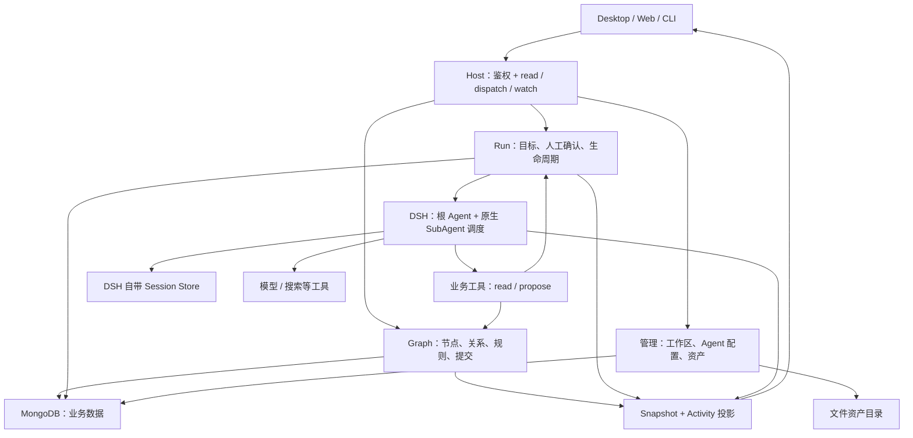
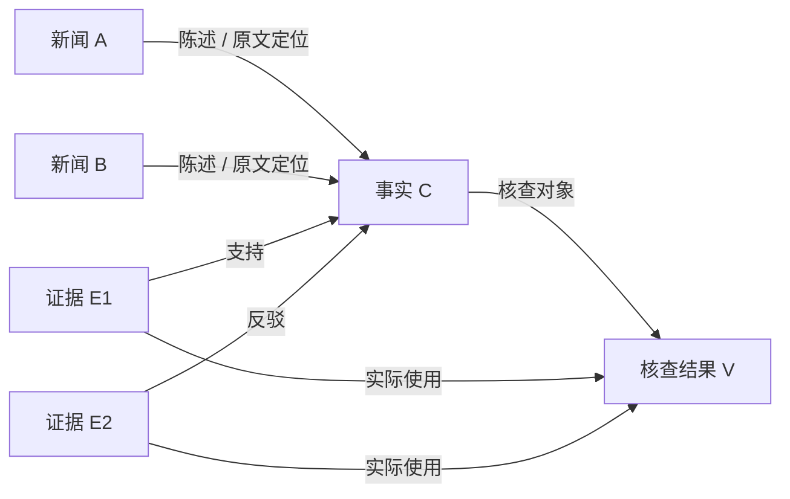

# 050 — 数据节点织网后端架构

> 更新：用户已选择多 Host 分摊执行、共用数据库。执行与部署边界以 [051-多Host协同演进数据图.md](./051-多Host协同演进数据图.md) 为准；本文的数据模型、业务规则和功能清单继续适用。

本次设计依据：以数据节点为核心，允许一个事实关联多篇新闻和多条证据；第一版处理规则固定为解析、拆分、核查；智能体调度交给 DSH，前端通过业务接口使用完整功能。

这是新的架构设计稿及后续实施依据。本轮只新增设计和实施原稿，不执行旧计划、不重写业务代码，也不覆盖工作树已有修改。049 的多人协作目标保留，其 Mapper 分步调度方式由本稿重新设计。

## 1. 核心决定

**数据网是产品本体。DSH 中的智能体负责提出和执行处理方案，后端负责认定哪些数据变化成立。**

业务只有三个核心对象：

- `Node`：可以独立阅读、编辑、引用的数据。
- `Edge`：数据之间有明确含义的关系。
- `Run`：用户要求对哪些数据做到什么程度，以及尚未完成的业务提交。

`Review`、候选结果和提交收据是 Run 的内部记录，不各建一套服务。Workspace、Agent 配置、用户、文件资产仍是必要的管理数据，不强行变成图节点。

## 2. 架构与状态所有权



物理上是一个 Host 进程；框图表示职责，不表示微服务。

| 位置 | 权威数据 | 不负责 |
|---|---|---|
| MongoDB | 节点、关系、业务目标、草稿、用户决定、已接受结果的收据 | 模型消息、Tool 调用账本、worker 生命周期 |
| DSH Session Store | Agent 会话、子 Agent 关系、消息、执行记录 | 认定业务数据已经入库、业务权限 |
| 前端 | 选中项、标签页、布局、尚未提交的表单输入 | 选择下一次 Agent 调用、恢复任务、竞争执行权 |

这里保留业务提交状态，删除的是第二套智能体运行时。把业务规则全部放进提示词同样不符合本设计。

## 3. Node：统一身份，明确内容

第一版只提供五种类型，不开放自定义 schema 或通用工作流编辑器。

| kind | 内容 | 可独立引用的原因 |
|---|---|---|
| `source` | 资产 ID 或 URL、名称、采集信息 | 同一个来源可以供多个数据引用 |
| `news` | 新闻正文、上下文及各字段 AI 可见性 | 可以直接导入或人工创建 |
| `claim` | 可核查陈述、分类 | 可以被多篇新闻共同引用，也可人工创建 |
| `evidence` | 摘录、出处定位、采集时间 | 同一证据可以用于多条事实 |
| `verification` | 总评分、理由、各视角意见及出处 | 核查结论本身也是可阅读的数据 |

各视角 `opinions[]` 嵌入 verification；Agent 槽位、工具调用和路由不建为数据节点。保留当前 `1 / 0.5 / 0` 的评分、意见 priority、Agent/实例出处。

类型采用有限判别联合，公共字段只放 `id / kind / revision / createdAt / updatedAt`。每种内容使用具体类型，避免 `Record<string, unknown>` 贯穿业务层。ID 用稳定 UUID，不编码父节点、Agent 名或数组下标。

一个 Node 的 revision 表示内容版本；Map revision 表示整个业务聚合的提交版本。两个版本服务不同目的：前者用于输入有效性，后者用于并发写入。

## 4. Edge：真正支持多来源



Edge 持久化 `id / kind / from / to`，按关系类型补充原文摘录、来源版本、位置等具体字段。第一版关系限制为 `derived-from / mentions / supports / refutes / verifies / related-to`；每种关系固定方向和允许的端点类型。

上图按阅读方向展示；存储中的 `derived-from` 固定为“产物 → 输入”，`verifies` 为“核查结果 → 事实”，其他关系方向按命名。所有客户端共用同一份关系定义。

**出处关系与计算依赖分开。** Edge 回答数据是什么关系；业务操作的 `inputs` 回答本次计算实际读了哪些版本。相关性边可以成环，不能驱动自动执行；实际派生依赖必须无环，并在提交时检查。

例：新闻 A、B 都陈述事实 C。修改 A 使 A 对应的旧出处定位过期，不直接删除 C。核查 V 只有实际读取过 A 的内容，才因 A 的版本变化失效；不能仅凭图上可达就把 V 一并判为过期。

删除来源时保留被共享的数据，处理或移除其出处边。删除实际计算输入时保留必要的缺失输入标记，旧结论显示需要复核。重新生成也不覆盖人工编辑或其他来源共同使用的节点；有冲突时形成可审阅的候选变化。

保留原始资产、证据摘录和采集信息以供追溯。第一版不新增完整文本编辑历史或时间旅行；旧位置的来源版本不匹配时明确标记，不解释成当前正文的位置。

## 5. Run：业务请求，不是 Agent 流程图

客户端的意图示例：

```json
{
  "type": "run.start",
  "mapId": "map-1",
  "requestId": "request-1",
  "expectedRevision": 12,
  "scope": { "nodeIds": ["news-a", "news-b"] },
  "until": "verified",
  "mode": "human-in-loop"
}
```

`until` 为 `news / claims / verified`。scope 包含起点及有效历史/本次处理收据指向的产物；从已解析 Source 启动也会纳入其既有 News/Claim。普通关联边不扩张 scope，共享 Claim 被纳入也不反向纳入另一篇新闻。不会在选中节点完成后悄悄扩展为整个 Map。独立 News、独立 Claim 都是合法起点。

Run 记录：

| 字段 | 用途 |
|---|---|
| `id / rootSessionId` | 稳定业务身份与唯一根 Session 绑定；Session ID 不进入前端协议 |
| `scope / until / mode` | 目标、边界和人工介入方式 |
| `policySnapshot` | 本次实际使用的 prompt、模型配置引用、tools、候选 Agent、priority、hint；不存凭证明文 |
| `status` | `accepted / running / waiting / completed / failed / cancelled` |
| `operations` | 按业务变换组织的候选数据、人工决定、提交收据 |
| `error / timestamps` | 用户可理解的错误和时间 |

一个 operation 表示“拆分新闻 A”或“核查事实 C”，其中可以发生任意多次 DSH 模型/工具调用。它只记录：

```text
operationId、parse/split/verify、targetId、输入版本、配置版本
经校验的候选业务报告与草稿
route/validate/save 的 reviewId、草稿版本、持久决定
接受后的结果 ID、提交时间（允许结果为空）
```

不记录 prompt 调用副本、attempt、worker pending/running 列表、重试队列或 route→workers→merge 游标。配置快照是可复现的业务输入，不是每次 LLM 请求的拷贝。

候选报告只保存可审阅的事实、意见和出处，不保存自由文本会话。其 producer/slot 身份由运行时绑定，用于原有来源展示和报告幂等，不用它建立 worker 状态机。

## 6. Graph 保留确定性的处理规则

用普通 TypeScript 的三个规则表达，不构造通用 DAG 引擎：

| operation | 合法输入 | 合法结果 | 判定完成 |
|---|---|---|---|
| parse | Source 及已解析的资产/采集内容 | News 和出处关系 | 当前输入的接受收据，允许 0 条 |
| split | News 及允许注入的上下文 | Claim、陈述/来源关系 | 当前输入的接受收据，允许 0 条 |
| verify | Claim、实际读取的上下文与证据 | Evidence、Verification 及关系 | 当前输入的有效核查结果 |

规则负责输入可见性、输出 schema、关系类型、作用域、有效输入版本、必需人工决定及结果是否满足目标。

`graphReadWork()` 是查询：返回 scope 内当前合法且尚未完成的业务项及操作收据。它不创建 Agent、不排 worker 队列、不计重试、不 await 模型。DSH 根 Agent 根据这些业务项组织执行；独立项的并行也由 DSH 负责。

根 Agent 宣称完成或进入 idle，都不能直接把 Run 改为 completed。Host 用同一套规则检查 scope 是否全部达到 until；遗漏时返回剩余业务项，异常退出时记录 failed。配置运行预算；预算耗尽明确失败，不无限自动唤醒。

## 7. DSH 承担完整的智能体调度

一次 Run 创建一个根 DSH Session。根 Agent 使用配置好的路由、拆分、核查和汇总能力，通过 DSH 原生 SubAgent 服务进行委派、并行和后续消息交互。

业务层只给 DSH 两类项目工具：

- `data.read`：读取允许访问的节点、业务项、已保存报告和决定。
- `data.propose`：提交 route 建议、候选事实/意见、验证草稿或最终变化。按有限 proposal 类型严格校验，执行同一条业务写入路径。

按 operation 读取正文时，Host 记录实际暴露的节点版本及关系/上下文范围；提交指纹由 Host 生成，不能让模型漏报读过的输入以绕过过期检查。搜索所得材料在报告中保留采集内容和出处，成为证据输入。

根 Agent 可以提交最终提案；子 Agent 只能提交绑定业务项的候选报告及读取授权上下文。Host 通过 DSH scope 和工具 guard 限制能力。`runId / workspaceId / producer / slot` 来自 Host 绑定，不信任模型自报。

用户仍能挑选 Agent、调整 priority/hint、批量修改策略。确认过的路由和 slot 限制在委派入口强制检查；自动模式也经过校验。业务层声明允许做什么，DSH 决定并执行什么时候调用、如何并行和继续。

所有 prompt 继续配置化。已有各角色 prompt、model/baseUrl、tools、promptVars 和返回格式配置映射到 DSH profile；候选报告 schema 是固定业务边界，修改提示词不能绕过它。

当前官方公开 API 支持 continuable 子 Agent、持久子会话关系和冷恢复；一次性 `SubagentRun` 与可继续子 Agent 的完成/恢复语义不同，不能混用。采用 continuable 路径保留已完成子任务成果，不再由 Mapper 自建 worker 池。[DSH Subagent](https://github.com/deepseek-ai/deepseek-harness/blob/b2e3b2a0125854567a4a5fcba75782e42fe84901/docs/subsystems/subagent.md)

**报告必须显式提交。** continuable 子 Agent 没有等同于一次性调用的 structured-result Promise；Tool 的 execution-local value 也不是可直接恢复的业务结果仓库。子 Agent 用 `data.propose` 交结构化候选报告，根 Agent 再读取并汇总。[DSH Tools](https://github.com/deepseek-ai/deepseek-harness/blob/b2e3b2a0125854567a4a5fcba75782e42fe84901/docs/subsystems/tools.md)

## 8. 自动模式和人工模式走同一条提交路径

保留三个用户可见的业务确认：路由确认、结果校验、最终保存。它们是审阅决定，不是 DSH 内部 step。

```text
DSH 提案 → schema/权限/输入检查 → 保存候选数据
                                    ↓
auto：按业务策略自动接受          HITL：发布 Review
                                    ↓
                 同一提交函数接受数据与关系
```

`Review` 带 `reviewId / operationId / kind / draftRevision / draft / decision`。修改草稿走 review 命令，不写正式 Node。新的 draftRevision 使旧的校验/保存决定失效；不通过修改 mode 自动复用旧批准。

一个业务项最多一个待答 Review。不同独立业务项可以同时等待，Snapshot 返回 reviews 数组；UI 可以按顺序展示。等待记录持久化，不靠内存 Promise 保存用户问题。还有独立工作执行时 Run 保持 running；全部未完成工作都等待用户时为 waiting，不反复启动模型轮询答案。

回答先通过 Map CAS 落库，再唤醒对应 DSH 会话；崩溃恢复可以读取已保存决定。两个 Editor 抢答只有一个成功。用户可以要求修订形成新草稿；拒绝且不要求修订则终结该业务项，从剩余工作查询中排除。本次目标因此未达成时 Run 以 `failed/user-declined` 或 cancelled 结束，不重新提出同一工作，也不标为 completed。

切到 auto 时，由 Host 对剩余提案执行当前策略；已终结/取消的 Run 不因此恢复。已被用户明确拒绝的内容不会仅因切换模式重新入库。

## 9. 原子提交、幂等与恢复

沿用 MongoDB。第一版一个 Map 聚合文档保存 nodes、edges、紧凑 Run/业务操作记录，以单文档 CAS 提交结果。所有 Map 写入都走一个入口；不新增跨存储事务。

同一次提交原子写入节点、边、操作接受收据、空结果完成标记、Map revision。DSH 会话里存在报告不等于图已入库，图已接受也不要求另补一条自定义 DSH 业务事件。

Host 生成两个不同用途的稳定身份：

```text
operationId = hash(runId + operation + targetId)

commitKey = hash(operationId + proposalKind + draftRevision
  + 排序后的输入(id, revision)
  + 本次关系/上下文读取范围的版本指纹
  + 冻结配置与已批准路由版本)
```

operationId 在发现新证据或修改路由时保持不变；报告、Review 和 slot 始终归属同一业务项。每个 proposal/commitKey 在对应草稿定版时生成，之后不可改写。Review 身份绑定 operationId、确认类型和草稿版本。

不能只拼 revision，不能使用随机 LLM tool callId 作为业务身份。报告、Review、最终接受分别有稳定身份；相同提交身份带不同 payload 时返回冲突。用户明确重新生成时创建新的 Run/草稿身份。

关键写入顺序：

1. 查业务收据；已接受的同一提交直接返回原结果。
2. 校验有效 runId、Run 状态、输入版本、目标范围、草稿版本及必要决定。
3. 单次 CAS 提交全部业务变化。
4. 发 Snapshot，再将接受结果返回 DSH。

客户端编辑的 revision 冲突直接返回 409 及新快照。内部独立报告的 CAS 冲突可重新读取并再次校验后提交，不能用旧快照覆盖新状态。

| 中断点 | 恢复行为 |
|---|---|
| Run 已接受，DSH 根 Session 尚未启动 | Host 根据已持久绑定创建/读取同一根 Session |
| 子 Agent 运行中 | DSH 重建会话；根据原生子关系及已保存报告，只继续未满足的业务工作 |
| 子报告已落库，根 Agent 尚未合并 | 读取已有报告，不重做已接受的报告 |
| Mongo 已接受，DSH 工具结果尚未持久化 | 同身份提案返回业务收据，不重复创建节点 |
| Review 等待或答案已落库 | 从业务记录重建待答项，或把已保存决定交给 DSH |
| 用户取消 | 先写 cancelled，再取消/释放 DSH 子树；迟到的新报告/提交被拒绝 |
| Host 正常退出 | 停止入口、flush 并释放运行时；未完成 Run 保留，区别于用户取消 |

恢复只在 Host 启动和显式重试入口进行，不由 read、前端挂载或标签页触发。同一 Host 内只有一个根 Session 的 live binding；不另建带排队/重试策略的 RunSupervisor。

DSH 恢复不是恢复 JavaScript 栈，也不保证恢复根 Agent 就自动继续整棵子树。取消不能只调用 root.cancel；当前公开接口有 `drainContinuableDescendants`，应先关闭子树 admission 并释放子孙，再释放根。业务取消围栏独立于运行时取消是否及时完成。[DSH Subagent 源码](https://github.com/deepseek-ai/deepseek-harness/blob/b2e3b2a0125854567a4a5fcba75782e42fe84901/packages/subagent/subagent/src/index.ts)

终结 Run 可压缩候选数据，但保留仍被产物引用的业务收据及空结果标记；新 Run 不覆盖这些记录。第一版明确限制单图大小，接近聚合上限时拒绝新增并引导拆图。需要大图时再拆集合/事务，不把所有 Session 历史塞进 Map。

## 10. 前端透明的具体含义

前端业务接口仍是 `read / dispatch / watch`，公共类型放 contracts，禁止引用 electron 或 DSH 内部类型。

```text
read      → Map/Node/业务操作/Review 的业务快照
dispatch  → 数据编辑、启动、重试、取消、切模式、草稿编辑、回答
watch     → snapshot（带 revision）或 activity（展示进度）
```

`GraphSnapshot` 包含 nodes、edges、runSummary、reviews、节点能力/过期提示。`Activity` 包含 nodeId、显示名称、状态、文本及工具摘要；不透传 DSH 原始事件、SessionId、工具内部参数或凭证。

智能体进度和出处仍可在侧栏或节点附属面板展开；如果保留画布里的 Agent 卡片，它们只是执行投影，不能成为数据节点的必经父节点。图布局必须支持多入边，不能给共享 Claim 强造一个业务 parentId。

Timeline 从业务目标、接受收据和当前 Activity 投影，不存像素坐标驱动执行。实时 Activity 丢失不影响业务正确性；重连首先恢复完整 Snapshot，再按 DSH 公开读取接口补可用执行摘要，不承诺逐 token 精确回放。

## 11. 多人协作及外围能力

保留 049 的单 Host 方案：HTTP 命令/查询、SSE 更新、Owner/Editor/Viewer 权限、资产上传、共享 Run 和多人 HITL。鉴权由 Host 注入身份，每个入口检查工作区权限。

同一 Map 同时一个 Run；它内部可以由 DSH 并行处理独立节点。运行期间普通图编辑被拒绝，人工改动通过对应 Review 提交；其他 Map 可以正常编辑和运行。关闭客户端不取消任务。

SSE 首帧与增量发布使用同一订阅顺序：先登记订阅并缓冲变化，取得基线后丢弃不高于基线 revision 的缓存，再发送后续更新；慢客户端断开重连。持久状态使用完整快照，不自建事件仓库。

控制服务保留 Workspace、Agent/prompt CRUD、本地配置池、变量与输出预览、模型/工具设置、数据库连接管理、导入导出。桌面凭证留在 Main 进程；数据库/Host 设置归管理员。

文件来源使用 Host assetId。导出包含资产或明确的资源清单；导入重映射 node/edge/map 引用，不导入活跃 Run 或原 Host 的可执行 Session 绑定。

本次范围还包括用户确认的多来源连接和证据复用。URL 抓取、真正的流式展示及多人 Host 是待新增能力；当前代码的 URL 解析明确报未支持，流事件在 Mapper 被丢弃，不能把它们写成已经完成的现状。

RSS 定时采集、报告 PDF、字符级实时合编等早期需求/远期设想，不是当前已实现能力；本设计不把它们捆绑成 DSH 重构前置条件。

## 12. 最小目录

```text
contracts/
  graph.ts           # Node/Edge/Command/Snapshot/Review 公共类型
  control.ts         # 管理接口公共类型
backend/
  main.ts            # Host 组合与关闭
  api.ts             # HTTP/SSE/身份与权限入口
  graph.ts           # 节点关系 CRUD、提交、去重、有效性
  rules.ts           # parse/split/verify 的业务规则与 schema
  run.ts             # 目标、Review、收据、启动/恢复/取消
  dsh.ts             # DSH 装配、业务工具、profile 和 Activity 转换
  store.ts           # Mongo schema、读取和 Map CAS
  control/           # 现有工作区/配置/资产服务按职责迁移
client/
  api.ts             # Desktop/CLI 共用 HTTP/SSE client
```

现有 Vue、Electron shell、CLI 先保持目录，只调整边界 import 和调用。需要改的地方集中在协议、图投影和 Host 入口；不以机械移动所有文件作为架构成果。

不增加抽象 Repository、通用 Runtime 接口、工厂层或业务事件总线。DSH 原生服务通过项目专用 dsh.ts 使用，不实现“未来可插拔 AgentLoop”。

## 13. 功能保留与替换对照

| 当前能力 | 新归属 |
|---|---|
| Map/Workspace/Node CRUD、独立 News/Claim | Graph + Control |
| 原文关系、Agent/实例出处、评分与意见 | Node/Edge + 经验证的候选报告 |
| 自动路由、手调 priority/hint、批量配置 | profile/policy + route Review + DSH 委派限制 |
| route/workers/merge 的模型工作 | DSH 根 Agent 与原生子 Agent |
| 自动/HITL、草稿编辑、validate/save | Run 内持久 Review/决定 |
| 取消、错误重试、重启、不重跑已完成报告 | 业务 Run/收据 + DSH 原生会话 |
| Claim 去重 | 保留选定稳定 ID，迁移来源边，保留意见出处，受内容/证据变化影响的核查需复核 |
| 节点删除、上游变动 | 明确输入有效性与共享引用处理，取代按单父树全删 |
| 图谱、进度、Timeline、多标签页 | 后端快照/Activity + 前端纯显示 |
| Agent 管理、变量/格式、模型、skills、DB 配置 | 保留现有产品能力，迁移到 Control/DSH 装配 |
| 导入导出、无头 CLI | 同一 Host API 与可移植资产 |

## 14. 开工前的唯一技术验证关口

以 DSH 官方 commit `b2e3b2a0125854567a4a5fcba75782e42fe84901` 的公开文档/源码为本次核查基准；正式依赖锁定可安装版本及对应 commit。未在此项目运行 DSH 集成测试。

需要一个最小闭环验证：**根 Agent → 两个 continuable 子 Agent → 结构化报告 → 人工确认 → 图提交 → 强制重启 → 恢复 → 取消子树。**

必须实测：稳定业务项/slot 与原生子会话的关联及恢复、已提交报告复用、冷子会话消息继续、取消后迟到报告、当前模型/搜索配置、Host 打包。不能以一次性 SubagentRun 能返回结果替代恢复验收。

当前官方 persistence 文档描述 JSONL、Zstd 等自带实现；旧 049 的 SQLite 包名/存储假设不继续采用。项目只配置 DSH 支持的 Session Store 及公开 flush/恢复接口，不直接读写其内部文件格式。append 被接受不等于已经耐久落盘：装配 checkpoint policy，并在会话绑定交付、可恢复报告完成及正常关闭等关键边界显式 flush；报告的业务落库仍以 Mongo 收据为准。[DSH Persistence](https://github.com/deepseek-ai/deepseek-harness/blob/b2e3b2a0125854567a4a5fcba75782e42fe84901/docs/subsystems/persistence.md)

只有闭环通过才删除现有可恢复执行路径。若某个恢复动作不能用公开 API 达成，先缩小或修正集成设计，不偷偷补回另一套 worker 账本。详细落地顺序见同编号实施原稿。
