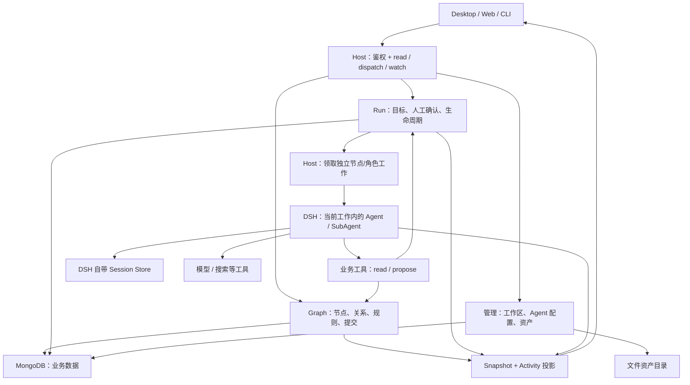
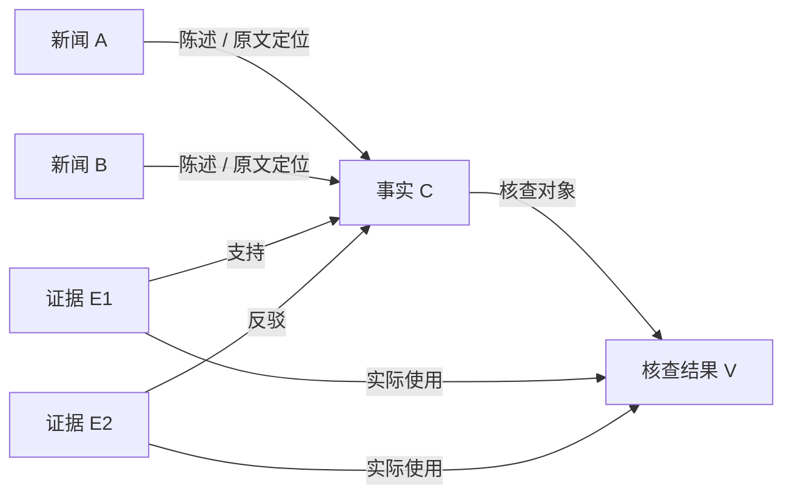

# 050 — 数据节点织网后端架构

> 2026-09-12 修订：本文保留数据节点与后继处理的产品目标；多 Host 边界见 [051](./051-多Host协同演进数据图.md)，本轮实施按 [059 节点驱动闭环](./059-节点驱动协作闭环与暂停恢复.md)。050–052 的宽范围目标不等于已完成能力。

本次设计依据：以数据节点为核心，允许一个事实关联多篇新闻和多条证据；第一版处理规则固定为解析、拆分、核查；智能体调度交给 DSH，前端通过业务接口使用完整功能。

053–058 已交付共享 Graph、DSH 核查、多 Host 租约、身份资产与核查客户端。059 在该基线上补齐 scope/until 下的 parse/source→news、split/news→claims、verify/claim→verification 和暂停控制，不从零重写。旧 Mapper 的已有未提交文件继续保留。

## 1. 核心决定

**数据网是产品本体。DSH 中的智能体负责提出和执行处理方案，后端负责认定哪些数据变化成立。**

业务只有三个核心对象：

- `Node`：可以独立阅读、编辑、引用的数据。
- `Edge`：数据之间有明确含义的关系。
- `Run`：用户要求对哪些数据做到什么程度，以及尚未完成的业务提交。

`Review`、候选结果和提交收据归属 Run.operations[] 中的具体业务项，不各建一套服务。Workspace、Agent 配置、用户、文件资产仍是必要的管理数据，不强行变成图节点。

## 2. 架构与状态所有权


```mermaid
flowchart TB
  UI["Desktop / Web / CLI"] --> API["Host：鉴权 + read / dispatch / watch"]
  API --> Graph["Graph：节点、关系、规则、提交"]
  API --> Run["Run：目标、人工确认、生命周期"]
  API --> Control["管理：工作区、Agent 配置、资产"]
  Run --> Host["Host：领取独立节点/角色工作"]
  Host --> DSH["DSH：当前工作内的 Agent / SubAgent"]
  DSH --> Tools["业务工具：read / propose"]
  Tools --> Graph
  Tools --> Run
  Graph --> Mongo["MongoDB：业务数据"]
  Run --> Mongo
  Control --> Mongo
  Control --> Assets["文件资产目录"]
  DSH --> Sessions["DSH 自带 Session Store"]
  DSH --> External["模型 / 搜索等工具"]
  Graph --> View["Snapshot + Activity 投影"]
  Run --> View
  DSH --> View
  View --> UI
```

框图表示职责，不要求特定进程拆分。单机 API、Mongo 与一个执行 Host 可以完成全部工作；多个 Host 可并行处理不同新闻、事实与角度，数据库负责裁决，不设全图执行主机。

| 位置 | 权威数据 | 不负责 |
|---|---|---|
| MongoDB | 节点、关系、业务目标、草稿、用户决定、已接受结果的收据 | 模型消息、Tool 调用账本、worker 生命周期 |
| DSH Session Store | Agent 会话、子 Agent 关系、消息、执行记录 | 认定业务数据已经入库、业务权限 |
| 前端 | 选中项、标签页、布局、尚未提交的表单输入 | 选择下一次 Agent 调用、恢复任务、竞争执行权 |

这里保留业务提交状态，删除的是第二套智能体运行时。把业务规则全部放进提示词同样不符合本设计。

## 3. Node：统一身份，明确内容

第一版只提供五种类型，不开放自定义 schema 或通用工作流编辑器。

| kind | 内容 | 可独立引用的原因 |
|---|---|---|
| `source` | 资产 ID 或 URL、名称、采集信息 | 同一个来源可以供多个数据引用 |
| `news` | 新闻正文、上下文及各字段 AI 可见性 | 可以直接导入或人工创建 |
| `claim` | 可核查陈述、分类 | 可以被多篇新闻共同引用，也可人工创建 |
| `evidence` | 摘录、出处定位、采集时间 | 同一证据可以用于多条事实 |
| `verification` | 总评分、理由、各视角意见及出处 | 核查结论本身也是可阅读的数据 |

各视角 `opinions[]` 嵌入 verification；Agent 槽位、工具调用和路由不建为数据节点。保留当前 `1 / 0.5 / 0` 的评分、意见 priority、Agent/实例出处。

类型采用有限判别联合，公共字段只放 `id / kind / revision / createdAt / updatedAt`。每种内容使用具体类型，避免 `Record<string, unknown>` 贯穿业务层。ID 用稳定 UUID，不编码父节点、Agent 名或数组下标。

一个 Node 的 revision 表示内容版本；Map revision 表示整个业务聚合的提交版本。两个版本服务不同目的：前者用于输入有效性，后者用于并发写入。

## 4. Edge：真正支持多来源


```mermaid
flowchart LR
  A["新闻 A"] -->|"陈述 / 原文定位"| C["事实 C"]
  B["新闻 B"] -->|"陈述 / 原文定位"| C
  E1["证据 E1"] -->|"支持"| C
  E2["证据 E2"] -->|"反驳"| C
  C -->|"核查对象"| V["核查结果 V"]
  E1 -->|"实际使用"| V
  E2 -->|"实际使用"| V
```

Edge 持久化 `id / kind / from / to`，按关系类型补充原文摘录、来源版本、位置等具体字段。第一版关系限制为 `derived-from / mentions / supports / refutes / verifies / related-to`；每种关系固定方向和允许的端点类型。

上图按阅读方向展示；存储中的 `derived-from` 固定为“产物 → 输入”，`verifies` 为“核查结果 → 事实”，其他关系方向按命名。所有客户端共用同一份关系定义。

**出处关系与计算依赖分开。** Edge 回答数据是什么关系；业务操作的 `inputs` 回答本次计算实际读了哪些版本。相关性边可以成环，不能驱动自动执行；实际派生依赖必须无环，并在提交时检查。

例：新闻 A、B 都陈述事实 C。修改 A 使 A 对应的旧出处定位过期，不直接删除 C。核查 V 只有实际读取过 A 的内容，才因 A 的版本变化失效；不能仅凭图上可达就把 V 一并判为过期。

删除来源时保留被共享的数据，处理或移除其出处边。删除实际计算输入时保留必要的缺失输入标记，旧结论显示需要复核。重新生成也不覆盖人工编辑或其他来源共同使用的节点；有冲突时形成可审阅的候选变化。

保留原始资产、证据摘录和采集信息以供追溯。第一版不新增完整文本编辑历史或时间旅行；旧位置的来源版本不匹配时明确标记，不解释成当前正文的位置。

## 5. Run：业务请求，不是 Agent 流程图

客户端的意图示例：

```json
{
  "type": "run.start",
  "mapId": "map-1",
  "requestId": "request-1",
  "expectedRevision": 12,
  "scope": { "nodeIds": ["news-a", "news-b"] },
  "until": "verified",
  "mode": "human-in-loop"
}
```

`until` 为 `news / claims / verified`。scope 包含起点及有效历史/本次处理收据指向的产物；从已解析 Source 启动也会纳入其既有 News/Claim。普通关联边不扩张 scope，共享 Claim 被纳入也不反向纳入另一篇新闻。不会在选中节点完成后悄悄扩展为整个 Map。独立 News、独立 Claim 都是合法起点。

Run 记录：

| 字段 | 用途 |
|---|---|
| `id` | 稳定业务身份；不绑定全图根 Session |
| `scope.nodeIds / until / mode` | 固定起点、后继闭包边界和人工介入方式 |
| `paused` | 独立运行控制位；保留 operation 状态和 Review |
| `policySnapshot` | 本次实际使用的 prompt、模型配置引用、tools、候选 Agent、priority、hint；不存凭证明文 |
| `status` | `accepted / running / waiting / completed / failed / cancelled` |
| `operations[]` | 可并行的 parse/source、split/news、verify/claim；各自有候选、Review、版本引用与收据 |
| `error / timestamps` | 用户可理解的错误和时间 |

一个 operation 表示“拆分新闻 A”或“核查事实 C”，其中可以发生任意多次 DSH 模型/工具调用。它只记录：

```text
operationId、parse/split/verify、targetId、输入版本、配置版本
经校验的候选业务报告与草稿
route/validate/save 的 reviewId、草稿版本、持久决定
接受后的 outputRefs、配置指纹、提交时间（允许结果为空）
```

不记录 prompt 调用副本、模型重试队列或 DSH 会话副本。保留核查/拆分现有 router、角度报告和 merge 的业务记录，从报告与审核事实推导角色工作；不因删除自研 AgentLoop 而删除这层领域协议。配置快照是业务输入，不是每次 LLM 请求的拷贝。

候选报告只保存可审阅的事实、意见和出处，不保存自由文本会话。其 producer/slot 身份由运行时绑定，用于原有来源展示和报告幂等，不用它建立 worker 状态机。

## 6. Graph 保留确定性的处理规则

用普通 TypeScript 的三个规则表达，不构造通用 DAG 引擎：

| operation | 合法输入 | 合法结果 | 判定完成 |
|---|---|---|---|
| parse | Source 及已解析的资产/采集内容 | News 和出处关系 | 当前输入的接受收据，允许 0 条 |
| split | News 及允许注入的上下文 | Claim、陈述/来源关系 | 当前输入的接受收据，允许 0 条 |
| verify | Claim、实际读取的上下文与证据 | Evidence、Verification 及关系 | 当前输入的有效核查结果 |

规则负责输入可见性、输出 schema、关系类型、作用域、有效输入版本、必需人工决定及结果是否满足目标。

现有 Run/work 代码按 scope/until 返回合法且尚未完成的 operation 及其角色工作，不创建通用队列、不 await 模型。Host 通过共享租约领取独立 Source、News、Claim 工作；每个 operation 内保留路由、并行角度和合并。DSH 只执行当前领取工作的智能体过程，不承担整张图的后继发现。

模型停止或当前没有可领取项都不能直接把 Run 改为 completed。业务层按同一确认图版本检查 scope/until 闭包：接受结果、空结果收据及所有新后继均满足，且无待审项，才可完成。不可继续错误明确终结失败；不以无限唤醒掩盖错误。

## 7. DSH 承担当前工作的智能体执行

一次领取绑定一个具体 operation/角色工作及有效 grant，对应一个本地 DSH 进程/会话。Run 不绑定唯一根 Session；多节点推进由确定性业务规则和 Host 领取完成。现有 verify 的 router/workers/merge 保留，split 采用相同业务结构，parse 返回 news[]。

业务模型仍通过受限 data.read/data.propose 读取已授权上下文、提交结构化报告；运行身份、operation、producer/slot、holder/fence 均由 Host 绑定，不信任模型自报。Tool guard 不能替代最后 Mongo 提交条件。

配置继续作为数据：保留现有顶层 verify 配置字段，新增可选 parse profile 和 split.router/merger/agents；scope/until 实际需要某阶段时，缺配置明确失败。split-report 保存 claims[]，split-merge 通过 selected[{reportId,index}] 选择已保存候选，不重新生成候选正文。parse/split 都允许合法零产物。

DSH 使用已有 start/run/close SDK 边界执行模型、工具与 SubAgent。本轮不要求 continuable 子会话冷恢复、跨 Host 搬迁或 token 级继续。已接受报告与用户决定来自 Mongo；未提交工作重新领取后用新会话执行。没有第二份模型消息账本，也不按每个 Agent 创建数据 Node。

报告必须显式通过业务提案接受，不能将会话日志、工具临时返回值或 Agent idle 当成已入库结果。prompt、model/tools、promptVars 和输出 schema 继续走可配置且受权限约束的边界。

## 8. 自动模式和人工模式走同一条提交路径

保留三个用户可见的业务确认：路由确认、结果校验、最终保存。它们是审阅决定，不是 DSH 内部 step。

```text
DSH 提案 → schema/权限/输入检查 → 保存候选数据
                                    ↓
auto：按业务策略自动接受          HITL：发布 Review
                                    ↓
                 同一提交函数接受数据与关系
```

`Review` 带 `reviewId / operationId / kind / draftRevision / draft / decision`。修改草稿走 review 命令，不写正式 Node。新的 draftRevision 使旧的校验/保存决定失效；不通过修改 mode 自动复用旧批准。

一个业务项最多一个待答 Review。不同独立业务项可以同时等待，Snapshot 返回 reviews 数组；UI 可以按顺序展示。等待记录持久化，不靠内存 Promise 保存用户问题。还有独立工作执行时 Run 保持 running；全部未完成工作都等待用户时为 waiting，不反复启动模型轮询答案。

回答先通过 Map CAS 落库，再由工作发现决定下一可领取项；需要执行时启动新 DSH 会话，读取已保存业务决定。两个 Editor 抢答只有一个成功。用户可以要求修订形成新草稿；拒绝且不要求修订则终结该业务项，从剩余工作查询中排除。本次目标因此未达成时 Run 以 `failed/user-declined` 或 cancelled 结束，不重新提出同一工作，也不标为 completed。

切到 auto 时，由 Host 对剩余提案执行当前策略；已终结/取消的 Run 不因此恢复。已被用户明确拒绝的内容不会仅因切换模式重新入库。

## 9. 原子提交、幂等与恢复

沿用 MongoDB。第一版一个 Map 聚合文档保存 nodes、edges、紧凑 Run/业务操作记录，以单文档 CAS 提交结果。所有 Map 写入都走一个入口；不新增跨存储事务。

同一次提交原子写入节点、边、操作接受收据、空结果完成标记、Map revision。DSH 会话里存在报告不等于图已入库，图已接受也不要求另补一条自定义 DSH 业务事件。

Host 生成两个不同用途的稳定身份：

```text
operationId = hash(runId + operation + targetId)

commitKey = hash(operationId + proposalKind + draftRevision
  + 排序后的输入(id, revision)
  + 本次关系/上下文读取范围的版本指纹
  + 冻结配置与已批准路由版本)
```

operationId 在发现新证据或修改路由时保持不变；报告、Review 和 slot 始终归属同一业务项。每个 proposal/commitKey 在对应草稿定版时生成，之后不可改写。Review 身份绑定 operationId、确认类型和草稿版本。

不能只拼 revision，不能使用随机 LLM tool callId 作为业务身份。报告、Review、最终接受分别有稳定身份；相同提交身份带不同 payload 时返回冲突。用户明确重新生成时创建新的 Run/草稿身份。

关键写入顺序：

1. 查业务收据；已接受的同一提交直接返回原结果。
2. 校验有效 runId、Run 状态、输入版本、目标范围、草稿版本及必要决定。
3. 单次 CAS 提交全部业务变化。
4. 发 Snapshot，再将接受结果返回 DSH。

客户端编辑的 revision 冲突直接返回 409 及新快照。内部独立报告的 CAS 冲突可重新读取并再次校验后提交，不能用旧快照覆盖新状态。

| 中断点 | 恢复行为 |
|---|---|
| Run 已接受，工作尚未启动 | Host 从 scope/until 和业务收据发现可执行项，再领取 |
| Agent 运行中失联 | 租约到期后新持有者启动新 DSH 会话，重做尚未接受的工作 |
| 子报告已落库，尚未合并 | 读取有效报告，仅继续缺少的角度/合并工作 |
| Mongo 已接受，工具响应丢失 | 同身份重放返回业务收据，不重复创建产物 |
| Review 等待或答案已落库 | 从 operation 记录展示待审项/读取决定，其他独立项继续 |
| 用户取消 | 先写 cancelled，后停止 Runtime；迟到新提案被拒绝 |
| Host 正常退出 | 停止领取、关闭 Runtime 后释放租约；保留未终结业务目标 |
| 用户暂停/恢复 | 同一 Run 的 paused 控制和租约失效，不改变业务报告/审核事实 |

恢复由现有 Host 领取循环读取共享业务记录完成，不由前端挂载或只读查询触发；不要求模型上下文、调用栈或旧 Session 恢复。DSH 本机历史只供执行观察/诊断，不决定业务身份。

暂停与审核正交：Run.paused 阻止发现、领取、续租及新执行结果提交；Review 仍属于 operation，批准不清 paused。pause 必须在现有权限事务中同次落库 paused/revision/收据并定向过期本 Run 租约，保留 holder/fence；resume 不恢复旧期限。claim/renew 不升 Map revision，枚举租约并失效必须保留事务边界，不能仅用旧快照加 revision CAS。无需再增加 executionEpoch。详见 [059 第 6 节](./059-节点驱动协作闭环与暂停恢复.md#6-暂停与-review-正交)。

业务暂停/取消的接受先于进程停止收敛；在途模型或外部工具可能继续片刻，也可能在接管后重做。所有新业务结果依靠数据库授权条件裁决，不能承诺外部调用只发生一次。

终结 Run 可压缩候选数据，但保留仍被产物引用的业务收据及空结果标记；新 Run 不覆盖这些记录。第一版明确限制单图大小，接近聚合上限时拒绝新增并引导拆图。需要大图时再拆集合/事务，不把所有 Session 历史塞进 Map。

## 10. 前端透明的具体含义

前端业务接口仍是 `read / dispatch / watch`，公共类型放 contracts，禁止引用 electron 或 DSH 内部类型。

```text
read      → Map/Node/业务操作/Review 的业务快照
dispatch  → 数据编辑、启动、重试、取消、切模式、草稿编辑、回答
watch     → snapshot（带 revision）或 activity（展示进度）
```

`GraphSnapshot` 包含 nodes、edges、runSummary、reviews、节点能力/过期提示。`Activity` 包含 nodeId、显示名称、状态、文本及工具摘要；不透传 DSH 原始事件、SessionId、工具内部参数或凭证。

智能体进度和出处仍可在侧栏或节点附属面板展开；如果保留画布里的 Agent 卡片，它们只是执行投影，不能成为数据节点的必经父节点。图布局必须支持多入边，不能给共享 Claim 强造一个业务 parentId。

Timeline 从业务目标、接受收据和当前 Activity 投影，不存像素坐标驱动执行。实时 Activity 丢失不影响业务正确性；重连首先恢复完整 Snapshot，再按 DSH 公开读取接口补可用执行摘要，不承诺逐 token 精确回放。

## 11. 多人协作及外围能力

保留 HTTP 命令/查询、Owner/Editor/Viewer、资产、共享 Run 和多人 HITL 目标，执行采用 051 的共享数据库、多 Host 领取。鉴权由服务端注入，每个入口检查 Workspace 权限。061 已接入RabbitMQ工作通知与认证SSE快照，执行分发细节以061为准；063已接入模型/工具阶段的Activity固定摘要，经同一MQ/SSE展示并在租约失效时清除；不回放模型上下文或原始事件。

同一 Map 同时一个活跃 Run，内部 operations[] 的独立节点由多个 Host 并行领取；单 Host 可顺序执行。运行期间普通图编辑被拒绝，人工改动通过对应 Review 提交；其他 Map 可以正常编辑和运行。关闭客户端不取消任务。

SSE 首帧与增量发布使用同一订阅顺序：先登记订阅并缓冲变化，取得基线后丢弃不高于基线 revision 的缓存，再发送后续更新；慢客户端断开重连。持久状态使用完整快照，不自建事件仓库。

控制服务保留 Workspace、Agent/prompt CRUD、本地配置池、变量与输出预览、模型/工具设置、数据库连接管理、导入导出。桌面凭证留在 Main 进程；数据库/Host 设置归管理员。

文件来源使用 Host assetId。导出包含资产或明确的资源清单；导入重映射 node/edge/map 引用，不导入活跃 Run 或原 Host 的可执行 Session 绑定。

多来源连接、共享资产和多 Host 的核查基线已在 053–056 实现；parse/split、跨新闻/事实闭包与暂停在 059 补齐。URL 内容采集、完整管理 UI、产品 SSE/Activity 的可用性以实际实现记录为准，不把旧 Mapper 的缺口继续当成新后端现状。

RSS 定时采集、报告 PDF、字符级实时合编等早期需求/远期设想，不是当前已实现能力；本设计不把它们捆绑成 DSH 重构前置条件。

## 12. 最小目录

```text
contracts/
  graph.ts           # Node/Edge/Command/Snapshot/Review 公共类型
  control.ts         # 管理接口公共类型
backend/
  main.ts            # Host 组合与关闭
  api.ts             # HTTP/SSE/身份与权限入口
  graph.ts           # 节点关系 CRUD、提交、去重、有效性
  work.ts            # 现有节点/角色工作发现；规则按实际职责留在 run/graph
  run.ts             # scope/until、operations、Review、暂停/业务恢复/取消
  dsh.ts             # DSH 装配、业务工具、profile 和 Activity 转换
  store.ts           # Mongo schema、读取和 Map CAS
  control/           # 现有工作区/配置/资产服务按职责迁移
client/
  api.ts             # Desktop/CLI 共用 HTTP/SSE client
```

现有 Vue、Electron shell、CLI 先保持目录，只调整边界 import 和调用。需要改的地方集中在协议、图投影和 Host 入口；不以机械移动所有文件作为架构成果。

不增加抽象 Repository、通用 Runtime 接口、工厂层或业务事件总线。DSH 原生服务通过项目专用 dsh.ts 使用，不实现“未来可插拔 AgentLoop”。

## 13. 功能保留与替换对照

| 当前能力 | 新归属 |
|---|---|
| Map/Workspace/Node CRUD、独立 News/Claim | Graph + Control |
| 原文关系、Agent/实例出处、评分与意见 | Node/Edge + 经验证的候选报告 |
| 自动路由、手调 priority/hint、批量配置 | profile/policy + route Review + DSH 委派限制 |
| route/workers/merge 的模型工作 | operation 内的角色工作与 DSH Agent/SubAgent |
| 自动/HITL、草稿编辑、validate/save | Run 内持久 Review/决定 |
| 暂停/继续、取消、错误与 Host 重启 | 共享 Run/operation/收据；未提交工作新 DSH 会话重跑 |
| Claim 去重 | 保留选定稳定 ID，迁移来源边，保留意见出处，受内容/证据变化影响的核查需复核 |
| 节点删除、上游变动 | 明确输入有效性与共享引用处理，取代按单父树全删 |
| 图谱、进度、Timeline、多标签页 | 后端快照/Activity + 前端纯显示 |
| Agent 管理、变量/格式、模型、skills、DB 配置 | 保留现有产品能力，迁移到 Control/DSH 装配 |
| 导入导出、无头 CLI | 同一 Host API 与可移植资产 |

## 14. 已验证边界与下一轮验收

DSH SDK 的 start/run/close、共享图核查、多 Host 租约和客户端已在 052–058 分阶段实现。早期要求“同一 Run 根 Session 冷恢复、continuable 子会话原地继续”的关口撤销：它既不是业务恢复必要条件，也不是 059 的实施目标。

下一轮最小闭环为：多个 Source/News/Claim 的 scope/until → 独立 operation 领取 → 结构化产物与空结果收据 → operation Review → 其他节点继续 → pause/resume → Host 重启后读取业务事实并重跑未提交工作 → 全范围完成。

必须验证输入/输出版本与配置指纹、重叠范围去重、后继发现与完成竞争、快速暂停恢复旧 grant 失效、取消/失败终态以及单 Host 可完成全部工作。模型上下文恢复不列为验收项，不读写 DSH 私有文件。

依赖锁定和 SDK 限制沿用已记录事实；生产代码与文档测试使用本轮实际运行结果。旧 Runtime/依赖删除在剩余业务能力与入口接线验收后进行，不先删除用户工作或用历史文档检查替代功能验收。
