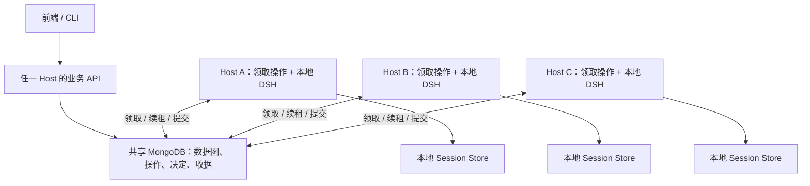

# 051 — 多 Host 协同演进数据图

> 具体模块函数、完整协议和现状迁移以 [052 代码复核与实现架构](./052-代码复核与实现架构.md) 及其接口文档为准；本文保留多 Host 架构决策背景。

用户已明确选择：**多个 Host 分摊执行，可以共用一个数据库。** 本稿更新 050 的执行与部署边界；Node/Edge 类型、多来源关系、业务规则、人工确认及前端透明原则继续适用。本轮仅设计，尚未实施。

## 1. 最小架构

**一张共享数据图，多个平等 Host，按业务操作领取执行。**



执行层没有唯一主 Host。数据库是共同的状态与写入裁决点；第一版不承担独立数据副本的离线同步。生产使用 Mongo 副本集，控制与接受写入使用 majority 确认、领取/校验面向 primary；不把只部署一台 Mongo 的单机故障风险当成已经解决。[Mongo Write Concern](https://www.mongodb.com/docs/manual/reference/write-concern/)

不新增中心调度服务、Redis、Kafka 或 P2P 数据同步协议。各 Host 运行相同后端，按本机容量从共享业务项中领取工作；没有容量就不提前占住租约。

## 2. 分配“操作”，不永久分割节点

业务操作仍只有三种：

```text
parse(source-1)       → Host A
split(news-1)         → Host B
verify(claim-1)       → Host A
verify(claim-2)       → Host C
```

后继操作只有在前置业务结果被接受后才可领取；两个独立 Claim 可以并行核查。同一节点的下一次演进可以换 Host，无须迁移节点归属。

分配的最小单位为 `runId + operation + targetId`。同一个业务项只有当前持有有效租约的执行者可以提交；一个操作内部的 route、多个 SubAgent 和 merge 由该 Host 的 DSH 管理。

一个 Run 是所有 Host 共同可读的用户目标记录：scope、until、mode、配置快照和业务操作。它不绑定全图根 Session，也不需要某台 Host 常驻推进。第一版仍可限制每图一个活跃 Run，其内部允许多个 Host 同时工作。

## 3. DSH 与跨 Host 领取的边界

| 机制 | 负责人 |
|---|---|
| 哪些数据尚需解析、拆分、核查 | Graph 的确定性业务规则 |
| 哪台 Host 暂时负责某个业务操作 | 数据库条件领取及租约 |
| 该操作使用哪些 Agent、怎样委派/并行/继续 | 该 Host 的 DSH |
| 图中哪些结果成立，是否过期或重复 | Graph 的版本校验与原子接受 |

需要增加的是业务操作领取循环。它只有“发现可执行项 → 原子领取 → 交给本地 DSH → 续租/结束”，不保存单个模型请求、Tool 队列或 SubAgent 重试状态。

050 的一个 Run 一个根 Session，改为**一次操作领取对应一个本地根 Session**。Session 绑定 operationId 与本次 fence；根 Agent 完成该业务操作的路由、报告与汇总，不调度整张图。

已核查的 DSH SDK 委派描述本地子进程执行，不能据其名称推导跨 Host 会话共享能力。本方案只依赖各 Host 本地的 DSH，不要求 DSH 提供数据库集群协调。[DSH SDK Provider](https://github.com/deepseek-ai/deepseek-harness/blob/b2e3b2a0125854567a4a5fcba75782e42fe84901/packages/subagent/subagent-dsh-sdk/README.md)

## 4. 为 operation 增加最小执行租约

在 050 的业务 operation 上增加：

```text
status: ready | executing | waiting | completed | failed | cancelled
ownerHostId: 哪台机器负责显示与路由
holderId: 本次 Host 进程的唯一身份
leaseUntil: 数据库时间下的到期时间
fence: 每次成功领取递增的执行代数
sessionId: 当前执行代数对应的本地 DSH 会话
```

holderId 区分同一 Host 重启前后的两个进程。fence 是提交授权版本，不能靠 Host ID 相同就续用旧权限。

领取为一次数据库条件更新：Run 活跃、操作 ready 或 executing 且已过期、未被终结。成功时同时写 holder、延长租约、递增 fence、置 executing。两个 Host 抢同一项只有一个成功。

续租要求 owner/holder/fence 匹配、租约仍有效、Run 仍活跃。过期持有者必须重新竞争，不能自行续活。领取、续租、提交都使用数据库时间；不依赖各机器墙上时钟一致。[Mongo NOW](https://www.mongodb.com/docs/manual/reference/aggregation-variables/)

所有 DSH 写入——包括候选报告、Review 提案、最终结果——检查这些条件：

```text
runId 仍是当前活跃 Run
operationId + holderId + fence 匹配
leaseUntil > 数据库当前时间
业务输入、配置与草稿版本有效
```

先验证共享授权，再接受结果。每次工具调用捕获自己的 fence，不能让旧的异步调用读取并冒用后来领取的新 fence。

## 5. 并行计算，短暂原子提交

第一版继续使用一图一个 Mongo 文档，内嵌按 operationId 定位的业务操作。耗时的 Agent 计算在多个 Host 同时进行，提交使用短暂的单文档条件更新，数据库事务不跨越模型调用。普通人工图编辑的限制由业务入口检查，不阻止各 Host 并行提交合法的运行产物。

最终接受一次性写入：

```text
节点变化 + 边变化 + 业务收据 + operation 完成状态
+ 新增的合法后继操作 + Map revision
```

保存时重新读取当前图，检查本次实际输入版本；以读取到的 Map revision 连同执行租约条件执行 CAS。另一个 Host 接受不相关产物导致 CAS 失败时，重新读取并校验后再提交已经得到的结果，无需重跑 DSH；实际输入变了则拒绝旧提案，不能覆盖新版本。

只做字段级更新，禁止从旧快照替换整张 Map 或整个 operations 容器，否则会覆盖别的 Host 的租约、报告或决定。纯 leaseUntil 续租不增加业务 revision；领取/完成等可见状态和所有业务数据变化增加 revision。Graph 写入不能顺带回写旧 lease 字段。

Mongo 支持单文档多字段原子更新，并在执行时检查过滤条件，因此第一版无需引入跨集合事务。[Mongo 原子性](https://www.mongodb.com/docs/manual/core/write-operations-atomicity/)

原 050 的 operationId/commitKey 规则保留。**ownerHostId、holderId、fence 都不进入业务幂等键**；同一个结果换机器提交仍是同一业务结果。已接受收据的查询可以返回已有结果，不产生任何新写入。

图大小与单文档写竞争仍有上限。真正达到瓶颈后再拆节点/operation 集合并设计 Mongo 事务；新增 Host 能提升模型计算并发，不能无限提升同图提交吞吐。

## 6. 没有唯一调度者，图如何继续演进

`graphReadWork()` 按 scope/until 查询缺失业务结果。任意 Host 都可以根据同一规则，幂等补齐缺少的 ready 操作；稳定 operationId 防止重复登记。

接受 parse/split 等结果时，在同一提交内补齐合法后继项。各 Host 启动和周期检查时也会补查，修复“结果存在但下一项未登记”的情况。只触发固定领域操作，不构造可编程工作流引擎。

首版领取采用有退避的数据库轮询，按 ready 时间稳定排序。订阅通知只降低等待延迟，正确性不依赖收到每个通知。不同 Host 必须运行兼容的规则/schema，领取前检查所需模型/工具能力及本机容量。

任何 Host 都可以尝试结束 Run，但必须在同一 Map revision 下重新检查整个 scope/until 是否达成。不能只统计“已经登记的 operations 全完成”，以免漏掉刚生成的 Claim；终态通过 CAS 写入，无常驻全图负责人。

有效持有者遇到不可继续的业务/模型错误时，将 operation.failed 与 Run.failed 同次 CAS 写入，其余 Host 由 Run 围栏停止；旧持有者因失去租约被拒绝，不得把接管者的 Run 标成失败。Run 终态不原地复活：显式重试创建新 Run，引用仍满足当前输入/配置的旧结果收据和候选报告，只处理剩余工作。这样旧 Run 的迟到调用不会因重试而重新获得权限。

## 7. 故障接管与人工等待

| 事件 | 行为 |
|---|---|
| Host A 崩溃 | 租约到期后 B 领取，fence 增加 |
| A 网络卡顿但仍在计算 | B 接管后 A 的旧 fence 无权提交；计算可能短暂重复 |
| B 接管 | 创建本地 Session，加载共享草稿、已接受报告、路由和人工决定，完成剩余业务 |
| 图已提交但响应丢失 | 读取同一收据，不再创建第二份结果 |
| 到达人工确认 | 原子保存 Review 并将操作置 waiting，释放执行租约，停驻本地 DSH |
| 用户回答 Review | 任意 API Host 校验身份和草稿版本，原子保存决定并置 ready，任意执行 Host 可接续 |

本地 DSH 会话不要求跨 Host 搬迁。已保存的结构化子报告复用；未入共享业务存储的推理/中间输出可能重做。承诺业务接受幂等，不承诺模型请求只发生一次。

人工回答不要求持有 Agent 执行租约，使用独立的用户权限、Review 身份和版本竞争。Review 变为 waiting 后，原持有者的新提案即被状态条件拒绝。拒绝且不修订的工作不再枚举，Run 按用户拒绝结束。

第一版保留 050 的运行中普通图编辑限制：用户通过 Review 修改当前草稿，或停止 Run 后编辑正式节点。多个 Host 仍可并行提交本次运行的不同产物。完整的运行中任意编辑需要另加输入代次与已完成操作重新激活规则，不在本次最小方案中隐含实现。运行配置快照不被其他 Host 的配置编辑暗中修改。

## 8. 取消与数据库失联

取消 Run 先在共享文档写 cancelled，再通知各执行 Host 取消本地 DSH 子树。所有领取、续租、新提案和接受都检查 Run 状态，因此取消成功后旧 Host 不能继续写入。

已接受结果保留。进程内 abort 是减少浪费的措施，共享写入条件负责正确性。界面区分“业务已取消”和“执行进程正在停止”；失联 Host 的运行时停止只能在恢复通信或本地租约截止后收敛。

Host 无法确认续租时应停止继续派生工作，并在保守的本地截止前停止计算；任何情况下都不能脱离数据库确认业务成功。无可写 primary 时不能领取或接受结果，本方案不承诺断网离线演进。

## 9. 前端、文件和实时进度

前端仍只调用 read/dispatch/watch，连接任一 API Host 即可。不显示执行机器作为用户必须选择的参数，不要求一个标签页绑定一个执行 Host。

共享业务快照使用 Mongo 变化通知到各 API Host，再通过 SSE 发给各自客户端；断线或通知游标失效时重读完整基线。Change Streams 需要副本集或分片集群，部署要求明确写入配置，不在 standalone Mongo 上假定可用。[Mongo Change Streams](https://www.mongodb.com/docs/manual/changeStreams/)

逐步文本/工具 Activity 留在执行 Host 的 DSH。API Host 按 operation 当前 owner 代理订阅进度；静态 Host 地址配置即可起步，无需额外服务发现系统。进度帧携带 operationId/fence/局部序号，切换 owner 时丢弃旧执行代数的流。业务正确性不依赖 Activity 转发成功。

资产也必须能被每个 Host 读取。第一版沿用共享 Mongo，使用 GridFS 保存不可变资产和内容摘要；上传完成并校验后才发布可引用 assetId。本地缓存只按内容摘要寻址，不能把一台 Host 的绝对路径当作共享来源。资产上传与图引用是先后步骤，不声称 GridFS 上传与图 CAS 是同一事务。[Mongo GridFS](https://www.mongodb.com/docs/manual/core/gridfs/)

所有 Host 处于同一受信部署，使用共同 Workspace 权限与配置来源；子任务只领取本机实际可用的能力。不同凭证值可以是各机 secret，但 profile 的语义配置版本必须匹配。

## 10. 相对 050 的直接变化

| 050 | 051 |
|---|---|
| 唯一中心 Host | 多个平等执行/API Host，共享数据库裁决 |
| 全图 Run 对应一个根 Session | 每次业务 operation 领取对应本地根 Session |
| 本机持有活跃 Run | operation owner/holder/lease/fence |
| 同图运行时禁止普通编辑 | 保留人工编辑限制，但允许多 Host 并行接受运行产物 |
| 本机 Set 分发业务更新 | 数据库变化通知 + 每 Host SSE |
| Host 私有资产目录 | 所有 Host 可读取的共享资产 |
| 本机恢复为主 | 共享报告/决定恢复业务，允许另一 Host 接管 |

目录仍沿用 050，仅增加 `backend/claim.ts` 处理领取/续租/释放和小型执行循环。Graph 的补齐工作查询、原子提交和 Run 终态判定分别留在 rules/graph/run；不新增通用集群调度框架。

后续实施及双 Host 故障验收见 [051 实施原稿](./051-implement-多Host协同演进数据图.md)。
