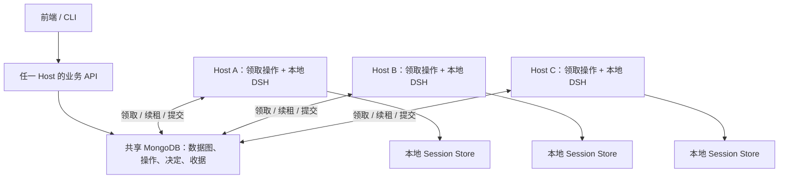

# 051 — 多 Host 协同演进数据图

> 2026-09-12 修订：本文定义共享图的多 Host 领取边界；[052](./052-代码复核与实现架构.md) 保留功能审计，当前补齐实施按 [059](./059-节点驱动协作闭环与暂停恢复.md)。

用户已明确选择：**多个 Host 分摊执行，可以共用一个数据库。** 本稿更新 050 的执行与部署边界；Node/Edge 类型、多来源关系、业务规则、人工确认及前端透明原则继续适用。053–058 已实现单 Claim 核查的共享后端和多 Host 租约；059 补齐不同 Source、News、Claim 的多 operation 闭包和暂停。

## 1. 最小架构

**一张共享数据图，多个平等 Host，按业务操作领取执行。**


```mermaid
flowchart TB
  UI["前端 / CLI"] --> API["任一 Host 的业务 API"]
  API --> DB["共享 MongoDB：数据图、操作、决定、收据"]
  A["Host A：领取操作 + 本地 DSH"] <-->|"领取 / 续租 / 提交"| DB
  B["Host B：领取操作 + 本地 DSH"] <-->|"领取 / 续租 / 提交"| DB
  C["Host C：领取操作 + 本地 DSH"] <-->|"领取 / 续租 / 提交"| DB
  A --> SA["本地 Session Store"]
  B --> SB["本地 Session Store"]
  C --> SC["本地 Session Store"]
```

执行层没有唯一主 Host。数据库是共同的状态与写入裁决点；第一版不承担独立数据副本的离线同步。生产使用 Mongo 副本集，控制与接受写入使用 majority 确认、领取/校验面向 primary；不把只部署一台 Mongo 的单机故障风险当成已经解决。[Mongo Write Concern](https://www.mongodb.com/docs/manual/reference/write-concern/)

单台机器上的一个执行 Host 也可完成全部业务；多 Host 用于并行，不是必需部署数量。不新增中心调度服务、Redis、Kafka 或 P2P 数据同步协议。各 Host 运行相同后端，按本机容量从共享业务项中领取工作；没有容量就不提前占住租约。

## 2. 分配“操作”，不永久分割节点

业务操作仍只有三种：

```text
parse(source-1)       → Host A
split(news-1)         → Host B
verify(claim-1)       → Host A
verify(claim-2)       → Host C
```

后继操作只有在前置业务结果被接受后才可领取；两个独立 Claim 可以并行核查。同一节点的下一次演进可以换 Host，无须迁移节点归属。

operation 以 Run、处理阶段、目标节点和输入/配置身份定位。同一 Run 的不同 operation 可分别领取；每个 split/verify 内保留已有 router、各角度、merge 角色工作，角色工作带自己的 holder/fence，不为 Agent 创建 Node。只有该工作当前有效持有者能接受新结果。

一个 Run 是所有 Host 共同可读的用户目标记录：scope.nodeIds、until、mode、paused、配置快照和 operations[]。它不绑定全图根 Session，也不需要某台 Host 常驻推进。本轮保留每图一个活跃 Run，其内部允许多个 Host 同时处理不同新闻、事实和角度。

## 3. DSH 与跨 Host 领取的边界

| 机制 | 负责人 |
|---|---|
| 哪些数据尚需解析、拆分、核查 | Graph 的确定性业务规则 |
| 哪台 Host 暂时负责某个业务操作 | 数据库条件领取及租约 |
| 该操作使用哪些 Agent、怎样委派/并行/继续 | 该 Host 的 DSH |
| 图中哪些结果成立，是否过期或重复 | Graph 的版本校验与原子接受 |

沿用 054 已有的 Host/work 领取循环。它只有“发现可执行项 → 原子领取 → 交给本地 DSH → 续租/结束”，不保存单个模型请求、Tool 队列或 SubAgent 重试状态。

**一次工作领取对应新的本地 DSH 会话**。Host 绑定 operation、角色/slot 与本次 holder/fence；DSH 执行该工作，不调度整张图。重新领取不加载旧模型会话，已接受报告和审核决定从共享业务数据读取。

已核查的 DSH SDK 委派描述本地子进程执行，不能据其名称推导跨 Host 会话共享能力。本方案只依赖各 Host 本地的 DSH，不要求 DSH 提供数据库集群协调。[DSH SDK Provider](https://github.com/deepseek-ai/deepseek-harness/blob/b2e3b2a0125854567a4a5fcba75782e42fe84901/packages/subagent/subagent-dsh-sdk/README.md)

## 4. 为 operation 增加最小执行租约

沿用现有独立 leases 容器记录工作授权，operation 只保存业务状态/报告/审核/收据，不镜像每个 Agent 的 Runtime 状态：

```text
workId / operationId: 业务项及角色工作身份
hostId / holderId: 执行机器与本次领取身份
expiresAt: 数据库时间下的到期时间
fence: 每次成功领取递增的执行代数
SessionId: 仅本地执行记录，不进入业务 Run 或幂等身份
```

holderId 区分同一 Host 重启前后的两个进程。fence 是提交授权版本，不能靠 Host ID 相同就续用旧权限。

领取为一次数据库条件更新：Run 未终结且未暂停、operation 满足业务前置条件、工作租约缺失或已过期。成功时写 holder、期限与递增 fence。两个 Host 抢同一工作只有一个成功，不通过更新 operation 状态镜像模型生命周期。

续租要求 holder/fence 匹配、租约仍有效、Run 未暂停且未终结。过期持有者必须重新竞争，不能自行续活。领取、续租、提交都使用数据库时间；不依赖各机器墙上时钟一致。[Mongo NOW](https://www.mongodb.com/docs/manual/reference/aggregation-variables/)

所有 DSH 写入——包括候选报告、Review 提案、最终结果——检查这些条件：

```text
runId 仍是当前活跃 Run，paused 为 false
operationId + workId + holderId + fence 匹配
expiresAt > 数据库当前时间
业务输入、配置与草稿版本有效
```

先验证共享授权，再接受结果。每次工具调用捕获自己的 fence，不能让旧的异步调用读取并冒用后来领取的新 fence。

## 5. 并行计算，短暂原子提交

第一版继续使用一图一个 Mongo 文档，内嵌按 operationId 定位的业务操作。耗时的 Agent 计算在多个 Host 同时进行，提交使用短暂的单文档条件更新，数据库事务不跨越模型调用。普通人工图编辑的限制由业务入口检查，不阻止各 Host 并行提交合法的运行产物。

最终接受一次性写入：

```text
节点变化 + 边变化 + 业务收据 + operation 完成状态
+ 新增的合法后继操作 + Map revision
```

保存时重新读取当前图，检查本次实际输入版本；以读取到的 Map revision 连同执行租约条件执行 CAS。另一个 Host 接受不相关产物导致 CAS 失败时，重新读取并校验后再提交已经得到的结果，无需重跑 DSH；实际输入变了则拒绝旧提案，不能覆盖新版本。

业务提交先读当前完整业务聚合，用 Map revision CAS 写 nodes/edges/Run/operations 和收据；冲突重读后重验。lease 容器独立定向更新，普通业务提交不得回写旧 lease。领取/续租不增加业务 revision；用户可见业务变化、pause/resume 均增加 revision。

Mongo 支持单文档多字段原子更新，并在执行时检查过滤条件；沿用现有业务 CAS 和公开命令的权限事务，不增加跨存储事务。[Mongo 原子性](https://www.mongodb.com/docs/manual/core/write-operations-atomicity/)

原 050 的 operationId/commitKey 规则保留。**ownerHostId、holderId、fence 都不进入业务幂等键**；同一个结果换机器提交仍是同一业务结果。已接受收据的查询可以返回已有结果，不产生任何新写入。

图大小与单文档写竞争仍有上限。真正达到瓶颈后再拆节点/operation 集合并设计 Mongo 事务；新增 Host 能提升模型计算并发，不能无限提升同图提交吞吐。

## 6. 没有唯一调度者，图如何继续演进

现有 Run/work 代码按 scope.nodeIds/until 和当前有效收据发现缺失业务结果。重叠起点与共享后继归并同一处理义务；NodeRef 输入/输出版本和配置指纹决定是否可复用，不仅检查存在一个下游节点。paused 时不派发新工作。

接受 parse/split 等结果时，在同一提交内补齐合法后继项。各 Host 启动和周期检查时也会补查，修复“结果存在但下一项未登记”的情况。只触发固定领域操作，不构造可编程工作流引擎。

061 将空闲领取轮询替换为RabbitMQ竞争消费，从持久业务事实派生工作并经合并outbox可靠发布；通知不能代替数据库领取与提交裁决。不同 Host 必须运行兼容的规则/schema，领取前检查所需模型/工具能力及本机容量。

任何 Host 都可以尝试结束 Run，但必须在同一 Map revision 下重新检查整个 scope/until 是否达成。不能只统计“已经登记的 operations 全完成”，以免漏掉刚生成的 Claim；终态通过 CAS 写入，无常驻全图负责人。

有效持有者遇到不可继续的业务/模型错误时，将 operation.failed 与 Run.failed 同次 CAS 写入，其余 Host 由 Run 围栏停止；旧持有者因失去租约被拒绝，不得把接管者的 Run 标成失败。Run 终态不原地复活：显式重试创建新 Run，引用仍满足当前输入/配置的旧结果收据和候选报告，只处理剩余工作。这样旧 Run 的迟到调用不会因重试而重新获得权限。

## 7. 故障接管与人工等待

| 事件 | 行为 |
|---|---|
| Host A 崩溃 | 租约到期后 B 领取，fence 增加 |
| A 网络卡顿但仍在计算 | B 接管后 A 的旧 fence 无权提交；计算可能短暂重复 |
| B 接管 | 创建本地 Session，加载共享草稿、已接受报告、路由和人工决定，完成剩余业务 |
| 图已提交但响应丢失 | 读取同一收据，不再创建第二份结果 |
| 到达人工确认 | 原子保存该 operation 的 Review/等待事实，结束当前工作并释放租约；其他独立 operation 继续 |
| 用户回答 Review | 校验身份/operation/草稿版本并原子保存决定；不清 Run.paused，未暂停时任意 Host 可领取新合法工作 |

本地 DSH 会话不要求跨 Host 搬迁。已保存的结构化子报告复用；未入共享业务存储的推理/中间输出可能重做。承诺业务接受幂等，不承诺模型请求只发生一次。

人工回答不要求持有 Agent 执行租约，使用独立的用户权限、Review 身份和版本竞争。operation 等待 Review 后不再派发该项依赖审核的新工作；其他 operation 不因此失去执行资格。拒绝且不修订的工作不再枚举，Run 按用户拒绝结束。

第一版保留 050 的运行中普通图编辑限制：用户通过 Review 修改当前草稿，或明确取消/终结 Run 后编辑正式节点；paused 仍属于活跃 Run。多个 Host 仍可并行提交本次运行的不同产物。完整的运行中任意编辑需要另加输入代次与已完成操作重新激活规则，不在本次最小方案中隐含实现。运行配置快照不被其他 Host 的配置编辑暗中修改。

## 8. 暂停、取消与数据库失联

Run.paused 是与业务 status/Review 正交的控制位。pause 在现有权限事务内同次写 paused/revision/收据，并将本 Run 各 lease 的 expiresAt 定向置为已过期，保留 holder/fence；resume 同一 Run 清 paused，重算剩余业务，不恢复旧期限或模型上下文。claim/renew 不升 Map revision，不能离开事务用旧快照枚举租约后只作 revision CAS；快速 pause→resume 的旧 grant 必须持续失效。不增加 executionEpoch。

Review 可以独立等待和接受用户回答，批准不解除 paused；暂停仍禁止普通图编辑、新 Run 覆盖与图/Workspace 删除。关闭客户端不发送暂停；停止一台 Host 也不会暂停其他 Host。

取消 Run 先在共享文档写 cancelled，再通知各执行 Host 取消本地 DSH 子树。所有领取、续租、新提案和接受都检查 Run 状态，因此取消成功后旧 Host 不能继续写入。

已接受结果保留。进程内 abort 是减少浪费的措施，共享写入条件负责正确性。界面区分“业务已取消”和“执行进程正在停止”；失联 Host 的运行时停止只能在恢复通信或本地租约截止后收敛。

Host 无法确认续租时应停止继续派生工作，并在保守的本地截止前停止计算；任何情况下都不能脱离数据库确认业务成功。无可写 primary 时不能领取或接受结果，本方案不承诺断网离线演进。

## 9. 前端、文件和实时进度

前端仍只调用 read/dispatch/watch，连接任一 API Host 即可。不显示执行机器作为用户必须选择的参数，不要求一个标签页绑定一个执行 Host。

产品流目标为：共享业务快照使用 Mongo 变化通知到各 API Host，再通过 SSE 发给各自客户端；断线或通知游标失效时重读完整基线。Change Streams 需要副本集或分片集群，部署要求明确写入配置，不在 standalone Mongo 上假定可用。[Mongo Change Streams](https://www.mongodb.com/docs/manual/changeStreams/)

061 已接入MQ广播和认证SSE Snapshot，客户端不再定时读取图快照；后文的细粒度Activity为尚待接线目标。目标中的逐步文本/工具 Activity 留在执行 Host 的 DSH。API Host 按 operation 当前 owner 代理订阅进度；静态 Host 地址配置即可起步，无需额外服务发现系统。进度帧携带 operationId/fence/局部序号，切换 owner 时丢弃旧执行代数的流。业务正确性不依赖 Activity 转发成功。

资产也必须能被每个 Host 读取。第一版沿用共享 Mongo，使用 GridFS 保存不可变资产和内容摘要；上传完成并校验后才发布可引用 assetId。本地缓存只按内容摘要寻址，不能把一台 Host 的绝对路径当作共享来源。资产上传与图引用是先后步骤，不声称 GridFS 上传与图 CAS 是同一事务。[Mongo GridFS](https://www.mongodb.com/docs/manual/core/gridfs/)

所有 Host 处于同一受信部署，使用共同 Workspace 权限与配置来源；子任务只领取本机实际可用的能力。不同凭证值可以是各机 secret，但 profile 的语义配置版本必须匹配。

## 10. 从早期方案到本轮实施的边界

| 050 | 051 |
|---|---|
| 唯一中心 Host | 多个平等执行/API Host，共享数据库裁决 |
| 全图 Run 对应一个根 Session | 取消该要求；每次未完成工作领取用新本地 Session |
| 本机持有活跃 Run | operation owner/holder/lease/fence |
| 同图运行时禁止普通编辑 | 保留人工编辑限制，但允许多 Host 并行接受运行产物 |
| 本机 Set 分发业务更新 | 数据库变化通知 + 每 Host SSE |
| Host 私有资产目录 | 所有 Host 可读取的共享资产 |
| 本机恢复为主 | 共享报告/决定恢复业务，允许另一 Host 接管 |

沿用已存在的 backend/work.ts、host.ts、run.ts、graph.ts、store.ts；不因历史命名创建 claim.ts 或调度器服务。节点后继发现、业务提交和完成判断留在现有具体模块。

后续实施及双 Host 故障验收见 [051 实施原稿](./051-implement-多Host协同演进数据图.md)。
