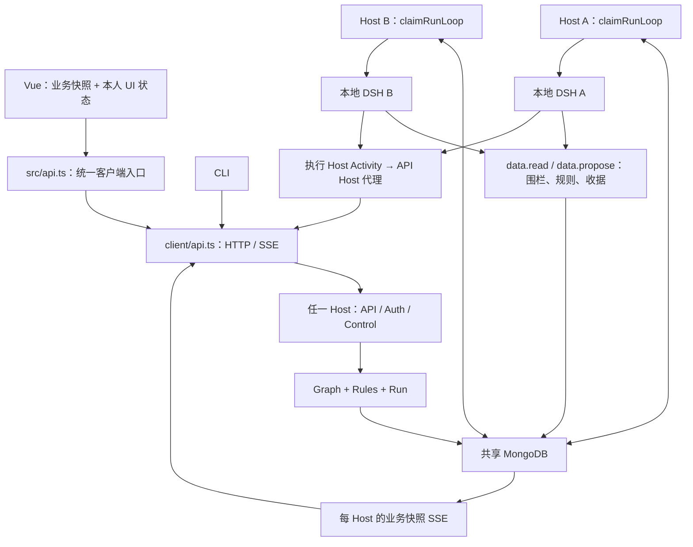

# 052 — 代码复核与实现架构

## 1. 交付与适用范围

本轮按用户要求重读实际前后端源码，重新确定函数与接口；不修改生产行为。以 051 的“多个平等 Host、共享 Mongo、每次业务操作领取对应本地 DSH”作为目标，本文和接口契约将其细化为实施规格。

**最新实施方向：从零编写新后端，第一阶段先将DSH官方SDK封装为可独立调用的执行接口。** 当前已验证的SDK线协议只支持初始化、命名Session的prompt及shutdown，因此一期封装为start/run/close，并由run回调流式事件；不虚构冷会话读取或单Session取消。随后接数据图、业务运行和多Host。

接口已按后续精简要求收敛为 **9个查询、23个命令**。当前采用graph.apply原子变更集、bootstrap/Workspace组合读取，删除重复详情与缓存刷新命令；审计附录仍记录历史代码，目标接口以最新契约为准。

| 工件 | 用途 |
|---|---|
| [本设计](./052-代码复核与实现架构.md) | 架构、确定的模块/函数总表、去留决定 |
| [完整接口文档](./052-完整接口文档.md) | HTTP、全部命令/查询、SSE、权限、错误、桌面与执行边界 |
| [接口契约](./052-接口契约.ts) | 完整 DTO、QueryMap/CommandMap、Client/Desktop/Admin/ExecutionAPI 类型 |
| [类型检查示例](./052-接口示例.ts) | 节点创建、限定范围运行、Review、空结果及草稿保存的有效请求形状 |
| [实施原稿](./052-implement-代码复核与实现架构.md) | 实施顺序、检查与验收 |
| [前端与入口审计](./052-前端与入口函数审计.md) | 当前前端/桌面/CLI 函数、调用点和逐项迁移 |
| [后端核心审计](./052-后端核心函数审计.md) | 当前 Mapper、stage、DB、工具和公共函数逐函数审计 |
| [管理接口审计](./052-管理接口与函数审计.md) | 当前 43 个入口、40 项管理功能、DTO/实现差异 |

审计附录中的目标函数名是职责建议；下面第 5–8 节给出规范化后的最终命名。接口参数与返回以 052-接口契约.ts 为准，不把附录早期建议名作为第二套 API。

## 2. 代码现状：已有能力与待实现能力

当前实际链路：

```text
Vue 组件/Pinia → window.electronAPI → preload → ipcMain handler
  → Mapper / Control services → Mongoose / 磁盘
  → 自有 AgentLoop → LangGraph / LangChain / Tavily

CLI → bootstrap → 同一 Mapper（另一个本地进程、自己的 DB/lease 配置）
```

关键依据：[preload](/Users/xiong/ChongMing/electron/preload.ts:5)、[handler](/Users/xiong/ChongMing/electron/api/register-handlers.ts:36)、[Mapper](/Users/xiong/ChongMing/electron/mapper/service.ts:197)、[CLI](/Users/xiong/ChongMing/server/commands.ts:66)。当前没有 DSH 依赖、HTTP Host、共享操作领取或网络用户权限实现。

| 实际发现 | 必须改变的实现 |
|---|---|
| run.start/continue 在 dispatch 中 await 整段执行 | HTTP 命令只接受业务目标；后台 Host 领取，立即返回确认 |
| Mapper 保存每次 prompt/result/attempt 并并行调用 AgentLoop | 删除调用账本；业务只保存候选报告、决定、收据，DSH 管智能体执行 |
| 一个 selectedNode 完成后清空选中范围并继续全图 | scope 显式固定；按有效派生收据扩展，不能扩到无关新闻 |
| 0 条 Claim 被再次判为未拆分 | 空结果也写有效接受收据 |
| node.update 不清理/标记旧输出 | 基于实际输入版本和来源关系判定过期 |
| 手工 route 与 run.draft.routes 不同源 | NodePolicy 必须进入冻结配置，并在委派入口生效 |
| 图的边由 Agent/parentId 推导，Claim/Opinion ID 含位置 | 正式 Node/Edge 有独立稳定 ID；Agent 卡片只是投影 |
| Agent 流事件被 onEvent 空函数丢弃 | 接 DSH Activity 投影/跨 Host 转发，不能只沿用现有 stream 类型 |
| DB 连接失败 fallback 到私有 memory DB | 多 Host 生产直接 unavailable，明确禁止 fallback |
| 整图 lease 检查与数据 CAS 分离；保存完整数组 | operation 围栏加入同次写入条件，更新指定字段，禁止覆盖别人租约 |
| catalog 写盘后异步同步，promptConfig 不同步公共池 | 共享 Agent library 成为唯一管理入口；Workspace 私有副本保留 |
| import 原样带 Map ID/run，非原子插入 | v3 包、完整 ID 重映射、资产、排除执行绑定，完整发布 |
| Workspace.ui 是所有人共用 | 偏好按 userId/workspaceId 存储，标签页不持有执行权 |

表内是现状纠正或目标新增，不声称当前已经具备这些能力。精确源码行号和已有测试覆盖见三份审计附录。

## 3. 最终架构



Desktop 的 client 运行在 Electron Main，经受限 preload 暴露给 Renderer；Web 才在浏览器中使用 client。CLI 与 Desktop 共用网络客户端。图中的共享职责框可以存在于每个 Host 进程内，不是新增中心服务。

三个业务对象：Node、Edge、Run。operation/Review/候选报告/收据内嵌 Run；Workspace、Agent library、副本、用户/成员、偏好、资产是必要的管理数据。DSH 的 Session 日志不放进 Mongo 图文档。

数据库文档边界：

- Map 聚合：nodes/edges/policies、Run 与操作、紧凑业务及命令收据、revision、deletedAt。
- Workspace：资料、成员、工作区 Agent 副本与集合版本；偏好另按 userId/workspaceId 保存。
- Agent library：共享集合版本和配置；磁盘文件仅 seed/import。
- 用户/token：服务端身份；只存 token hash。
- Cluster settings：非秘密运行默认配置及版本；Host secret 在各机受控配置。
- Assets：共享 GridFS + ready 元数据；图只引用 assetId。

每图一个活跃 Run 可以包含许多 Host 同时领取的操作。没有全图根 Session、执行主 Host 或长时间数据库锁；最终结果短暂 CAS。普通人工图编辑在活跃 Run 期间受限，Review 修改仍可用。

## 4. 目录

```text
contracts/                  # 将本轮已校验 DTO 迁入正式源码
  graph.ts
  control.ts
  api.ts
backend/
  main.ts                   # 生命周期组合
  api.ts                    # HTTP、SSE、错误映射
  auth.ts                   # actor、Workspace 权限、token
  graph.ts                  # 正式数据变更和候选提案
  rules.ts                  # parse/split/verify、输入有效性
  run.ts                    # 目标、Review、终态
  claim.ts                  # 共享业务项领取和本地执行循环
  dsh.ts                    # DSH 原生装配和精确操作树
  store.ts                  # Mongo schema、查询、字段级条件写
  control/
    workspaces.ts
    agents.ts
    assets.ts
    bundles.ts
    settings.ts
    admin.ts                # 仅本机 Host Admin
client/api.ts               # typed query/command/SSE、二进制 I/O
src/api.ts                  # Vue 统一入口，选择 preload 或 Web client
src/                        # 保留现有 Vue 目录，仅修改相关逻辑
electron/main.ts            # 客户端壳，不启动 DB/DSH
electron/preload.ts          # ClientAPI + DesktopAPI
server/cli.ts               # 远程业务 CLI
server/commands.ts
```

固定规则和少量纯 helper 不另拆 ports/repositories/factories。下列总表列出需要实现的项目边界函数；模块内小 helper 只在真实实现需要时增加。

## 5. 后端核心函数总表

`Actor` 为 Host 解析出的身份；输入中的查询/命令 payload 均引用 QueryMap/CommandMap；`Grant` 为 ExecutionGrant；`Binding` 为 DshBinding。GraphDocument、ValidatedProposal、GraphWrite、HostRuntime 是后端私有窄类型，不能由 HTTP/模型构造原始 Mongo modifier。

| 文件 | 需实现函数 | 输入 → 输出 / 职责 | 旧来源与动作 |
|---|---|---|---|
| main.ts | applicationCreateHost | Host 配置 → HostRuntime；连接共享 DB、校验身份/schema、装配 DSH/API/领取循环 | 替换 electron/main + server/bootstrap 双装配 |
| main.ts | applicationDeleteHost | HostRuntime → void；停止领取、停树/flush、释放、关流/DB | 重写 shutdown，不等同用户取消 |
| api.ts | apiCreateServer | HostRuntime → HTTP server | 新增 |
| api.ts | apiReadQuery | Actor + QueryRequest → 对应 query output | 替换 Mapper.read / Control handler |
| api.ts | apiReadBootstrap | Actor → AppBootstrap；组合身份、settings与版本化有限元数据 | 合并初始化查询，不包含Host管理详情 |
| api.ts | apiDispatchCommand | Actor + CommandRequest → 对应 command output | 替换 handler 与长阻塞 dispatch |
| api.ts | apiWatchMap | Actor + mapId + signal → SSE 生命周期 | 替换单进程 Set 广播 |
| api.ts | apiReadActivity | Actor + map/operation → 当前 owner 的授权代理流 | 新增 |
| api.ts | apiWriteError | 未知异常 + requestId → HTTP Failure | 保留错误归一化意图，删除 IPC 字符串协议 |
| auth.ts | authReadActor | Bearer token → Actor | 新增；只在服务端解析 |
| auth.ts | authRequireRole | Actor/workspaceId/最低角色 → void | 新增；所有边界调用 |
| graph.ts | graphReadGraph | Actor + map查询 → Snapshot/摘要 | 重写 mapDocumentRead/List + projectSnapshot |
| graph.ts | graphUpdateGraph | Actor + graph.apply/图生命周期/claims.merge → GraphWriteResult | graph.apply一次验证最终图及CAS，合并保留独立语义 |
| graph.ts | graphReadData | Binding + DshRead → DshReadResult | 重写 context读取；真实读集/可见性 |
| graph.ts | graphUpdateProposal | Binding + DshProposal → DshProposalResult | 替换 stages 写 draft/save；唯一提案接受边界 |
| graph.ts | graphReadSnapshot | GraphDocument + Actor能力 → GraphSnapshot | 重写 projectSnapshot；草稿独立显示 |
| rules.ts | rulesReadWork | GraphDocument + Run → 合法未完成业务项 | 替换 readNextRun；正确 scope 和零产物 |
| rules.ts | rulesReadMetadata | 无 → AppBootstrap.metadata | 复用变量槽、输出格式、技能纯规则，一次生成版本化元数据 |
| rules.ts | rulesValidateProposal | 图/操作/提案/冻结策略 → ValidatedProposal | 替换猜测输出解析，严格 schema |
| rules.ts | rulesUpdateValidity | 图 + 已校验编辑 → 失效变化 | 新增；按实际依赖，不沿普通关联全删 |
| rules.ts | rulesReadGoal | 图 + Run → completed/remaining/declined | 新增；不是 root idle，也不只数登记队列 |
| rules.ts | rulesCreateOperationId | runId/kind/targetId → 稳定 ID | 替换每 stage 随机 run/call 身份 |
| rules.ts | rulesCreateCommitKey | 操作/草稿/输入/配置指纹 → 幂等 key | 新增；不含 holder/fence |
| run.ts | runCreateRun | Actor + run.start → GraphWriteResult | 重写 run.start；立即接受，不 await 模型 |
| run.ts | runUpdateWork | mapId → void | 各 Host 幂等补齐 ready 项与检查终态 |
| run.ts | runUpdateMode | Actor + run.set-mode → GraphWriteResult | 重写，保留合法决定 |
| run.ts | runUpdateReview | Actor + review.update → GraphWriteResult | 新增，替换直接混改 draft/正式节点 |
| run.ts | runAnswerReview | Actor + review.answer → GraphWriteResult | 拆分 run.continue，人类版本竞争 |
| run.ts | runCancelRun | Actor + run.cancel → GraphWriteResult | 先共享终态再 abort |
| run.ts | runFailOperation | Grant + PublicError → void | 有效持有者将操作/Run 同次 failed |
| run.ts | runCreateRetry | Actor + run.retry → GraphWriteResult | 新 Run；复用有效报告，不复活旧 grant |
| claim.ts | claimAcquireOperation | ClaimInput → LeaseResult/null | 重写 mapLeaseTryAcquire 为 operation 原子领取 |
| claim.ts | claimRenewOperation | Grant → 新 Grant | 重写 heartbeat，用 DB 时间、过期不可续活 |
| claim.ts | claimReleaseOperation | Grant → void | 精确释放该 holder/fence；不改新持有者 |
| claim.ts | claimRunLoop | Host 配置/capacity/signal → 生命周期 | 新增，每 Host 一份，有退避无中心 |
| dsh.ts | dshCreateRuntime | 本机设置/secret → DSH runtime | 替换 createLangGraphAgentLoop |
| dsh.ts | dshCreateSession / dshReadSession / dshWatchSession | DshRuntimeAPI.create/read/watch；创建持久根会话、只读快照与事件 | 第一期DSH封装，独立于Graph |
| dsh.ts | dshSendMessage / dshCancelSession | DshRuntimeAPI.send/cancel；原生inbox投递/确认、根及子树停止 | 第一期DSH封装，不将idle当业务完成 |
| dsh.ts | dshRegisterBusiness | DSH context + 受限ExecutionAPI/绑定解析 → 可释放的工具/guard注册 | 一个本地业务接入插件模块，root/worker按各自scope安装 |
| dsh.ts | dshRunOperation | LeaseResult + 业务输入 → void | 一个领取代数一个本地根，复用共享报告 |
| dsh.ts | dshCancelOperation | Grant + 原因 → void | 精确 drain 子树再释放 root |
| dsh.ts | dshReadActivity | 本地 binding/原生事件 → Activity/null | 取代被丢弃的 onEvent |
| dsh.ts | dshDeleteRuntime | runtime → void | 正确 flush/dispose；不更改 Run 成 cancelled |
| store.ts | storeCreateConnection | 集群配置 → void | 重写 dbCreate；禁止生产 memory fallback |
| store.ts | storeReadGraph | mapId → GraphDocument/null | 替换 readDocument 序列化/默认兜底 |
| store.ts | storeReadGraphs | workspaceId/page → Page<MapSummary> | 替换 mapDocumentList |
| store.ts | storeCommitGraph | GraphWrite → 原子结果或明确冲突 | 改为字段级 CAS+有限用户/执行 guard；禁全容器覆盖 |
| store.ts | storeWatchGraphs | listener/signal → 生命周期 | Mongo 通知、基线重建 |
| store.ts | storeDeleteConnection | 无 → void | 改造 dbDelete，最后关闭 |

执行函数与纯业务规则的边界是硬约束。graphUpdateProposal 的“验证—接受”不能仅在写入前查询一次 lease；holder/fence/过期时间/Run 状态必须同时出现在实际数据库条件更新里。

## 6. Control 函数总表

| 文件 | 需实现函数 | 对应接口/行为 | 处理方式 |
|---|---|---|---|
| workspaces.ts | workspaceReadWorkspaces / workspaceReadWorkspace | workspace.list/get | 详情组合成员与本人Preferences；版本各自明确 |
| workspaces.ts | workspaceCreateWorkspace / workspaceUpdateWorkspace / workspaceDeleteWorkspace | 工作区资料 CRUD | 改共享语义、tombstone/事务边界 |
| workspaces.ts | workspaceUpdateMember | member.set，role=null移除 | 统一成员设置，保护最后Owner |
| workspaces.ts | workspaceUpdatePreferences | 本人 preferences.set | 读取随workspace.get返回；不共享所有人ui |
| agents.ts | agentReadProfiles / agentCreateProfile / agentUpdateProfile / agentDeleteProfile | agent.list/create/update/delete | list完整返回详情；选择与刷新不增加服务器入口 |
| agents.ts | agentCopyProfiles | agent.copy | 保留本地池上传的 merge/replace，来源改共享 library |
| assets.ts | assetCreateAsset / assetReadAsset / assetReadContent / assetDeleteAsset | 上传、元数据、下载、删除 | 共享 GridFS、ready 标记、摘要/权限 |
| bundles.ts | bundleReadMap / bundleReadWorkspace | 两种 export | 复用 fileReadExportBundle 思路，v3可移植包 |
| bundles.ts | bundleCreateWorkspace | workspace.import | 验证、重映射所有引用、完整发布 |
| settings.ts | settingsReadCluster / settingsUpdateCluster | bootstrap内部读取/settings.update | 公共非秘密配置，版本化 |
| settings.ts | settingsReadHosts / settingsTestEndpoint | host.list/endpoint.test | 实际 Host 能力及带权限诊断 |
| admin.ts | adminReadSettings / adminTestDatabase / adminStageDatabase | 本机部署配置及候选连接 | 替换 db.get/save/test，无公共HTTP |
| admin.ts | adminDrainHost / adminReconnectHost | 受控停止领取与重连 | 不直接把运行 Host 切到新库 |
| admin.ts | adminUpdateSecret / adminImportSeeds | secret只写、显式seed | 替换本机任意写盘+自动异步同步 |
| admin.ts | adminCreateUser / adminCreateToken / adminRevokeToken / adminDisableUser | 用户/token 生命周期 | 新增，明文token只返回一次 |

表中以 `/` 分隔的函数分别需要实现；完整参数使用接口契约对应 Spec/HostAdminAPI。不要再为旧三组 Agent CRUD 各做一套服务包装。具体旧函数与新职责逐项映射见管理接口审计。

## 7. Client、桌面与 CLI 函数

| 位置 | 需实现函数 | 行为 |
|---|---|---|
| client/api.ts | clientCreateClient | 创建受限 typed 客户端，绑定 baseUrl/凭证提供者 |
| client/api.ts | clientReadQuery / clientDispatchCommand | 图相关 QueryMap/CommandMap，统一错误/幂等传输 |
| client/api.ts | clientReadControl / clientDispatchControl | 同协议下管理操作的窄入口；复用一个 HTTP 请求函数，不复制transport |
| client/api.ts | clientWatchMap / clientDeleteClient | SSE基线/重连、Activity代次和取消订阅 |
| client/api.ts | clientUploadAsset / clientDownloadAsset | 二进制与摘要/idempotency |
| client/api.ts | clientExportMap / clientExportWorkspace | 读取可移植 bundle |
| contracts/graph-helpers.ts | policyReadBatch / claimsReadMergeGroups | 纯函数展开明确策略变更/精确重复组；Web/Desktop/CLI共享，不写数据库 |
| src/api.ts | apiReadClient | 选 Desktop preload 或 Web client；Vue 不引用后端源码 |
| electron/main.ts | desktopCreateWindow / desktopRegisterHandlers | 只做桌面壳、ClientAPI/DesktopAPI IPC |
| electron/main.ts | desktopReadConnection / desktopUpdateConnection | 保存 Host URL 与安全凭证；更换连接不取消远端任务 |
| electron/main.ts | desktopUpdateTitle / desktopReadVersion | 本机 UI 功能 |
| electron/main.ts | desktopPickSource / desktopExportMap / desktopExportWorkspace / desktopImportWorkspace | 系统对话框 + 网络协议，不在 Host 弹窗 |
| server/cli.ts | cliCreateClient / cliDeleteClient | 连接服务，处理退出码/关闭订阅，不启动本机 Mongo/DSH |
| server/commands.ts | cliReadMaps / cliCreateMap / cliRunMap / cliReadStatus | 原 list/create/run/status 的网络实现 |
| server/commands.ts | cliCancelRun / cliAnswerReview / cliRetryRun | 把完整异步/HITL控制补到无头入口 |

CLI 的 run 输出先给 runId；`--wait` 才等完成，等待客户端结束不取消共享 Run。`--until` 使用业务名称；旧 timeline 数字在最终切换时移除，不保留长期兼容转发。

## 8. 前端状态与函数

保持 Vue 组件/布局目录。用户可见的 Agent 管理、节点编辑、评分/意见、工具摘要、快捷键、多标签页、导入导出继续保留。

| 文件 | 保留/修改的函数与状态 | 去掉的责任 |
|---|---|---|
| src/stores/flow-map.ts | applySnapshot、applyActivity、watchMap、unwatchMap；节点/边/策略编辑统一发送graph.apply | 单父业务图推断、后端 draft 覆盖正式数据、自己推进 pipeline |
| 同上 | updateRunOptions、startRun、cancelRun、retryRun、editReview、answerReview | startParse/startSplit/startVerify 等重复运行入口；编辑 draft 当作正式 node.update |
| 同上 | createEdge、removeEdge、updatePolicy、batchUpdatePolicy、mergeClaims | 把 route 当数据节点、删除 Agent 卡片即删除事实 |
| src/stores/workspace.ts | 工作区/Map列表与名称更新；调用共享 Control | 重命名前临时 acquire/release lease |
| src/stores/workspace-tabs.ts | openMap/closeMap/activateMap、本人 preferences | 标签页控制执行所有权、关闭标签取消任务 |
| src/stores/run-coordinator.ts | 由每图后端 RunSummary缓存取代；有实际展示用途的缓存合入flow-map | 第二套可自行变化的 runPhase 状态 |
| src/flow-map/layout.ts、layout-nav.ts | 纯布局与键盘导航算法保留；输入改 Node/Edge，多入边选择展示锚点 | 单一 parentId 作为业务真值 |
| timeline*.ts | 目标/业务收据/Activity 的只读进度投影 | startX/endX/stateIndex 决定实际调用 |
| AgentManagerCanvas.vue | agent.list/create/update/delete；详情按ID选择；变量/输出预览读取bootstrap.metadata | 拼接服务器磁盘路径和等待异步本地池同步 |
| DatabaseCanvas.vue / Health | Host连接/管理员诊断入口、明确 unavailable | 远程普通用户切 Mongo URI、将 fallback memory 当健康 |

Vue composable/Pinia 内函数可按 coding.md 豁免保留现有可读命名；内部后端新函数按模块前缀+单动词+实体。完整前端旧函数表以审计附录为证据，不要求为“目录统一”重命名每个组件方法。

## 9. DSH 插件边界

第一阶段先交付DSH专用DshRuntimeAPI（类型见接口契约），不依赖Graph/Mongo/Run。当前通过官方SDK子进程和JSON-RPC实现start/run/close；业务接入插件在数据图出现后安装。后续若直接嵌入DSH以取得冷查询或精确取消，仍保持同一项目接口并先补集成验证。

第一版自有扩展只有**一个业务接入模块**，可以直接写在dsh.ts中作为本地插件安装，不要求发布独立包或建立插件市场。插件负责把已有后端能力接入DSH，Graph/rules/Run仍是普通TypeScript业务模块。

| 内容 | 处理方式 | 边界 |
|---|---|---|
| data.read / data.propose | 自有业务接入插件注册工具、输入输出schema与结果转换 | 调用graphReadData/graphUpdateProposal，不直接写Mongo |
| operation/producer/slot绑定、工具权限、已批准槽位检查 | 放在同一插件的scope/setup/guard中 | 每个root/worker显式装配；后端仍在最终CAS校验holder/fence，插件guard不替代数据库条件 |
| parse/split/verify、route/merge的prompt与profile | 配置数据，使用DSH原生Agent/SubAgent能力 | 不按每种角色建一个插件；固定业务输入/输出规则仍在rules.ts |
| 模型调用、工具循环、子Agent、会话持久化/checkpoint、取消 | 装配DSH原生插件/provider | 不重写框架的运行时；具体可安装版本由集成闭环锁定 |
| 上下文计量、工具结果裁剪、摘要压缩 | 装配原生token-meter/compaction/pruner | 配置与验证后由DSH管理；不自研摘要状态机，压缩结果不是业务事实源 |
| 跨会话长期记忆 | 暂不选型，不接入社区记忆插件 | 不视为默认Session功能；有明确需求后再审查存储、隔离、共享与冲突语义 |
| 当前Tavily搜索 | 条件增加一个WebSearchProvider适配 | 若所选发行版无可复用Tavily provider，适配ctx.web；模型侧复用原生web_search，不再写一套LangChain Tool |
| Activity转换 | 保留dshReadActivity观察器 | 暂不单独插件化，SSE和跨Host代理仍在API层 |
| 多Host领取/续租/fence、Graph CRUD/合并、Review/收据、权限、资产和导入导出 | 普通后端模块 | 不放进DSH插件，不把23个业务命令全部变成模型工具 |

业务Review是共享Mongo里的持久决定。插件收到waiting只停驻本地执行；回答与下一次领取继续由业务层完成，不依赖原生Questions/Approval提供多人竞争或跨Host待答恢复。

原生Tool注册和guard依据[DSH Tools](https://github.com/deepseek-ai/deepseek-harness/blob/b2e3b2a0125854567a4a5fcba75782e42fe84901/docs/subsystems/tools.md)；Web扩展的provider与模型工具分层依据[DSH Web](https://github.com/deepseek-ai/deepseek-harness/blob/b2e3b2a0125854567a4a5fcba75782e42fe84901/docs/subsystems/web.md)。这里确定的是项目边界，尚未编写或安装插件。

## 10. 复用和删除

复用并补边界：ctxReadAiContext/ctxFormat、promptReadSlots/promptRender、promptFormatOutput、技能目录、纯前端布局、错误归一化、文件包字段提取思路。它们仍需适配冻结配置和统一 DTO，不连带保留旧数据源。

切换后删除生产路径：

```text
electron/agent-loop/langgraph.ts
AgentLoop / AgentCall / AgentResult / MapperCallPlan / MapperCallRecord
executeCalls / checkpoint / runUntilPause / readNextRun
parseStep / splitStep / verifyStep（改为 DSH 角色 + 纯领域规则）
旧整图 mapLeaseTryAcquire/Heartbeat/Release/AssertWritable 与客户端 lease IPC
以索引/Agent路径构造业务 Node ID 的 map-ids 函数
持久化 MapperTimeline 与 timeline.update
旧catalog/registry/promptConfig三套写入路径与后台同步
IPC __APP_ERROR__ 字符串解析在Web/Host侧的依赖
LangGraph / LangChain / LangSmith production dependencies
```

不把旧数据库或用户未提交修改直接删除。schema 迁移为独立一次性工具；生产切换后只保留新路径，不留 shim 或双写。当前阶段没有执行这些删除。

## 11. 实现必须保持的不变式

1. API接受长任务不执行模型；API Host 断开不影响已接受操作。
2. 任意 Host 可领取同图不同 operation；同 operation 只有有效 holder/fence 可以接受新结果。
3. 本机 DSH 内部调度与数据库操作领取分开；不重建 SubAgent 账本。
4. Node/Edge/Receipt/operation完成/后继项同次条件写入；内部冲突重读校验已有输出，不随意重跑模型。
5. 读上下文、模板变量和模型配置必须来自实际授权输入/冻结版本；不从任意 Host 私有文件补默认值。
6. Review 决定与草稿版本持久化，waiting 放租，回答不需要执行租约。
7. 取消/不可继续失败先落共享终态；显式重试新 Run，旧授权不复活。
8. UI、导入导出、Desktop/CLI只依赖公共契约，不能通过透传 Session/DB/磁盘结构完成工作。

本轮检验范围为源码审计、文档覆盖、DTO类型检查。双 Host 争抢、DSH 真实恢复、Mongo故障切换和打包需要实施阶段实测，不能由本文的静态检查代替。
