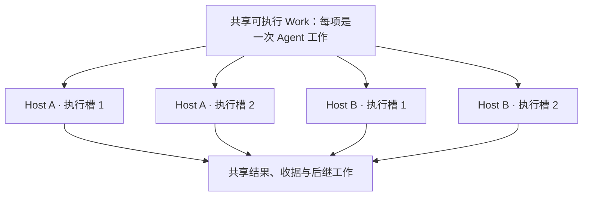

# 077 — 分支编辑保护与 Agent 级分布式执行

状态：已实现当前范围。通用数据、有限计划、Agent Work、多槽 Host、通用 UI、v4 数据包、显式迁移、分支内容版本、编辑租约、同图多 Run、Run 范围占有与可接管控制租约已落地。更新：2026-09-29。

## 1. 用户目标与本稿定义

本地模式的用户操作不使用编辑/控制租约，也不需要续租。由本机服务在事务中校验分支版本、权限和 Run 范围占有；bootstrap 返回 `clientLeases: none`。本文客户端领取、续租、释放和控制权接管均指协作模式（`clientLeases: required`）。Agent Work 的内部授权仍由 Host 自动管理。

用户已明确两项要求：人工修改先领取分支编辑权，其他客户端只读；执行调度粒度下降到 Agent，使单 Host 的多 Agent 并发与多个 Host 的并发使用同一种抽象。

用户进一步明确：统一“数据类”中的“后继”指该数据类型允许产生哪些后继数据类型，不是某份数据已经连接的节点 ID。下文分别使用“允许后继类型”和“实际后继节点”，避免把类型声明与实例关系混为一谈。

用户继续提出将 claim、verification 等业务节点及 verify 等处理规则从核心代码中移出。本稿据此采用可注册的数据类型与转换定义；事实核查成为默认定义包。具体业务类型不再要求新增 TypeScript 子类或修改封闭 kind 枚举。

已确定继续完善自有调度：协作模式使用 RabbitMQ＋Work，本机使用进程内通知＋同一种 Work。底层 DSH 保留，负责单次 Agent 的模型、工具和会话执行；工作适配器及业务插件可以调整以接入新协议。本轮不接入外部工作流平台。

本稿将分支定义为“起点节点及其全部业务后继”，作为实施建议；它不是画布上的视觉分组，也不是固定归属于某台 Host 的数据分片。互不影响的分支可以分别编辑、分别运行；同一分支及相互重叠的分支只允许一个有效占有者。

分支是数据修改的保护范围，Agent 的一次工作才是调度与故障接管单元。Run 占有分支后，可以授权多个 Agent 同时执行其中不同工作，分配到同一 Host 或不同 Host 不改变业务语义。不能把分支独占解释为整个分支只能有一个 Agent 运行。

当前实现使用通用数据实例、注册定义与转换、冻结执行规格和 Agent 级 Work；默认事实核查链已通过真实 DSH 闭环。`branch.*`、`run.control.*`、内容 proof、编辑/Run 占有、`ownershipRevision`、`runs[]` 和无关分支 CAS 重放已经接通。不相交分支可在同图并行运行，重叠范围仍互斥。

字段、schema、注册事务、基数、输入齐备、候选发布和迁移规则见 [077 数据定义协议](./077-数据定义协议.md)。本文保留整体架构与分支协作约束，实施清单与该协议使用同一术语。

### 1.1 统一调度单元沿用 Work

| 概念 | 定义与身份 |
|---|---|
| Agent 配置 | 模型、提示词和工具能力；agentId 可以被不同任务重复使用，不是锁的键 |
| Work | 一次可独立领取并提交业务结果的 Agent 工作；沿用 workId、runId、operationId、角色和路由槽身份 |
| 执行尝试 | 某个执行槽对 Work 的一次领取；使用独立 holderId/fence，重试不改变业务 workId |
| Host 执行槽 | Host 提供的一个有界并发位置，一次运行一个已领取 Work；不是长期绑定某个 Agent 的实例 |
| DSH 会话 | 当前执行尝试的本地运行状态；不充当分布式任务身份，也不要求跨机器搬迁 |

现有 `workReadItems()` 按冻结阶段依赖和 `stageId/slotId` 派生 Work；计划阶段可以受限地产生后续 Agent 槽，结果阶段支持 outputs、selection 或 plan。`dshRunWork()` 为一次领取创建独立 DSH 进程与会话。因此复用 GraphWork 和现有 claim/renew/release/提案收据，不另建与它平行的 AgentTask 系统。

统一生命周期为：可执行 Work → 空闲执行槽领取 → 运行指定 Agent → 提交结果 → 释放执行槽。业务代码不选择本机执行或远程执行，也不先把整条分支分配给某个 Host。

图中的槽位只用于说明部署方式，不是固定数量。每个 Host 配置自己的容量 N，总容量为各 Host 容量之和；实际吞吐受模型服务、工具、依赖关系和存储限制，故障影响范围也随 Host 布局不同。

### 1.2 Host 只提供执行容量

Host 已支持 1..64 的 concurrency 配置，默认为 1。队列消费在此上限内领取和执行，不提前囤积超过容量的租约。每项 Work 拥有独立续租、取消、活动和清理状态；一个 Work 失租只中止本次尝试。业务失败是否终止所属 Run 仍由现有 Run 规则决定，不因同机运行就终止其他 Work。

RabbitMQ 和进程内通知现已实现同一有界并发契约。传输层记录全部在途处理器；连接断开或 Host 关闭时停止新投递并中止受影响工作，等待全部 DSH 清理与授权释放后才重连或退出。测试覆盖了独立 ACK/NACK、乱序完成、重复通知去重与排空。

SQLite 本机模式仍只有一个服务进程和一个 Host，但该 Host 也能提供多个执行槽；使用进程内传输承载同一种 Work 协议。协作模式通过 RabbitMQ 扩展到多个 Host，不另写一套本机 Agent 调度。

同 Host 的 DSH 会话、临时补丁和可写运行目录按执行槽/尝试隔离；公共只读资源可以共享。所有参与执行的 Host 必须具备任务所需的模型和工具能力；第一版按能力一致的部署配置验收，不宣称已有异构能力路由。

聚合事件回调必须附带 workId、holderId/fence；需要标识本地位置时使用 executionSlotId，避免与业务路由 slotId 混淆。不能把多个 DSH 的裸事件混入同一 Host 回调后丢失工作归属。

重复通知不能无限占满执行容量。本 Host 可对已有在途 Work 合并重复唤醒，跨 Host 的 busy 仍须保留可靠重投机会并采用有界退避；只有确认另有可靠唤醒覆盖时才能丢弃重复投递。不能把 busy 当成 obsolete，也不能通过立即 NACK 循环占满队列。

### 1.3 Agent 依赖与内部委派

执行分层为：已选计划和共享图状态 → Work 就绪判断 → Outbox/队列 → 单 Work 的领取、续租、取消与释放 → dshRunWork → DSH。dshRunWork 不自行管理租约，Host 必须承担完整生命周期；不绕过图服务的最终授权与收据检查。

runUpdateProgress/workReadItems 负责推进已选计划，Host 负责有界执行；流程层和队列层不能各自再创建一次相同后继或无条件重试。类型/转换定义的通用化不增加另一套调度服务。

计划 Agent 提交受冻结白名单限制的槽位后结束自身 Work；多个产出 Agent 各提交自己的结果，全部前置阶段封闭后才派生依赖阶段。等待人工审核或子结果时，不让一个父 Agent 长期占着执行槽，否则在小容量 Host 上可能阻塞它等待的工作。

一次 Work 可以包含多轮模型调用和工具使用，这些仍由 DSH 管理。现有业务插件禁止绕过工作授权直接使用 subagent/data_delegate 等工具；不能把 SDK 的本机委派误认为已自动纳入分布式。若增加可独立调度的动态子 Agent，必须通过服务端登记受限子 Work、稳定父子身份和依赖关系，再进入同一执行池；在该协议实现前保持现有限制。

### 1.4 统一数据类型声明允许的后继类型

基础数据抽象统一实例的 id、revision、typeId、typeVersion 和 payload；注册的数据类型定义声明内容结构和 successorTypes。successorTypes 属于类型定义，例如事实类型声明可以产生核查意见类型，不为每份事实重复保存一份可由客户端改写的规则。

以下是类型关系的设计示意，不是具体数据的 ID，也不表示这些实例一定已经存在：

| 数据类型 | 允许的后继数据类型 |
|---|---|
| 来源 | 新闻 |
| 新闻 | 事实 |
| 事实 | 核查意见 |
| 核查意见 | 核查结论 |
| 核查结论 | 暂无 |

此表说明允许后继类型的含义；完整默认包还包含证据类型。运行代码已使用独立意见节点、候选与正式产物区分及原子候选引用回填；旧嵌入报告由显式迁移按数据定义协议第 11 节转换。

允许后继类型用于约束某种输入可以产生哪些输出，并供 Agent 工作选择和提交校验共用。它不表示所有允许类型都必须生成，也不表示每出现一个节点就立即派发全部 Agent。具体任务仍由用户目标、前置数据、路由/审核、配置和既有完成收据决定；多个意见汇总为一个结论还需要完整的多输入依赖条件。

类型规则描述“能产生什么”，GraphEdge 描述具体实例之间“已经建立什么关系”，Work 描述“由哪次 Agent 工作产生”。核心只依赖通用节点结构与已注册定义；来源→新闻→事实是定义中的类型转换链，不是类继承链。运行时通过注册表读取定义，未知 typeId 或不匹配版本须明确拒绝。

### 1.5 可注册定义与通用执行

| 定义／实例 | 主要内容 |
|---|---|
| 数据类型定义 | id、不可变 version、字段 schema、successorTypes、显示名称/摘要字段/基础表单提示、数据与资产引用字段的语义 |
| 转换定义 | id/version、输入类型与选择范围、输出类型及数量、输入分组与齐备条件、Agent 绑定、审核要求 |
| 数据实例 | id/revision、精确 typeId/typeVersion、符合该定义的 payload；不包含可执行代码 |
| Operation/Work | 转换定义及冻结执行规格、输入实例/版本、明确的阶段或结果槽、幂等身份和当前执行授权 |

基数枚举仍保留 OneToOne、OneToMany、ManyToOne、ManyToMany；允许零结果和具体数量上下限由转换定义补充。业务数据类型 ID 可注册，不做封闭枚举。运行状态、租约状态和受支持的执行方式属于引擎机制，仍可用固定枚举。

类型定义的 successorTypes 表示许可；转换定义的输出必须满足该许可。定义包发布时统一检查类型引用和转换一致性，运行时不得分别读取互不匹配的“最新”类型与转换版本。多输入转换区分参与产出的主输入和仅供读取的上下文输入。

一个 OneToMany 转换可以由一个 Agent 输出多条数据，也可以由明确的多个执行槽分别输出；基数不等于 Agent 数量。第一版执行方式覆盖单项生成、明确分工后的并行工作、输入组齐备后的汇总，继续使用同一种 Work 和现有租约机制。

类型、转换、Agent 绑定以工作区可用的定义包管理，内置事实核查包只负责首次初始化或显式导入。已发布版本不原地修改；Run 冻结实际使用的 schema、转换、Agent 和工具绑定及其版本/摘要。定义升级只影响之后创建的任务，已有运行和历史节点仍能读取原定义。

claim、opinion、verification 的字段、评分枚举和显示名称属于默认业务定义。parse/split/verify 的输入选择、提示词映射和产物字段属于默认转换定义。引擎不得把“未知类型”兜底解释为 verify，也不能只把 kind 改成 string 后继续保留相同的业务 switch。

通用执行路径为：读取冻结的转换定义 → 确定本次输入组及目标 → 满足前置条件后建立 Work → 空闲 Host 执行槽运行绑定 Agent → 按冻结 schema/基数/依赖/授权校验并接纳输出。多输入汇总必须知道本次组的预期成员及完成状态；零输出成功、未完成与失败是不同事实。

界面按类型定义展示和编辑字段，至少覆盖默认定义包实际使用的字段结构，并提供只读结构化数据显示。新增符合已支持 schema 和执行方式的业务类型，不应修改调度、存储或通用 UI；新工具实现和新执行原语仍需要相应代码能力。

权限、字段对 Agent 的可见性、附件引用归属、租约、幂等和最终提交检查仍由服务端统一执行。定义只声明受支持的字段、输入映射与执行方式，首版不引入任意脚本调度或无界循环。自定义类型的资产导入导出须携带或解析精确的定义版本，不能丢失 schema 后仅保存 payload。

## 2. 用户可见行为

| 场景 | 目标行为 |
|---|---|
| A、B 同时领取同一分支 | 数据库只批准一个，另一个看到占用者并保持只读 |
| 同一账户的两个窗口领取同一分支 | 同样互斥，不能因 userId 相同而共享编辑权 |
| A 编辑新闻甲分支，B 编辑独立的新闻乙分支 | 两人可以同时编辑和保存，无需因对方改动刷新自己的草稿 |
| A 持有祖先分支，B 领取其内部子分支 | 拒绝 B，因为覆盖范围重叠 |
| 两条新闻引用同一条事实 | 包含该事实的两个分支互斥；画布显示两份不代表数据有两份 |
| A 断线或退出 | 未保存草稿保留在当前客户端内存中；编辑租约到期后其他人可以领取。进程关闭后的草稿持久化另行定义 |
| A 失租后迟到提交 | 拒绝写入，不因 token 仍有效或 userId 未变化而放行 |
| A 分支在运行，B 编辑或运行不相交分支 | 允许，A 的运行不再冻结整张图 |
| 同一核查有三个 Agent 报告工作 | 三份 Work 可以在一台或多台 Host 上并行，按各自报告槽提交，不互抢整条分支 |
| 启动 Run 后关闭客户端 | Run 继续；运行范围不会随浏览器租约到期而开放普通编辑 |

分布式网络下，失联窗口可能短暂显示旧占用状态。保证的是服务器不会同时接受两个冲突持有者的写入；界面在无法确认续租时停止提交并显示待确认状态，不把通知及时性当作互斥保证。

## 3. 实际分支范围由服务端统一计算

本节计算内容摘要与编辑/Run 占有共同覆盖的实际节点，和第 1.4 节的允许后继类型是两个层次。允许类型用于校验生成关系是否合法；分支 scope 沿当前实例关系计算，不能把所有类型相同的节点都视为同一个分支。

下表记录旧事实核查模型的关系方向，供迁移使用。新的通用范围计算依据关系的结构语义与注册转换，不把这些业务类型名称写成固定分支；引用关系和产出关系须区分。

当前关系的物理方向不统一，后继遍历必须按业务规则解释：

| 业务方向 | 现有关系 |
|---|---|
| Source → News | derived-from，实际边为 News → Source |
| News → Claim | derived-from 的反向，或 mentions 的正向 |
| Claim → Verification | verifies 的反向 |

新模型沿 successor 角色的实际边正向遍历，包含根、按节点 ID 去重；reference 不扩展后继范围，旧 related-to 按此迁移。界面的树形副本不参与授权计算。`branch.get` 支持一次提交多个根，并返回合并后的 `GraphBranchScope`、版本摘要、根节点 revision 和读取时 mapRevision；后两者用于客户端确认分支读取与当前快照配对，不参与服务端并发裁决。`branch.claim` 使用同一种合并范围。

只比较 rootId 不够：两个不同根可能有祖先关系或共享后继。版本冲突以实际闭包及相邻关系的摘要为准；占有冲突以全部有效占有的动态实际范围交集为准。

新增后继自动进入所属范围。`graph.apply` 在同一业务动作中比较修改前 proof、计算节点/关系真实影响，并按修改后 successor 闭包返回新摘要；既有端点必须属于授权范围，新节点必须从原根可达，跨到范围外的改接或级联删除会被拒绝。最终提交还会按修改后的实际范围核对其他有效占有，防止把原本不相交的两个范围连成重叠范围。

修改关系、删除节点的影响范围包含边的两端和删节点级联删除的关系。客户端必须先用足以覆盖这些旧端点的根集合取得 proof 和同根集合的租约；多根只删除其中一部分、触及范围外既有节点或创建不可从原根到达的数据都会拒绝。当前客户端通过一次多根 claim 取得完整范围，不把多个局部领取拼成一份授权。

核查等操作还可能读取分支之外的新闻输入。输入校验须包含节点版本、实际输入成员集合和相关关系版本；只验证原有 inputRefs 会漏掉后来新增的 mentions 关系。外部输入变化必须拒绝旧结果或使已有结果失效，不能默默接纳基于旧输入的结果。

## 4. 两种占有与客户端控制租约

编辑租约、Run 范围占有和客户端控制租约已经接在摘要型内容版本之上。

### 人工编辑

认证 editor/owner 为自己的客户端会话领取分支。每个窗口生成独立 holderId，服务端把它与认证 actor 记录在占有中；同一账户的窗口也不会共享编辑权。

领取返回 scope、leaseId、holderId、fence、expiresAt、leaseMs 和当前 branchVersion。释放或过期后重新领取形成新的授权代次；旧续租、释放和提交不能影响新持有者。持有者标识不等于权限凭证，所有命令仍须鉴权。

续租要求授权仍有效，以存储端时间裁决。客户端约每 `leaseMs/3` 续租；断线、权限撤销或无法确认续租后禁用提交，保留草稿。重连后先取得最新占有状态；失效授权不自动复活，也不自动抢回其他人的锁。

### Run 执行

启动 Run 原子验证编辑权、输入版本和范围，并把分支占有转换为持久的 Run 占有，同时使原来的普通编辑授权失效。Run 在运行、暂停和等待审核期间都保留范围，直到完成、失败或取消；Work 的领取、读取和提交持续校验该 Run 占有。

Run 的占有不依赖浏览器续租。启动者原子取得可过期控制租约，暂停、继续、取消和人工审核同时校验 editor 权限与控制 proof；原控制者释放或租约过期后，其他有权限的用户可以显式领取控制权。人审仍保留 reviewId/expectedReviewRevision，不再增加另一把审核锁。

Host 的每个空闲执行槽独立领取一份 Work，在同一个 Run 内并行执行不同 operation/slot。Work 的领取、续租和结果提交同时校验 Run 占有代次与自身 holder/fence。分支占有属于 Run，不授予某个 Host 或 Agent；这些 Work 是该 Run 之下各自受限的写入者，不调用 branch.claim 争抢整条分支。Run 控制权换人不重启 Host；取消、终态或执行授权撤销才使对应 Work 失效。浏览器控制租约与 Host 执行租约不可混用。

暂停保留 Run 占有，但必须在同一事务撤销该 Run 当前的 Work 租约。继续后未完成工作重新领取并使用新授权；快速“暂停→继续”也不能让旧 Work 的迟到提交重新有效。仅更换客户端控制者不撤销执行授权。

## 5. 提交、版本与原子性

人工分支修改使用 `GraphBranchProof { rootIds, expectedVersion }`，不再要求提交时整张图仍等于用户开始编辑时的版本。`branch.get` 从服务端取得 proof 所对应的 scope/version；客户端不能自行计算或解释摘要。修改已有分支时还必须携带同根集合的有效 `GraphBranchLeaseProof`。

branchVersion 已使用服务端对根集合、后继成员、节点版本、所有相邻关系及类型声明中的 payload 节点引用计算稳定摘要。`reference` 不扩展 scope，但 GraphEdge reference 和 payload reference 都会影响两端版本与修改范围。它是不可解释的版本标识，不是客户端随意更新的计数器；无关分支变化不改变它。`branch.get` 和与当前返回快照同次的 `graph.apply` 可返回相应版本；较早请求的幂等重放不会把旧 proof 拼到新快照。

创建完全独立的新根时，proof 使用 `expectedVersion: null`。这个快捷路径只允许本次新节点之间的关系；successor 子图必须无环，且所有新节点都要从声明根沿 successor 可达。它不能更新旧节点、删除数据、修改图名称或接触旧边。已有分支的修改必须使用非空版本。

`run.start` 同样携带非空 proof 和编辑租约。客户端在启动前对完整根集合调用 `branch.get`/`branch.claim`，服务端在创建 Run 前再次比较摘要并把编辑租约转换为持久 Run 占有；Run 随后在每次 Work 读取/提交时复核 branchState 与占有，正式产物发布后原子推进 scope/version。选择后发生的输入或相关关系变化会使旧 Work 失效，不会被静默吸收。当前持久结构仍是单 `run`，不能并行启动同图第二个 Run。

Agent 提案不固定整条分支的 branchVersion：兄弟 Work 提交候选会改变运行状态，但不应使其余合法工作失效。每份 Work 只核对所属 Run 的执行授权、独立工作租约、冻结输入及依赖关系、specHash 和自身结果合同。Agent 只能提交获授的 stage/slot 与输出端口，依赖阶段在所需结果组封闭后提交选择或汇总；不能持有一个 Work 的凭证就任意修改整条分支。

角色权限、独立结果槽及最终输入检查必须同时成立。仅以“不同 workId”判断可以并行写入不够；相同正式节点或结果槽的竞争修改必须归入同一业务工作或由服务端拒绝。有效的兄弟提案遇到 Map CAS 冲突时，重读后重放已经产生的提案，不重跑 Agent。

输入真正变化后的重新计算必须形成新的业务代次，第一版可用新的 Operation/Run 表达；不能改输入后沿用已有成功收据的 workId。holder/fence 只表示同一工作的执行接管，不代替输入或配置版本。

Map revision 继续用于完整快照排序和内部 CAS。服务端在最新图上验证范围、授权和相关版本，再应用本次局部 changes。整图 CAS 因无关写入失败时，有界重读并重新验证后重放同一补丁；绝不整体写回客户端旧快照，也不在存储重试里重跑模型。真实分支版本变化则返回冲突。

当前最终写入原子满足：身份仍有业务权限；proof 匹配相关内容；编辑租约未过期且 holder/fence 匹配，或 Work 属于仍有效的 Run 占有；变化及副作用在 scope 内；修改后范围不冲撞其他占有者；拓扑、资源引用和业务 schema 有效。服务端不会先查锁再无条件写入。

第一版可以保留单图文档。图内容与占有协调状态必须在同一存储原子边界中裁决；领取、续租、释放、拓扑修改都参与协调版本检查，不能只以业务 revision 保护领取。Mongo 使用数据库时间和事务/CAS；SQLite 在既有事务内实现同样语义，不引入另一套规则。

占有状态使用独立 ownershipRevision；领取、续租、释放不会增加内容版本或制造全图草稿冲突。业务写入、结果收据及相应通知标记仍原子提交。工作收据的业务身份不包含租约 fence，避免换持有者后重复接纳已完成结果；查询既有成功收据仍需当前业务访问权限。

所有改变占有裁决条件的动作都推进 ownershipRevision，包括编辑/控制续租、Run 转换、控制接管和终态释放。涉及拓扑与范围的提交同时比较读取时的内容 revision 和 ownershipRevision；两者任一变化都重读重验，避免并发新领取被旧拓扑提交漏掉。

这一步解决独立分支的逻辑并发。单图文档的物理写热点和 8 MiB 限制仍然存在，本稿不把它描述为完成了存储分片。

## 6. 对外接口与实时状态

认证后的 `branch.get { mapId, rootIds }` 返回 `GraphBranchSnapshot { scope, version, rootRevisions, mapRevision }`。`branch.claim` 支持一个或多个根的原子领取并返回 claimed/busy，`branch.renew` 和 `branch.release` 使用同一 leaseId/holderId/fence。`graph.apply` 对已有分支要求 branch proof 和 lease proof，`run.start` 要求相同的非空 proof 与 lease；缺少凭证的旧写法在 HTTP 或服务边界即被拒绝。

正文、关系和删除命令携带根集合、`expectedVersion` 与编辑租约，跨分支命令必须让 scope 覆盖全部实际影响，不能由前端禁用按钮代替服务端校验。启动 Run 会消费有效编辑授权并返回 `runControl`。`run.control.claim/renew/release` 使用 runId 与独立 control proof；暂停、继续、取消和审核也携带该 proof，并在最终写入条件中校验。

图名称、创建新根、删除整图使用各自条件。图名称修改要求 proof 和编辑租约的 scope 覆盖当前全部节点；独立新根使用 null 版本规则；`map.create` 使用工作区 revision，`map.delete` 继续使用图资源 revision。分支租约不会自动授予整图删除能力，工作区删除会检查无有效分支占有和无活跃 Run。

SSE 以 `ownershipRevision` 独立跟踪占有变化，首次连接和重连发送包含完整占有基线的 snapshot；内容 revision 不变的领取、释放、接管和 Run 转换仍会广播。Mongo outbox 监听全部图更新并从持久 dispatch 状态过滤待发记录。通知只用于同步展示，最终写入仍由存储裁决；续租响应直接更新持有者期限，旁观者的到期显示不能被当成领取成功。

客户端在选择节点时读取分支版本，草稿只与该分支版本比较；无关分支的新快照不会制造草稿冲突。界面显示分支编辑权和 Run 控制权的领取、释放或占用只读状态，迟到领取响应按视图代次隔离，失租后禁用相应提交。离开视图会尝试释放客户端租约，不取消后台 Run。

## 7. 已落地能力与剩余限制

| 能力 | 当前状态 |
|---|---|
| 通用数据实例、注册类型/转换、冻结执行规格 | 已落地；默认事实核查是定义包，不是核心 kind 分支 |
| 有限 Run plan 与通用阶段 outputs/selection/plan | 已落地；定义发布时校验，运行时冻结精确版本 |
| 一个 Host 的 N 个执行槽 | 已落地，范围 1..64；RabbitMQ 和进程内通知均有界管理全部在途 Work |
| 多 Host 的 Agent Work 分配与故障接管 | 已落地现有逐 Work 租约、holder/fence 和幂等结果协议；生产 HA 仍取决于 Mongo/RabbitMQ 部署 |
| 通用 UI 和 v4 bundle | 已落地；UI 按 schema 编辑，画布按真实 successor/reference 展示，包携带定义依赖闭包 |
| GraphDocument/GraphSnapshot 多 Run | 已落地；使用 `runs[]`，命令、Work、活动、审核和 UI 选择均按 runId 路由 |
| 分支编辑权与 Run 范围占有 | 已落地；branch.claim/renew/release、holder/fence、存储最终 guard、客户端续租/只读及 Run 转换已接通 |
| 可领取的 Run 控制权 | 已落地；启动原子授予，claim/renew/release、最终 guard、接管、只读 UI 与终态清理已接通 |
| 分支级内容版本 | 已落地；`branch.get`、GraphBranchProof、graph.apply/run.start 摘要屏障和无关分支 CAS 重放已接通 |
| ownershipRevision 与占有 SSE | 已落地；纯占有变化不推进内容 revision，SSE 仍会发送完整占有基线 |

旧单 `run` 通用文档需要通过显式迁移转换为 `runs[]`；正常读取不会维护两套可变运行状态。

## 8. 迁移与验收

不自动改写已有用户数据。现已提供 Mongo 管理命令和 SQLite 离线入口的显式 dry-run/apply 迁移，把旧固定业务节点与报告转换为通用数据 v4，并保留可确认的身份；有有效 Work/分支租约、版本竞争或无法判定的结构时不写入。迁移不会复制活跃租约，也不会把旧 Run 伪装成新的持久范围占有。

本机 SQLite 采用相同业务迁移。导出数据包不携带分支 proof、活跃编辑凭证或可执行占有；缺少 GraphBranchProof 或已有分支 lease proof 的旧写入不能绕过当前协议。

以下清单中，分支摘要、不相交写入、旧版本拒绝、新根、拓扑影响、领取/失租、同图多 Run、控制权接管与 SSE 基线已有自动化覆盖；生产基础设施主切换仍需按实际部署验收。定义、Agent Work、多槽、DSH 和 v4 数据链路也已有对应自动化覆盖：

1. 同根同时领取仅一个成功；同账户不同窗口也互斥。
2. 不相交分支同时保存或运行均成功；暂停、取消其中一个 Run 不撤销另一个 Run 的 Work。
3. 祖先/子分支、共享后继和多个根的原子领取正确互斥；持有期间动态增加根仍待定义独立扩充命令。
4. 新增/改接/删除边、删除节点的级联副作用不能绕过范围检查；新增关系导致的输入变化可被发现。
5. 断线、过期、撤权和接管后，旧续租/释放/提交全部受到保护；本地草稿不会被通知覆盖。
6. 浏览器关闭不释放活跃 Run；暂停/等待审核仍保留运行占有；控制权换人不重复模型工作。
7. Host 失租或 Run 取消后旧结果被拒绝，已接受结果的重试保持幂等。
8. 占有通知跨 API 传播、乱序/重复可处理、重连有完整基线；业务 revision 不因心跳变化。
9. Mongo 事务竞争、主切换与 SQLite 回归均通过；迁移保留全部既有业务身份。
10. 同一组 Agent Work 分别用单 Host 多槽、多 Host 单槽及混合布局执行，已接受业务结果与依赖顺序一致，并发始终不超过各 Host 配置。
11. 同一 agentId 用于不同输入/槽时可以并行；同一 workId 竞争领取仅有一个有效持有者。一个报告提交不会使仍合法的兄弟 Agent 失效。
12. 单项失租仅中止对应尝试；Host 崩溃后只接管该 Host 未完成的 Work；多项在途时的连接断开、退出及重连均等待全部清理，不遗漏或错误 ACK。
13. 进程内传输与 RabbitMQ 均通过上述有界并发场景；DSH 使用真实并行进程验证目录、会话和活动隔离。重试沿用 workId，使用新的 holder/fence 和本地会话。
14. 多 Work 的事件始终可归属到原授权；忙重复通知不会导致无界任务、热重试或丢失唯一恢复机会；输入改变后的重算不会被旧成功收据误判为已完成。
15. 注册一组不含 source/news/claim/verification 名称的新类型及转换，只新增定义即可完成创建、编辑、单 Host/多 Host 执行、审核及结果读取；不能依赖任何默认核查分支。
16. 定义升级不改变在途 Run；输出类型/schema/基数不合法时拒绝；零输出与输入未齐区分；自定义类型的资产引用、字段可见性及导出导入保持一致。

已完成项和后续步骤见 [077 实施状态](./077-implement-分支独占与分布式协作.md)。
