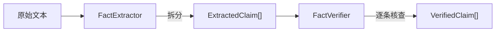
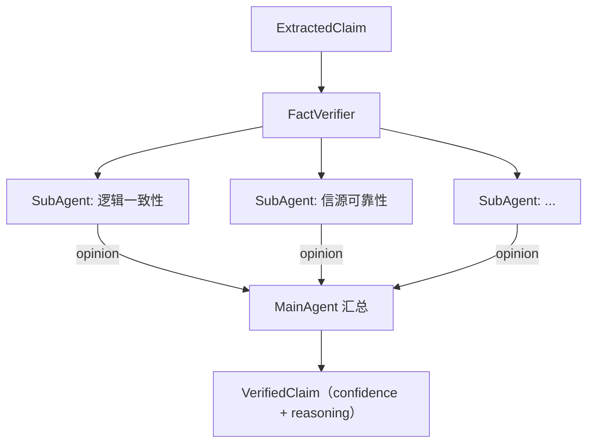

# 事实拆分与核查模块 — 总体架构设计

> 本文档为总体架构概览，具体模块的详细设计见各自文档。

## 整体流程



两个阶段：

| 阶段 | 模块 | 输入 | 输出 | 详细设计 |
|------|------|------|------|---------|
| **拆分** | FactExtractor | 原始文本 | ExtractedClaim[] | 见 `design-text-splitting.md` |
| **核查** | FactVerifier | 单条 ExtractedClaim | VerifiedClaim | 见 `design-verification.md`（待设计） |

---

## 核查阶段架构（概要）

### 置信度

| 值 | 含义 |
|----|------|
| `1` | ✅ 可信 |
| `0.5` | ⚠️ 不确定 |
| `0` | ❌ 不可信 |

### 多 SubAgent 扇出/汇聚



1. FactVerifier 将一条事实并发分发给多个 **SubAgent**
2. 每个 SubAgent 有独立的视角和 prompt，从各自角度给出核查意见
3. 所有意见收集后，交给 **MainAgent** 汇总，给出最终置信度 + 综合理由

### 关键抽象

| 接口 | 职责 |
|------|------|
| `SubAgent` | 单一视角的核查能力（`buildPrompt` + `parseResponse`） |
| `MainAgent` | 汇总所有 SubAgent 意见，输出最终评分 |
| `AIProvider` | 封装 AI API 调用，可切换供应商 |

---

## 共享类型概览

```typescript
type Confidence = 1 | 0.5 | 0

interface ExtractedClaim {
  content: string     // 事实陈述
  category: string    // 分类
  context: string     // 原文上下文
}

interface SubAgentOpinion {
  agentName: string
  reasoning: string
  rawResponse: string
}

interface VerificationResult {
  confidence: Confidence
  reasoning: string
  opinions: SubAgentOpinion[]
  rawResponse: string
}

interface VerifiedClaim extends ExtractedClaim {
  verification: VerificationResult
}
```
