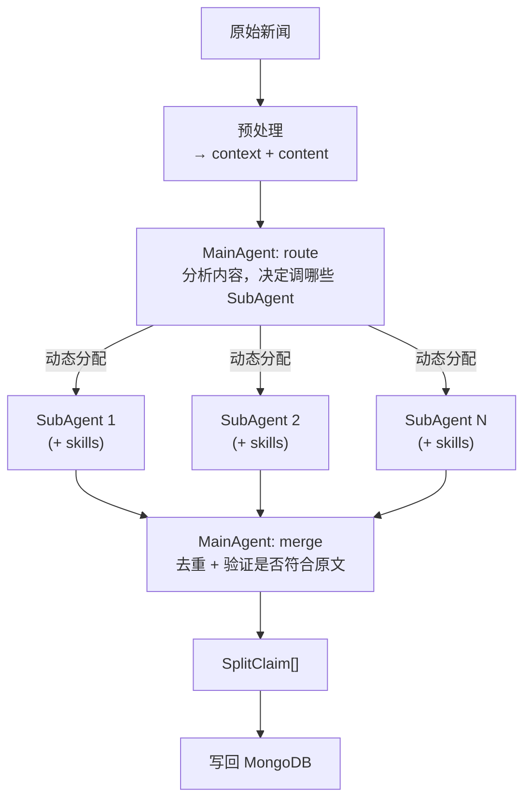
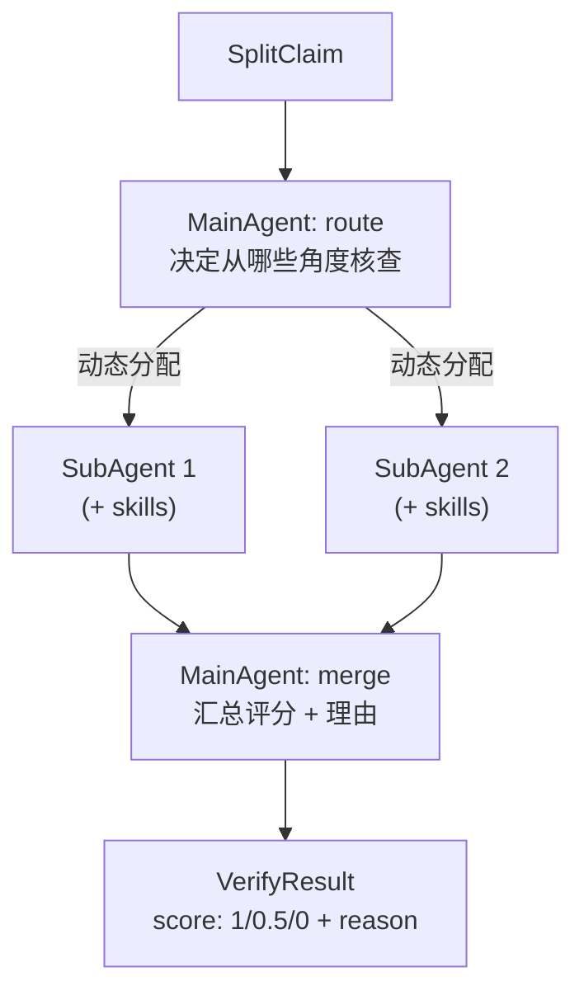

# 事实拆分与核查模块 — 总体架构设计

> 本文档为总体架构概览，具体模块的详细设计见各自文档。

## 技术栈

| 组件 | 选型 | 说明 |
|------|------|------|
| Agent 编排 | LangGraph.js | StateGraph + Send 扇出/汇聚 |
| AI 调用 | LangChain ChatModel | 统一接口，一行换供应商 |
| 数据库 | MongoDB + Mongoose | 本地/Atlas 一行切换 |
| Prompt 管理 | 配置文件 (`prompts/`) | 路径 = 调用位置 |

---

## 拆分阶段 — 典型流程

> 一篇新闻首先预处理为 context 和 content。
> 对于 content，先交给 MainAgent，它决定给哪些 SubAgent 来拆分。
> 这些 SubAgent 具备各自可配置的 skill。
> 最后 MainAgent 来去重并验证拆分是否符合原文。



### MainAgent 双职责

| 阶段 | 职责 | prompt 配置 |
|------|------|-------------|
| **route** | 分析内容，决定调用哪些 SubAgent | `prompts/fact-extractor/main-agent-route.json` |
| **merge** | 去重 + 验证拆分结果是否忠于原文 | `prompts/fact-extractor/main-agent-merge.json` |

### SubAgent 能力

- 每个 SubAgent 有独立的 prompt 配置（拆分视角）
- 可调用 skills（搜索、计算等），通过 LangChain tool calling
- 内部运行 ReAct 循环（AI 自主决定是否/何时调用 tools）

---

## 核查阶段 — 与拆分对称

### 置信度

| 值 | 含义 |
|----|------|
| `1` | ✅ 可信 |
| `0.5` | ⚠️ 不确定 |
| `0` | ❌ 不可信 |

### 流程



---

## 通用模式

拆分和核查共用同一图结构：

```
loadData → MainAgent route → 动态 Send[] SubAgent(+skills) → MainAgent merge → saveResults
```

---

## 数据模型（单文档）

```
NewsDocument {
  _id: string
  content: string
  context: {
    [key]: { value, visibleToAI }
  }
  claims: [
    { claimId: "1", content: "...", category: "..." }
  ]
  splitMeta: { model, subAgentResults[], rawMergeResponse, splitAt }
  createdAt, updatedAt
}
```

事实引用：`news-20260630-001#1`（文档 ID + `#` + claimId）

