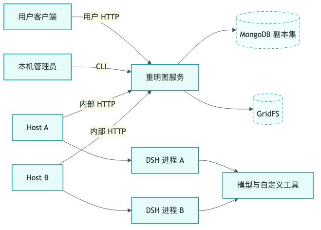
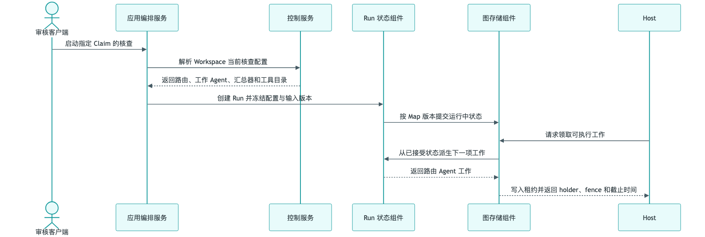
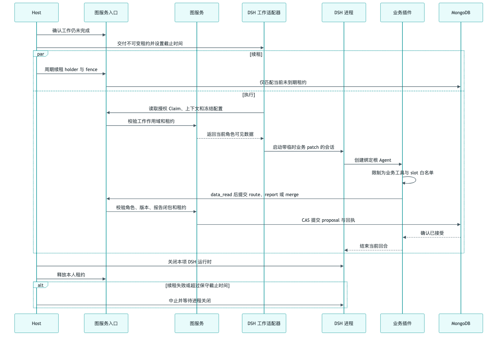
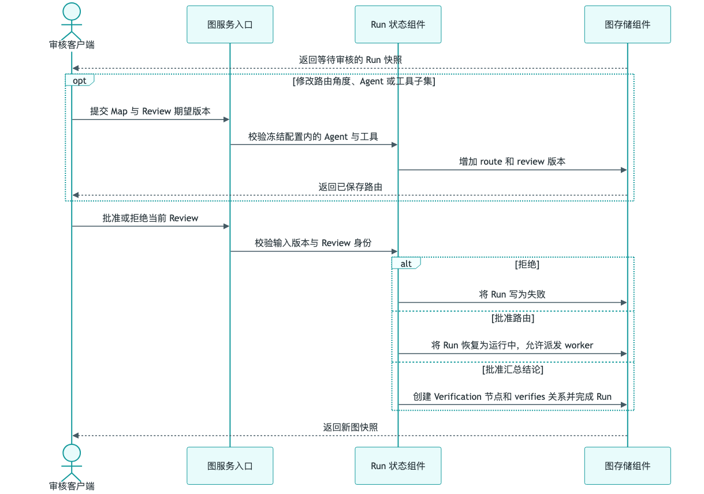
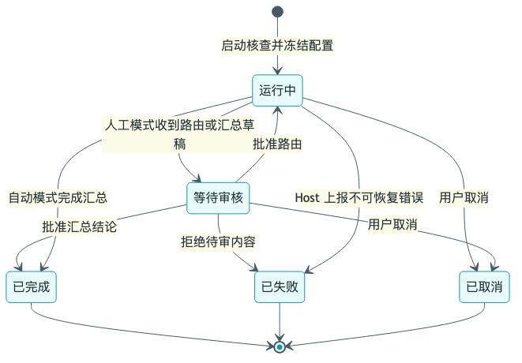
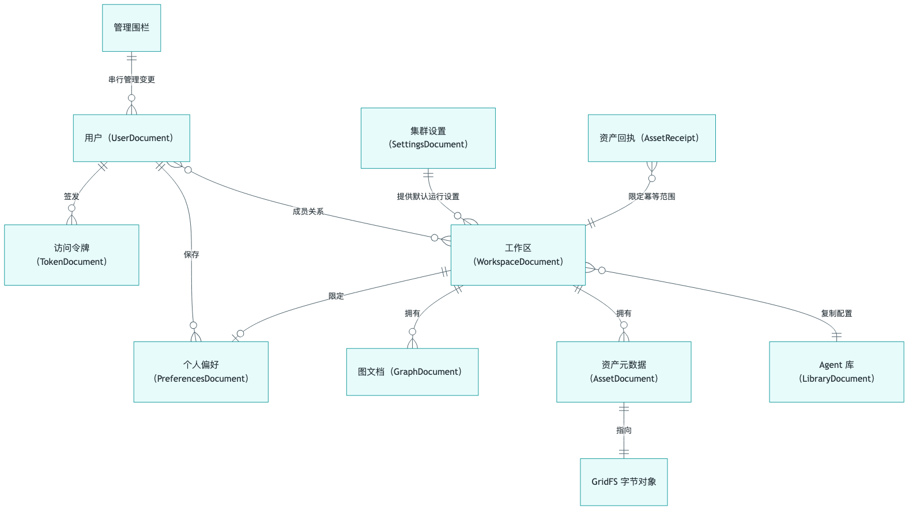

# 重明图服务技术说明书

| 项目 | 内容 |
|---|---|
| 服务 | 重明图服务（Graph API、Host 与 DSH 工作适配器） |
| 分支 | `codex/run-review-core` |
| Commit | `b5b6df5af5367b1147f0311c6fe96f1cf0fbf903` |

## 1. 服务概述

重明图服务以数据图保存新闻、可核查事实、来源、证据和核查结论。它拥有用户与 Workspace 权限、图数据、核查 Run、人工 Review、Agent 配置副本、资产及幂等回执；多个 Host 可以共享同一图服务和 MongoDB，从同一张图领取不同核查角度并演进结果。

服务把模型会话和工具执行交给 DSH。图服务决定“允许谁对哪张图做什么、可使用哪些 Agent 和工具、结果是否仍属于当前 Run”；DSH 决定一次受限工作的模型执行过程。用户客户端看不到 Host 调度和 DSH Session，只读取业务状态并提交审核决定。

服务不负责浏览器抓取 URL、保证外部工具副作用恰好一次、保存模型完整思维过程，也尚未执行 parse/split 阶段。GridFS 是本服务的资产字节存储；模型供应商和自定义工具保持为 DSH 外部黑盒。

主要调用者包括用户客户端、本机管理员、常驻 Host 和本机开发者。运行时基础设施为 MongoDB 副本集、GridFS 与每台 Host 上的独立 DSH 目录。

## 2. 用例视角

| 流程 | 参与者 | 业务目标 | 可观察结果 |
|---|---|---|---|
| UC-01 登录并恢复上下文 | 用户 | 打开本人可见的 Workspace 与数据图 | 返回身份、权限、偏好和图快照 |
| UC-02 治理协作配置 | Owner、HostAdmin | 管理成员、Agent 副本和共享设置 | 新配置版本供后续 Run 使用 |
| UC-03 维护事实数据图 | Editor | 创建或修改节点与显式关系 | 原子生成新的图版本 |
| UC-04 动态多角度核查 | Editor、Host、DSH、审核者 | 动态选择角度并形成可追溯结论 | Run 结束；批准时结论节点入图 |
| UC-05 管理可追溯资产 | Editor、Owner、Viewer | 上传、读取和删除有摘要的证据文件 | ready Asset 可引用，删除后不可读 |
| UC-06 移植 Workspace | Viewer、Owner、staging Owner | 导出和导入完整 v3 包 | 产生标识隔离的新 Workspace |

运维流程负责服务初始化、用户与密钥管理、诊断和显式数据修复。另有一个独立 DSH SDK 调试端点，不进入用户数据图流程。

## 3. 接口与服务通信

### 3.1 HTTP API

所有公开 JSON 请求使用用户 Bearer token；成功命令返回请求标识、是否重放及业务结果，错误返回稳定错误码、是否可重试与可选当前版本。查询不要求幂等键；命令要求稳定 UUID，相同命令在传输结果不确定时可原样重发。

| 业务能力 | 方法与路径 | 访问边界 | 关键请求 | 响应 | 流程 |
|---|---|---|---|---|---|
| 查询业务数据 | `POST /api/v1/query` | 登录；资源权限按 method | 查询 method 与其参数 | 身份、Workspace、Map、Run、Agent 或 Asset 视图 | UC-01/02/04/05 |
| 修改业务数据 | `POST /api/v1/command` | 登录；Owner/Editor/HostAdmin 按 method | 请求 UUID、命令 method、期望版本与业务参数 | 新资源视图或图快照，含重放标识 | UC-01..06 |
| 上传资产 | `POST /api/v1/assets` | Workspace Editor | Workspace、文件名、媒体类型、长度、SHA-256、幂等键和字节流 | ready Asset | UC-05 |
| 下载资产 | `GET /api/v1/assets/{资产标识}/content` | Workspace Viewer | 资产标识 | 原媒体类型字节流、长度与摘要 ETag | UC-05 |
| 导出 Map | `GET /api/v1/maps/{图标识}/export` | Workspace Viewer | 图标识 | MapBundle v3 JSON | UC-06 |
| 导出 Workspace | `GET /api/v1/workspaces/{工作区标识}/export` | Workspace Owner | 工作区标识 | WorkspaceBundle v3 JSON | UC-06 |
| 健康探测 | `GET /health` | 进程网络可达 | 无 | `{ok:true}` | 运维 |

query methods：应用启动信息、工作区列表/详情、图列表/详情、Run 详情、Agent 列表、Asset 元数据。command methods：Workspace、成员、偏好、Agent、共享设置、Map、Graph、Run、Review、Asset 删除和 Workspace 导入。每个 method 的字段以共享 TypeScript 契约为准。

### 3.2 内部 Host/DSH 接口

| 能力 | 路径 | 访问边界 | 请求与结果 |
|---|---|---|---|
| 领取和维护工作 | `POST /internal/v1/work` | 独立内部 Bearer token | claim/read/renew/release/fail；grant 含工作、角色、holder、fence 和到期时间 |
| 读取授权输入 | `POST /internal/v1/data/read` | 内部 token + 当前 work headers | 返回 Claim、可见 News 上下文、冻结配置、批准路由、报告和待审状态 |
| 提交业务产物 | `POST /internal/v1/data/propose` | 同上 | 提交 route/report/merge，成功返回新图快照 |

Host 不从用户请求直接接收 Agent 配置；它领取的 grant 只指向服务端冻结的工作。DSH 插件每次读取当前授权投影，模型参数不包含 holder、fence 或内部 token。

### 3.3 其他通信

图服务和 Host 之间是普通 HTTP，没有消息队列。Host 以轮询发现工作，以 lease 表达暂时所有权。Host 与 DSH 进程通过官方 SDK 的 JSON-RPC 协议通信；图服务不依赖该协议细节，只接收最终业务 proposal。

MongoDB 提供事务、CAS 和多数写。GridFS 保存资产字节。自定义模型 provider 与工具由受信 DSH patch 注册，Workspace 只保存逻辑名称和参数，不保存系统密钥或任意服务地址。

## 4. 用例运行机制

### 4.1 登录并恢复工作上下文

客户端提交用户 token 后，认证服务只接受未撤销、未过期 token 及启用用户。随后按成员关系返回本人可见的 Workspace；Workspace 详情同时返回成员显示名、Agent 副本和个人偏好。读取 Map 前再次检查其所属 Workspace 权限，防止仅凭图标识越权读取。

个人偏好独立于 Workspace 版本，记录打开的图、当前图与每张图的节点选择。首次访问得到版本 0 的空偏好；保存时校验所有图都属于当前 Workspace。权限变化或版本冲突直接返回错误，不返回旧权限下的缓存结果。

### 4.2 治理 Workspace、成员、Agent 和共享设置

创建者自动成为 Workspace Owner。Workspace 可以从空 Agent 集合开始，也可以复制共享 Agent 库；复制时生成新 Agent 标识，因此后续共享库修改不会改变已有 Workspace。Owner 管理成员和 Workspace Agent；HostAdmin 管理共享库、默认模型和工具目录。

每个管理命令在认证事务中重新确认 token、用户和角色。Workspace、Agent 库及共享设置各有版本；Agent 另有自身版本。提交同时匹配作用域版本和对象版本，并写请求回执。不能移除最后一个 Owner，不能删除固定路由/汇总角色，也不能移除仍被配置引用的工具。

启动核查时才把 Workspace 当前 verify 路由器、worker、汇总器、模型解析结果、工具目录和 slot 上限组合为运行配置。此后修改管理配置不影响已经创建的 Run。

### 4.3 建立和维护事实数据图

Map 是一个带整体版本的数据图。新闻节点保存正文和可选择提供给 Agent 的上下文字段；事实节点保存可独立核查的陈述；来源和证据节点用 Asset 或 HTTP(S) URL locator；Verification 保存总分、理由和各角度意见。mentions 连接新闻到事实，verifies 连接结论到事实，related-to 表示其他显式关联。

一次图命令可同时修改名称、节点和关系。服务先验证 ID 唯一、端点存在、关系方向、自环、节点类型不可改变及 Asset 引用，再以旧 Map 版本做单文档 CAS。成功后整体版本增加一次；更新的 Node/Edge 各自增加版本。删除节点会同时删除相邻关系。

活动 Run 冻结了输入节点版本，因此普通图编辑被阻止。删除 Map 也要求先结束 Run。图文档超过 8 MiB 软限制时拒绝普通增长型写入，并保留取消、失败和删除的收尾空间。

### 4.4 动态多角度核查

用户针对 Claim 启动核查时，服务冻结 Agent 配置以及 Claim 和关联 News 的版本。工作发现器从已接受状态派生下一步：没有路由时生成 router 工作；路由批准后为每个未完成角度生成 worker 工作；报告齐全后生成 merge 工作。

每个 Host 一次只拥有一个工作。claim 在 Graph 文档中写 holder、单调 fence 和数据库时间计算的到期时间；不同 Host 因而可并行领取同一图的不同 slot。执行期间 Host 周期续租，并在到期前使用更保守的本地截止时间中止工作。

DSH 工作适配器读取当前角色可见的数据，构造 persona 和一次性 patch。业务插件绑定根 Agent，把工具限制为 `data_read`、`data_propose` 和当前 slot 的工具白名单。router 提交角度、Agent、优先级、提示和工具子集；worker 提交该角度的分数与理由；merger 必须引用全部已批准角度报告。

最终 proposal 同时校验工作 ID、角色、slot、route 版本、输入节点版本、holder、fence、到期时间和当前 Run。多个 worker 同时完成时，服务只重试 Mongo CAS 写入，不重跑模型。提交成功后写业务回执；相同 proposal 可确认重放，旧租约或迟到结果不能写入。

人工模式在 route 和 merge 后分别进入等待审核。路由审核可以在冻结目录内修改角度、Agent 和工具子集；修改增加 route 与 Review 版本。批准 route 后恢复运行并开放 worker；拒绝使 Run 失败。批准 result 时把汇总草稿和所有角度意见写成 Verification 节点与 verifies 关系；自动模式跳过两轮 Review，merge 后直接完成。

用户显式取消会终止活动 Run。Host 遇到不可恢复的模型或配置错误会提交失败；临时内部 API 失败保留可接管状态。关闭客户端或 Map 标签只停止观察，不取消服务端 Run。

### 4.5 管理可追溯资产

上传先验证 Workspace Editor 权限，再把受限字节流写入 GridFS，同时计算长度与 SHA-256；任何超长、中断或摘要不符都会中止。字节完整后，服务在事务中重新验证用户与 Editor 权限并发布 ready 元数据。相同用户、Workspace、幂等键和内容返回同一 Asset；同键不同内容冲突。

下载先验证 Viewer 权限，只读取 ready 资产，并带媒体类型、长度和摘要。删除要求 Owner、摘要匹配且没有未删除 Graph 引用该 Asset；成功后写 deleted tombstone。物理 blob 由显式清理动作回收。

### 4.6 导出和导入可移植 Workspace

导出在 Mongo 快照事务中读取 Workspace、Map、Agent 和所有被引用 Asset，再从 GridFS 读取并复核字节。MapBundle 需要 Viewer，导出一张图及其 Agent；WorkspaceBundle 需要 Owner，导出全部图。包采用 v3 JSON，包含 base64 后总大小最多 64 MiB。

导入前验证格式、版本、字段、数量、重复 ID、base64 canonical 形式、摘要及节点—关系—资产引用闭包。随后为 Workspace、Map、Node、Edge、已打包 Agent 和历史 slot 建立新标识。导入的 Verification 标为 stale，活动 Run、lease 和执行回执不进入新图。

资产 blob 先私有准备，最终以一个有限事务发布 Workspace、所有 Graph、资产元数据和命令回执。确定回滚会清理本次 blob；提交结果未知时保留私有 blob，避免误删可能已经发布的数据。

## 5. 横切技术机制

### 5.1 身份与资源归属

用户 token 只以 SHA-256 持久化。Owner、Editor、Viewer 构成 Workspace 角色层级；HostAdmin 是用户级管理权限。每次写事务会触碰 token 和用户围栏，使并发撤权与业务写发生事务冲突。内部 Host token 与用户 token 分离。

### 5.2 幂等与并发

用户命令按用户、资源、请求 UUID 和规范化输入生成回执；同 ID 改输入返回冲突。Graph 以整体 revision CAS，Workspace 与 Agent 管理也使用显式版本。Host proposal 用工作 ID 作为业务幂等标识，并额外受 lease fence 保护。

### 5.3 事务与补偿

用户写使用 Mongo snapshot transaction 和 majority write concern。Graph 单文档提交天然原子；Workspace 导入跨多个集合使用有限事务。GridFS 写在事务外准备，通过 ready metadata 控制可见性，并按提交确定性决定是否清理。

### 5.4 输入与敏感信息

JSON 边界拒绝未知字段并限制为 1 MiB；UUID、版本、score、URL、文件名、媒体类型、长度和摘要逐项校验。客户端和服务拒绝重定向或任意内部方法调用。系统密钥仅来自 Host 本机环境/0600 配置文件，不进入 Workspace、bundle、模型参数或公开响应。

### 5.5 错误与恢复

业务错误按 400/401/403/404/409/410/413/422/503 分类。5xx 标记可重试；命令重试必须保持原 requestId 和原参数。版本冲突需要重读、人工合并并使用新请求标识。Host 失租会中止当前 DSH，工作在到期后可被其他 Host 领取。

## 6. 部署与运行

图服务入口为 `npm run graph:serve`，默认监听 loopback 4320；需要 MongoDB 副本集。Host 入口为 `npm run host:serve`，可以部署多份，每份使用唯一 Host ID 和独立 DSH home，共享图服务。客户端、图服务和 Host 是三个独立进程；客户端不会自动启动后端。

影响运行行为的配置包括 Mongo URI、图服务端口、lease 时长、内部数据 token、Host 轮询与请求超时、DSH home/bin/provider/model、token/round 上限及受信 patch。环境变量优先于本机设置。本机 settings/secrets 文件以互斥锁和原子替换写入，权限为 0600。

图服务只在 Mongo 索引和事务能力初始化成功后监听。退出信号先停止 HTTP，再关闭数据库；Host 退出先关闭当前工作和 DSH。运维应观察图服务连通性、Mongo 事务可用性、Host start/stop 与执行错误、lease 接管频率、写冲突、图大小和孤立 blob 维护需求。

独立 DSH 调试服务默认监听 4318，以 NDJSON 返回 SDK 通知和最终结果。它没有用户鉴权、Workspace 或 lease，只用于本机验证 DSH 配置，不应作为产品图 API 暴露。

## 附录 A：Entity 字段与状态模型

### A.1 图文档（GraphDocument，集合 `graphv3`）

| 源码字段 | 源码类型 | 字段用途 | 声明位置 |
|---|---|---|---|
| id / `_id` | string | Map 业务标识和 Mongo 主键 | `backend/store.ts:16,64` |
| workspaceId | string | 所属 Workspace | `backend/store.ts:18,65` |
| revision | number | Graph 整体 CAS 版本 | `backend/store.ts:19,66` |
| name | string | Map 显示名称 | `backend/store.ts:20,67` |
| nodes | GraphNode[] | 数据节点集合 | `backend/store.ts:21,68` |
| edges | GraphEdge[] | 显式关系集合 | `backend/store.ts:22,69` |
| run | GraphRun \| null | 当前或最近一次 Run | `backend/store.ts:23,70` |
| runHistory | GraphRun[] | 更早的终态 Run | `backend/store.ts:24,71` |
| leases | Record<string, GraphWorkGrant> | Host 工作租约 | `backend/store.ts:25,72` |
| receipts | GraphReceipt[] | 图命令与 proposal 幂等回执 | `backend/store.ts:26,73` |
| createdAt / updatedAt | string | 创建与最后业务更新时间 | `backend/store.ts:27-28,74-75` |
| deletedAt | string? | Map tombstone 时间 | `backend/store.ts:29,76` |

节点、关系、Run、Review、报告、lease 和 GraphReceipt 是该 Entity 的嵌入值，不对应独立集合。`workspaceId` 建索引；文档使用 8 MiB 软限制。

### A.2 用户（UserDocument，集合 `control_users`）

| 源码字段 | 源码类型 | 字段用途 | 声明位置 |
|---|---|---|---|
| `_id` | string | 用户业务标识 | `backend/auth.ts:8` |
| displayName | string | 展示名称 | `backend/auth.ts:8` |
| hostAdmin | boolean | 本机/共享配置管理权 | `backend/auth.ts:8` |
| disabled | boolean | 用户是否禁止登录与写入 | `backend/auth.ts:8` |
| writeFence | number | 与并发授权变更建立写冲突 | `backend/auth.ts:8` |

### A.3 访问令牌（TokenDocument，集合 `control_tokens`）

| 源码字段 | 源码类型 | 字段用途 | 声明位置 |
|---|---|---|---|
| `_id` | string | token 管理标识 | `backend/auth.ts:9` |
| userId | string | 关联用户 | `backend/auth.ts:9` |
| hash | string | 原 token 的 SHA-256；唯一索引 | `backend/auth.ts:9,41` |
| revoked | boolean | 是否永久撤销 | `backend/auth.ts:9` |
| expiresAt | Date \| null | 到期时间；null 表示无显式到期 | `backend/auth.ts:9` |
| createdAt | Date | 签发时间 | `backend/auth.ts:9` |
| writeFence | number | 并发授权写围栏 | `backend/auth.ts:9` |

### A.4 管理围栏（集合 `control_admin`）

| 源码字段 | 源码类型 | 字段用途 | 声明位置 |
|---|---|---|---|
| `_id` | string | 固定为 root 的全局管理记录 | `backend/auth.ts:14,43` |
| writeFence | number | 串行化用户管理事务 | `backend/auth.ts:14,70` |

### A.5 工作区（WorkspaceDocument，集合 `control_workspaces`）

| 源码字段 | 源码类型 | 字段用途 | 声明位置 |
|---|---|---|---|
| `_id` | string | Workspace 标识 | `backend/control.ts:16-17` |
| name / description | string | 名称与说明 | `backend/control.ts:17` |
| revision | number | Workspace/Agent 副本 CAS 版本 | `backend/control.ts:17` |
| members | Array<{userId,role}> | 成员和 Owner/Editor/Viewer 角色 | `backend/control.ts:18` |
| agents | AgentProfile[] | Workspace 私有 Agent 配置副本 | `backend/control.ts:18` |
| receipts | ControlReceipt[] | 管理命令回执 | `backend/control.ts:18` |
| writeFence | number | 权限和工具引用并发围栏 | `backend/control.ts:19` |
| createdAt / updatedAt | string | 创建和更新时间 | `backend/control.ts:19` |
| deletedAt | string \| null | Workspace tombstone | `backend/control.ts:19` |

成员、AgentProfile 与 ControlReceipt 为嵌入值。成员用户标识、更新时间和主键组成查询索引。

### A.6 Agent 库（LibraryDocument，集合 `control_library`）

| 源码字段 | 源码类型 | 字段用途 | 声明位置 |
|---|---|---|---|
| `_id` | string | 固定 global 记录 | `backend/control.ts:21` |
| revision | number | Agent 库 CAS 版本 | `backend/control.ts:21` |
| agents | AgentProfile[] | 可复制的共享 Agent | `backend/control.ts:21` |
| receipts | ControlReceipt[] | library 管理回执 | `backend/control.ts:21` |
| writeFence | number | 与复制/工具目录更新串行化 | `backend/control.ts:21` |
| updatedAt | string | 最后更新时间 | `backend/control.ts:21` |

### A.7 集群设置（SettingsDocument，集合 `control_settings`）

| 源码字段 | 源码类型 | 字段用途 | 声明位置 |
|---|---|---|---|
| `_id` | string | 固定 global 记录 | `backend/control.ts:22` |
| revision | number | 设置 CAS 版本 | `contracts/control.ts:35` |
| llm | {provider,model} | 默认 DSH provider 与模型逻辑名 | `contracts/control.ts:37` |
| tools | Array<{name,description}> | 共享工具能力目录 | `contracts/control.ts:38` |
| limits | {maxAgentSlots} | 单次路由最大角度数 | `contracts/control.ts:39` |
| receipts | ControlReceipt[] | 设置更新回执 | `backend/control.ts:22` |
| writeFence | number | 工具引用并发围栏 | `backend/control.ts:22` |
| updatedAt | string | 最后更新时间 | `backend/control.ts:22` |

### A.8 个人偏好（PreferencesDocument，集合 `control_preferences`）

| 源码字段 | 源码类型 | 字段用途 | 声明位置 |
|---|---|---|---|
| `_id` | string | 用户与 Workspace 组合主键 | `backend/control.ts:23,114` |
| userId | string | 偏好所有者 | `backend/control.ts:23` |
| workspaceId | string | 偏好作用域 | `contracts/control.ts:20` |
| revision | number | 本人偏好 CAS 版本 | `contracts/control.ts:20` |
| openMapIds | string[] | 打开的 Map | `contracts/control.ts:20` |
| currentMapId | string \| null | 当前 Map | `contracts/control.ts:20` |
| nodeSelection | Record<string,string\|null> | 每张图选中的节点 | `contracts/control.ts:21` |
| receipts | ControlReceipt[] | 偏好命令回执 | `backend/control.ts:23` |

`userId+workspaceId` 有唯一索引。

### A.9 资产元数据（AssetDocument，集合 `control_assets`）

| 源码字段 | 源码类型 | 字段用途 | 声明位置 |
|---|---|---|---|
| `_id` | string | Asset 标识 | `backend/assets.ts:18-20` |
| workspaceId | string | 所属 Workspace | `contracts/control.ts:49` |
| filename | string | 安全显示文件名 | `contracts/control.ts:49` |
| mediaType | string | 内容媒体类型 | `contracts/control.ts:49` |
| size | number | 原始字节长度 | `contracts/control.ts:49` |
| sha256 | string | 内容摘要 | `contracts/control.ts:49` |
| createdAt | string | ready 元数据创建时间 | `contracts/control.ts:49` |
| blobId | ObjectId | GridFS blob 引用 | `backend/assets.ts:19` |
| state | ready \| deleted | 可见性生命周期 | `backend/assets.ts:19` |
| uploadKey | string? | 上传幂等键 | `backend/assets.ts:20` |
| inputHash | string? | 上传规范化输入摘要 | `backend/assets.ts:20` |
| deletedAt | string? | 逻辑删除时间 | `backend/assets.ts:20` |

### A.10 资产命令回执（AssetReceipt，集合 `asset_receipts`）

| 源码字段 | 源码类型 | 字段用途 | 声明位置 |
|---|---|---|---|
| `_id` | string | 用户、命令与请求组合摘要 | `backend/assets.ts:22-25` |
| userId | string | 发起用户 | `backend/assets.ts:23` |
| hash | string | 命令输入摘要 | `backend/assets.ts:23` |
| workspaceId | string | 幂等作用域 | `backend/assets.ts:23` |
| data | ImportResult \| 删除结果 | 重放时返回的业务结果 | `backend/assets.ts:24` |

## 附录 B：术语与契约索引

| 术语 | 含义 |
|---|---|
| Workspace | 成员、数据图和 Agent 私有副本的协作边界 |
| Map / Graph | 同一个带整体版本的数据图对象 |
| Run | 对一个 Claim 的一次核查生命周期 |
| Route | 路由 Agent 生成并可由人修改的角度、Agent 和工具分配 |
| Report | 一个已批准角度对应的 worker 意见 |
| Review | 人工模式下 route 或 result 的版本化确认点 |
| Grant / Lease | Host 对一项工作的临时所有权；由 holder、fence 和到期时间共同证明 |
| Proposal | DSH 对 route、report 或 merge 的业务提交 |
| DSH | 承担单次 Agent/工具执行的外部运行层 |
| requestId | 用户命令稳定幂等标识；重试相同命令时保持不变 |
| revision | Workspace、Map、Agent、Review 等对象的并发版本 |
| score | 0=不可信，0.5=不确定，1=可信；服务不自行投票重算 |
